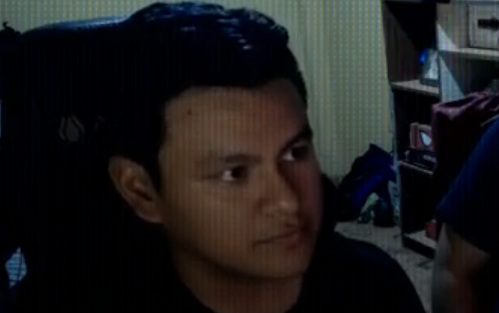

# 
COURSE PROJECT

    <strong>Universidad Peruana de Ciencias Aplicadas</strong> 
    </img> 
    <strong>Ingeniería de Software</strong> 
    <strong>2025-10 </strong>
    <strong>1ASI0572 Desarrollo de Soluciones IOT - 2952</strong> 
    <strong>Profesor: Marco Antonio Leon Baca</strong> 
     <strong>Informe del Trabajo Final </strong>
    <strong>Grupo 3</strong>

    <strong>Startup: SmartGuard</strong> 
    <strong>Producto: FaceLoock </strong>

    <h3>Team Members:</h3>
    <table align="center">
        <tr>
            <th style="text-align:center;">Member</th>
            <th style="text-align:center;">Code</th>
        </tr>
        <tr>
            <td>Fernando Aquino Iman</td>
            <td>U20171E997</td>
        </tr>
        <tr>
            <td>Pérez García David Alexander</td>
            <td>U202222942</td>
        </tr>
        <tr>
            <td>Gonzales Gomez, Antonella Frida</td>
            <td>U20211c403</td>
        </tr>
        <tr>
            <td>Ramos Najar, Tony Alexander</td>
            <td>u20211a153</td>
        </tr>
        <tr>
            <td>Zárate Gamarra, Luis Alejandro</td>
            <td>u20181h198</td>
        </tr>
    </table>

    <strong>Marzo, 2025</strong>

 

<h1 align="center">Registro de versiones del Informe</h1>
 
<table>
    <thead>
        <tr>
            <th>Versión</th>
            <th>Fecha</th>
            <th>Autor</th>
            <th>Descripción de modificaciones</th>
        </tr>
    </thead>
    <tbody>
        <tr>
            <th>TB1</th>
            <td>20/04/2025</td>
            <td>
                <ul>
                    <li>Fernando Aquino Iman</li>
                    <li>Pérez García David Alexander</li>
                    <li>Gonzales Gomez, Antonella Frida</li>
                    <li>Ramos Najar, Tony Alexander</li>
                    <li>Zárate Gamarra, Luis Alejandro</li>
                </ul>
            </td>
            <td>            
                <ul>
                    <li>Capítulo I: Introducción</li>
                    <li>Capítulo II: Requirements Elicitation & Analysis</li>
                    <li>Capítulo III: Requirements Specification</li>
                    <li>Capítulo IV: Solution Software Design</li>
                    <li>Avance de Conclusiones, Bibliografía y Anexos</li>
                </ul>
            </td>
        </tr>
        <tr>
            <th>TP</th>
            <td></td>
            <td>
                <ul>
                </ul>
            </td>
            <td>            
                <ul>
                </ul>
            </td>
        </tr>
        <tr>
            <th>TB2</th>
            <td></td>
            <td>
                <ul>
                </ul>
            </td>
            <td>            
                <ul>
                </ul>
            </td>
        </tr>
        <tr>
            <th>TF</th>
            <td></td>
            <td>
                <ul>
                </ul>
            </td>
            <td>            
                <ul>
                </ul>
            </td>
        </tr>
    </tbody>
</table>

# Project Report Collaboration Insights

TB1:

TP:

TB2:

TF:

# Contenido
[Student Outcome](#student-outcome)

[Capítulo I: Introducción](#capítulo-i-introducción)
- [1.1. Startup Profile](#11-startup-profile)
  - [1.1.1. Descripción de la Startup](#111-descripción-de-la-startup)
  - [1.1.2. Perfiles de integrantes del equipo](#112-perfiles-de-integrantes-del-equipo)
- [1.2. Solution Profile](#12-solution-profile)
  - [1.2.1 Antecedentes y problemática](#121-antecedentes-y-problemática)
  - [1.2.2 Lean UX Process](#122-lean-ux-process)
    - [1.2.2.1. Lean UX Problem Statements](#1221-lean-ux-problem-statements)
    - [1.2.2.2. Lean UX Assumptions](#1222-lean-ux-assumptions)
    - [1.2.2.3. Lean UX Hypothesis Statements](#1223-lean-ux-hypothesis-statements)
    - [1.2.2.4. Lean UX Canvas](#1224-lean-ux-canvas)
- [1.3. Segmentos objetivo](#13-segmentos-objetivo)

[Capítulo II: Requirements Elicitation & Analysis](#capítulo-ii-requirements-elicitation--analysis)
- [2.1. Competidores](#21-competidores)
  - [2.1.1. Análisis competitivo](#211-análisis-competitivo)
  - [2.1.2. Estrategias y tácticas frente a competidores](#212-estrategias-y-tácticas-frente-a-competidores)
- [2.2. Entrevistas](#22-entrevistas)
  - [2.2.1. Diseño de entrevistas](#221-diseño-de-entrevistas)
  - [2.2.2. Registro de entrevistas](#222-registro-de-entrevistas)
  - [2.2.3. Análisis de entrevistas](#223-análisis-de-entrevistas)
- [2.3. Needfinding](#23-needfinding)
  - [2.3.1. User Personas](#231-user-personas)
  - [2.3.2. User Task Matrix](#232-user-task-matrix)
  - [2.3.3. User Journey Mapping](#233-user-journey-mapping)
  - [2.3.4. Empathy Mapping](#234-empathy-mapping)
  - [2.3.5. As-is Scenario Mapping](#235-as-is-scenario-mapping)
- [2.4. Ubiquitous Language](#24-ubiquitous-language)

[Capítulo III: Requirements Specification](#capítulo-iii-requirements-specification)
- [3.1. To-Be Scenario Mapping](#31-to-be-scenario-mapping)
- [3.2. User Stories](#32-user-stories)
- [3.3. Impact Mapping](#33-impact-mapping)
- [3.4. Product Backlog](#34-product-backlog)

[Capítulo IV: Solution Software Design](#capítulo-iv-solution-software-design)
- [4.1. Strategic-Level Domain-Driven Design](#41-strategic-level-domain-driven-design)
  - [4.1.1. EventStorming](#411-eventstorming)
    - [4.1.1.1. Candidate Context Discovery](#4111-candidate-context-discovery)
    - [4.1.1.2. Domain Message Flows Modeling](#4112-domain-message-flows-modeling)
    - [4.1.1.3. Bounded Context Canvases](#4113-bounded-context-canvases)
  - [4.1.2. Context Mapping](#412-context-mapping)
  - [4.1.3. Software Architecture](#413-software-architecture)
    - [4.1.3.1. Software Architecture System Landscape Diagram](#4131-software-architecture-system-landscape-diagram)
    - [4.1.3.2. Software Architecture Context Level Diagrams](#4132-software-architecture-context-level-diagrams)
    - [4.1.3.3. Software Architecture Container Level Diagrams](#4133-software-architecture-container-level-diagrams)
    - [4.1.3.4. Software Architecture Deployment Diagrams](#4134-software-architecture-deployment-diagrams)
- [4.2. Tactical-Level Domain-Driven Design](#42-tactical-level-domain-driven-design)
  - [4.2.1. Bounded Context: <Bounded Context Name>](#421-bounded-context-bounded-context-name)
    - [4.2.1.1. Domain Layer](#4211-domain-layer)
    - [4.2.1.2. Interface Layer](#4212-interface-layer)
    - [4.2.1.3. Application Layer](#4213-application-layer)
    - [4.2.1.4. Infrastructure Layer](#4214-infrastructure-layer)
    - [4.2.1.5. Bounded Context Software Architecture Component Level Diagrams](#4215-bounded-context-software-architecture-component-level-diagrams)
    - [4.2.1.6. Bounded Context Software Architecture Code Level Diagrams](#4216-bounded-context-software-architecture-code-level-diagrams)
      - [4.2.1.6.1 Bounded Context Domain Layer Class Diagrams](#42161-bounded-context-domain-layer-class-diagrams)
      - [4.2.1.6.2 Bounded Context Database Design Diagram](#42162-bounded-context-database-design-diagram)

[Capítulo V: Solution UI/UX Design](#capítulo-v-solution-uiux-design)  
- [5.1. Style Guidelines](#51-style-guidelines)  
  - [5.1.1. General Style Guidelines](#511-general-style-guidelines)  
  - [5.1.2. Web, Mobile and IoT Style Guidelines](#512-web-mobile-and-iot-style-guidelines)  
- [5.2. Information Architecture](#52-information-architecture)  
  - [5.2.1. Organization Systems](#521-organization-systems)  
  - [5.2.2. Labeling Systems](#522-labeling-systems)  
  - [5.2.3. SEO Tags and Meta Tags](#523-seo-tags-and-meta-tags)  
  - [5.2.4. Searching Systems](#524-searching-systems)  
  - [5.2.5. Navigation Systems](#525-navigation-systems)  
- [5.3. Landing Page UI Design](#53-landing-page-ui-design)  
  - [5.3.1. Landing Page Wireframe](#531-landing-page-wireframe)  
  - [5.3.2. Landing Page Mock-up](#532-landing-page-mock-up)  
- [5.4. Applications UX/UI Design](#54-applications-uxui-design)  
  - [5.4.1. Applications Wireframes](#541-applications-wireframes)  
  - [5.4.2. Applications Wireflow Diagrams](#542-applications-wireflow-diagrams)  
  - [5.4.2. Applications Mock-ups](#542-applications-mock-ups)  
  - [5.4.3. Applications User Flow Diagrams](#543-applications-user-flow-diagrams)  
- [5.5. Applications Prototyping](#55-applications-prototyping)

[Capítulo VI: Product Implementation, Validation & Deployment](#capítulo-vi-product-implementation-validation--deployment)  
- [6.1. Software Configuration Management](#61-software-configuration-management)  
  - [6.1.1. Software Development Environment Configuration](#611-software-development-environment-configuration)  
  - [6.1.2. Source Code Management](#612-source-code-management)  
  - [6.1.3. Source Code Style Guide & Conventions](#613-source-code-style-guide--conventions)  
  - [6.1.4. Software Deployment Configuration](#614-software-deployment-configuration)  
- [6.2. Landing Page, Services & Applications Implementation](#62-landing-page-services--applications-implementation)  
  - [6.2.X. Sprint n](#62x-sprint-n)  
    - [6.2.X.1. Sprint Planning n](#62x1-sprint-planning-n)  
    - [6.2.X.2.](#62x2)  
    - [6.2.X.3.](#62x3)  
    - [6.2.X.4.](#62x4)  
    - [6.2.X.5.](#62x5)  
    - [6.2.X.6.](#62x6)  
    - [6.2.X.7.](#62x7)  
    - [6.2.X.8.](#62x8)  
    - [6.2.X.9.](#62x9)  
- [6.3. Validation Interviews](#63-validation-interviews)  
  - [6.3.1. Diseño de Entrevistas](#631-diseño-de-entrevistas)  
  - [6.3.2. Registro de Entrevistas](#632-registro-de-entrevistas)  
  - [6.3.3. Evaluaciones según heurísticas](#633-evaluaciones-según-heurísticas)  
- [6.4. Video About-the-Product](#64-video-about-the-product)

[Conclusiones](#conclusiones)
- [Conclusiones y recomendaciones](#conclusiones-y-recomendaciones)
- [Video About-the-Team](#video-about-the-team)

[Bibliografía](#bibliografía)

[Anexos](#anexos)

# Student Outcome
ABET – EAC - Student Outcome 5

Criterio: La capacidad de funcionar efectivamente en un equipo cuyos miembros juntos proporcionan liderazgo, crean un entorno de colaboración e inclusivo, establecen objetivos, planifican tareas y cumplen objetivos

<table>
  <tr>
    <td><b>Criterio específico</b></td>
    <td><b>Acciones realizadas</b></td>
    <td><b>Conclusiones</b></td>
  </tr>
  <tr>
    <td><b>Trabajo en equipo para proporcionar liderazgo en forma conjunta.</b></td>
    <td><b>Luis Alejandro Zárate Gamarra</b>  Al desarrollar el capítulo 1, lideré la estructuración del perfil de nuestra startup y colaboré activamente en la redacción de la misión, visión y descripción de la solución tecnológica propuesta. También participé en sesiones de EventStorming y Context Mapping, proponiendo ideas clave para definir los bounded contexts del sistema FaceLoock.  <b>Gonzales Gomez, Antonella Frida</b>  Desarrollé el capítulo 4 sobre Context Mapping, creando diagramas de arquitectura de software a nivel de contexto, componentes y contenedores. También realicé los diagramas de clases y base de datos para los dos bounded contexts. 
     <b>Pérez García, David Alexander</b>  Desarrollé el capítulo 2, el cual abarca el análisis de los potenciales competidores, así como la definición de los user persona para cada segmento objetivo, incluyendo las matrices de segmentación (user tax metrics), el user journey mapping, el empathy mapping, y el as-is scenario mapping. 
     <b>Ramos Najar, Tony Alexander</b   En esta entrega del proyecto, me encargué de diseñar el desarrollo de los 10 pasos del Domain-Driven Design. Desde la definición de eventos de dominio hasta la identificación de los bounded contexts, propuse ideas y enfoqué el trabajo para que todos estuviéramos alineados. Usamos herramientas como Miro para organizarnos mejor y entender el dominio del sistema en conjunto, lo que ayudó bastante a que todos pudiéramos aportar de forma clara y con objetivos comunes.
</td>
    <td>Consideramos que la participación activa facilitó el desarrollo de esta primera fase del proyecto, promoviendo una visión clara de la idea  y contribuyendo al avance coordinado hacia los objetivos planteados.</td>
  </tr>
  <tr>
    <td><b>Creo un entorno colaborativo e inclusivo, establezco metas, planifico tareas y cumplo objetivos.</b></td>
    <td><b>Luis Alejandro Zárate Gamarra</b>  Durante el desarrollo del capítulo 1, promoví un ambiente de trabajo colaborativo e inclusivo. Aporté en la planificación de tareas y organización de entregables del equipo, especialmente en el diseño de la arquitectura del sistema a nivel de contenedores y despliegue. Coordiné tiempos y responsabilidades para asegurar el cumplimiento de los objetivos del proyecto. <b> Gonzales Gomez, Antonella Frida</b>  Trabajé de manera colaborativa en la planificación y diseño de los diagramas y modelos del sistema, cumpliendo con los plazos establecidos y asegurando una alineación constante con el equipo para realizar las entregas a tiempo. 
     <b>Pérez García, David Alexander</b>  Fomenté un entorno colaborativo e inclusivo, establecí metas claras, planifiqué las tareas correspondientes a cada capítulo del reporte y aseguré el cumplimiento de los objetivos establecidos. 
     <b>Ramos Najar, Tony Alexander</b>  Me encargué de dividir dos bounded contexts en capas (interfaz, dominio e infraestructura), para ordenar mejor el diseño de la solución. Usé Visual Paradigm para armar diagramas C4 que ayudaron a que todo el equipo entienda cómo se conecta cada parte del sistema. Gracias a esto, logramos organizarnos mejor, establecer metas claras y avanzar en el desarrollo respetando los tiempos que nos propusimos.
    </td>
    <td>Gracias a una planificación efectiva y una comunicación constante entre los integrantes del equipo, logramos cumplir con los objetivos propuestos, demostrando un trabajo en equipo cohesionado y orientado al logro.</td>
  </tr>
</table>

# Capítulo I: Introducción
## 1.1. Startup Profile
A continuación, procederemos a informar sobre a lo que se dedica nuestra startup “SmartGuard”, así como la presentación del equipo de desarrollo del producto, software presentado anteriormente, “FaceLoock”.
### 1.1.1. Descripción de la Startup

    <strong>SmartGuard</strong> es una startup tecnológica orientada a desarrollar soluciones de seguridad residencial inteligentes.
    Nuestra misión es transformar la forma en que las personas protegen sus hogares mediante el uso de tecnologías avanzadas, confiables y fáciles de usar.
    Apostamos por la innovación y la comodidad como ejes principales en el desarrollo de nuestros productos.
  

  

    El primer producto de SmartGuard es <strong>"FaceLoock"</strong>, un sistema de reconocimiento facial para el acceso a viviendas,
    que busca reemplazar el uso de llaves tradicionales por una solución segura y sin contacto físico.
    FaceLoock se enfoca en usuarios que desean modernizar la seguridad de su hogar mediante tecnología biométrica.
  

  <h4><strong>Misión</strong></h4>
  

    Transformar la forma en que las personas protegen sus hogares mediante el uso de tecnologías avanzadas, confiables y fáciles de usar.
  

  <h4><strong>Visión</strong></h4>
  

    Ser líderes en soluciones de seguridad residencial inteligente en América Latina,
    ofreciendo productos innovadores que mejoren la calidad de vida de nuestros usuarios.
  

### 1.1.2. Perfiles de integrantes del equipo

<table border="1" cellpadding="10" cellspacing="0">
  <thead>
    <tr>
      <th>Perfil</th>
      <th>Descripción</th>
    </tr>
  </thead>
  <tbody>
    <tr>
      <td></td>
      <td>Mi nombre es Tony Ramos, estoy cursando el 9no ciclo de la carrera de Ingeniería de Software. Me considero hábil en el ámbito de la programación en los lenguajes, Python, Javascript, y últimamente estoy aprendiendo Angular. Con respeto a mi, me considero una persona responsable, con ganas de aprender y a superarme a mi mismo.</td>
    </tr>
    <tr>
      <td></td>
      <td>Mi nombre es Antonella, actualmente estoy cursando el 9no ciclo de la carrera de ingeniería de software. Tengo conocimientos de distintos lenguajes de programación como Java, Node.js, C#, y diferentes frameworks. Me gusta trabajar en equipo responsablemente.</td>
    </tr>
    <tr>
      <td></td>
      <td>Mi nombre es Fernando, actualmente estoy cursando el 8vo ciclo de la carrera de ingeniería de software. Tengo conocimiento desarrollando plataformas web para la gestión empresarial, me encanta la innovación y el aprendizaje constante. Cada desafío es una oportunidad de avanzar y desarrollarme profesionalmente.</td>
    </tr>
    <tr>
      <td></td>
      <td>Mi nombre es David, actualmente soy estudiante de Ingeniería de Software (7mo ciclo). Me especializo en el desarrollo de aplicaciones web, trabajando de forma independiente en proyectos de programación. Tengo experiencia en lenguajes como  TypeScript, Java y PHP, utilizando tecnologías modernas como React, Next.js, Spring Boot, Express y Laravel. Apasionado por la tecnología y el aprendizaje continuo, siempre busco mejorar mis habilidades y asumir nuevos desafíos en el mundo del desarrollo de software.</td>
    </tr>
    <tr>
      <td></td>
      <td>Mi nombre es Alejandro, actualmente curso el 7mo ciclo de la carrera de Ingeniería de Software. Tengo experiencia en programación con lenguajes como Python, JavaScript y Java, y he trabajado con frameworks como React y tecnologías como .NET. Me considero una persona responsable, proactiva y con un fuerte compromiso por seguir aprendiendo y superándome constantemente en el ámbito profesional y personal.</td>
    </tr>
  </tbody>
</table>

## 1.2. Solution Profile
### 1.2.1 Antecedentes y problemática

<h3>Antecedente</h3>
  

    En la actualidad, el uso de llaves físicas continúa siendo el método más común para acceder a viviendas. 
    Sin embargo, este sistema presenta diversas vulnerabilidades: extravío de llaves, duplicación no autorizada, robos o situaciones de emergencia 
    donde el acceso rápido se ve limitado. Estas condiciones generan un entorno propenso a riesgos y afectan la percepción de seguridad de los usuarios 
    en sus propios hogares.
  

  <h3>Problemática – Enfoque con las 5W + 2H</h3>
  <ul>
    <li><strong>What?</strong> Las personas enfrentan problemas de seguridad y practicidad debido a la dependencia de llaves físicas para el ingreso a sus hogares.</li>
    <li><strong>Why?</strong> Porque las llaves pueden perderse, duplicarse sin permiso o ser robadas, generando inseguridad. Además, su uso requiere contacto físico, lo cual puede ser incómodo o riesgoso en ciertas circunstancias.</li>
    <li><strong>Who?</strong> A propietarios de viviendas, familias y personas que buscan mejorar la seguridad y accesibilidad en su entorno residencial.</li>
    <li><strong>When?</strong> De manera cotidiana, especialmente en situaciones imprevistas como olvidos, emergencias médicas, o pérdida de llaves.</li>
    <li><strong>Where?</strong> En zonas residenciales urbanas y suburbanas donde aún se emplean métodos de acceso tradicionales.</li>
    <li><strong>How?</strong> A través de experiencias negativas como bloqueos de acceso, necesidad de copias físicas adicionales, o temor a intrusiones por pérdida o robo de llaves.</li>
    <li><strong>How Much?</strong> El impacto varía, pero puede traducirse en costos económicos (cambio de cerraduras), pérdida de tiempo, estrés y una constante sensación de vulnerabilidad.</li>
  </ul>

### 1.2.2 Antecedentes y problemática
#### 1.2.2.1 Lean UX Hypothesis Statements

  <article>
    <h3>Propietarios de viviendas</h3>
    

      Las personas que poseen una vivienda desean garantizar la seguridad de su hogar, pero muchas veces confían únicamente en llaves físicas 
      que pueden perderse, ser duplicadas sin consentimiento o forzadas. Además, no siempre se tiene control sobre quién ha ingresado o en qué momento.
    

    
<strong>¿Cómo pueden los propietarios acceder a sus hogares y gestionar el acceso de forma segura, moderna y sin depender de llaves físicas?</strong>

  </article>

  <article>
    <h3>Adultos mayores o personas con movilidad reducida</h3>
    

      Este grupo enfrenta dificultades al manipular llaves físicas, lo cual puede limitar su autonomía o poner en riesgo su seguridad en situaciones urgentes.
    

    
<strong>¿Cómo pueden acceder fácilmente a sus viviendas sin depender del uso físico de llaves o ayuda de terceros?</strong>

  </article>

#### 1.2.2.2  Lean UX Assumptions
<section id="business-assumptions">
  <h4>Business Assumptions</h4>
  <ul>
    <li>Creemos que nuestros clientes necesitan una solución moderna, segura y sin contacto físico para acceder a sus hogares.</li>
    <li>Estas necesidades pueden resolverse mediante un sistema de reconocimiento facial que permita a los usuarios entrar a su vivienda sin necesidad de llaves tradicionales ni tarjetas.</li>
    <li>Nuestros clientes iniciales son propietarios de viviendas tecnológicas, personas interesadas en domótica, y usuarios preocupados por mejorar los niveles de seguridad de sus hogares.</li>
    <li>El valor número 1 que un cliente busca en nuestros servicios es la seguridad sin fricciones, es decir, poder ingresar a su hogar de forma segura, rápida y sin complicaciones.</li>
    <li>El cliente también puede obtener estos servicios adicionales:
      <ul>
        <li>Control de acceso mediante aplicación móvil</li>
        <li>Historial de accesos por usuario</li>
        <li>Integración con sistemas de domótica</li>
        <li>Notificaciones en tiempo real ante intentos fallidos de reconocimiento</li>
      </ul>
    </li>
    <li>Vamos a adquirir la mayoría de nuestros clientes a través de estrategias de marketing digital en redes sociales como Instagram, YouTube y LinkedIn, así como demostraciones en ferias de tecnología y alianzas con inmobiliarias o empresas de domótica.</li>
    <li>Haremos dinero mediante la venta del sistema FaceLoock y un modelo de suscripción mensual para funciones premium (notificaciones avanzadas, respaldo en la nube, control remoto, integración con múltiples dispositivos).</li>
    <li>La competencia principal en el mercado nacional es limitada, ya que la mayoría de sistemas similares son importados y no están optimizados para el contexto local. A nivel internacional, existen sistemas de reconocimiento facial para acceso, pero sus precios son elevados y no están pensados para residencias en América Latina.</li>
    <li>Nuestra ventaja competitiva radica en el precio accesible, la facilidad de instalación, la personalización local y las integraciones con otros sistemas del hogar.</li>
    <li>Nuestro mayor riesgo es la desconfianza en la precisión y seguridad del reconocimiento facial. Resolveremos esto mediante campañas de sensibilización, pruebas públicas de eficacia, garantías de satisfacción, y auditorías de seguridad que validen la calidad del sistema.</li>
  </ul>
</section>

<section id="business-outcomes">
  <h4>Business Outcomes</h4>
  <ul>
    <li>Incremento en la percepción de seguridad residencial: Mejorar la percepción de seguridad en los hogares de nuestros usuarios en un 30% dentro de los primeros 12 meses, a través de encuestas y reportes post-implementación.</li>
    <li>Adopción tecnológica masiva en hogares: Lograr una adopción del sistema FaceLoock en al menos el 10% de residencias con sistemas de domótica dentro del primer año.</li>
    <li>Reconocimiento de marca y confianza: Alcanzar una tasa de reconocimiento de marca del 35% entre los usuarios interesados en seguridad inteligente dentro de los primeros 18 meses, reforzada por influencers tecnológicos y alianzas estratégicas.</li>
    <li>Ingresos sostenibles: Alcanzar un crecimiento del 15% mensual en ventas del sistema FaceLoock y suscripciones premium, generando ingresos recurrentes estables.</li>
    <li>Liderazgo en el mercado nacional: Posicionarnos como la primera opción de seguridad inteligente residencial en Perú y expandirnos a otros países de América Latina en un plazo de 24 meses.</li>
  </ul>
</section>

<section id="user-assumptions">
  <h4>User Assumptions</h4>
  <ul>
    <li><strong>Seguridad y conveniencia:</strong> Los usuarios desean una solución que garantice un alto nivel de seguridad mientras les permite ingresar a sus hogares de manera rápida y sin complicaciones. Prefieren la comodidad de no depender de llaves físicas ni tarjetas.</li>
    <li><strong>Preocupación por la privacidad:</strong> Los usuarios valoran la privacidad de sus datos y buscan sistemas de reconocimiento facial que ofrezcan garantías de seguridad, con almacenamiento de datos mínimamente accesibles y encriptados.</li>
    <li><strong>Facilidad de uso:</strong> Los usuarios desean un sistema intuitivo, fácil de instalar y utilizar, con opciones claras y accesibles para gestionar el acceso y configurar notificaciones a través de una aplicación móvil.</li>
    <li><strong>Interconexión con otros dispositivos:</strong> Los usuarios valoran la capacidad de integración del sistema de reconocimiento facial con otros dispositivos de domótica ya presentes en sus hogares, como cámaras de seguridad, sistemas de luces inteligentes y termostatos.</li>
    <li><strong>Seguridad en caso de fallos:</strong> Los usuarios esperan que el sistema ofrezca opciones alternativas de acceso en caso de fallos en el reconocimiento facial, como códigos temporales o acceso remoto mediante la aplicación móvil.</li>
    <li><strong>Confianza en la tecnología:</strong> Los usuarios tienen dudas sobre la precisión y seguridad del sistema de reconocimiento facial, especialmente en condiciones de poca luz o ante personas con características similares. Esperan pruebas públicas y auditorías que validen la eficacia del sistema.</li>
  </ul>
</section>

<section id="user-outcomes">
  <h4>User Outcomes</h4>
  <ul>
    <li><strong>Acceso sin fricciones:</strong> Los usuarios pueden ingresar a su hogar de manera rápida y sin inconvenientes, sin necesidad de llaves o tarjetas. El sistema reconoce a los usuarios con alta precisión y eficacia.</li>
    <li><strong>Mayor control sobre la seguridad del hogar:</strong> Los usuarios reciben notificaciones en tiempo real sobre intentos fallidos de acceso y pueden revisar el historial de entradas para tener visibilidad sobre las personas que acceden a su hogar.</li>
    <li><strong>Tranquilidad y confianza:</strong> Los usuarios sienten que sus hogares están mejor protegidos gracias a un sistema de seguridad robusto que les brinda un control total y acceso remoto. Además, tienen confianza en que sus datos están seguros gracias a las auditorías de seguridad.</li>
    <li><strong>Satisfacción con la integración domótica:</strong> Los usuarios disfrutan de la interconexión del sistema de reconocimiento facial con otros dispositivos inteligentes en el hogar, como luces y cámaras, para mejorar la comodidad y el control.</li>
    <li><strong>Flexibilidad en el acceso:</strong> En caso de problemas con el reconocimiento facial, los usuarios tienen opciones alternativas para acceder a su hogar sin complicaciones, como códigos de acceso temporales o control remoto.</li>
  </ul>
</section>

<section id="features">
  <h4>Features</h4>
  <ul>
    <li><strong>Reconocimiento Facial Avanzado:</strong> Sistema de reconocimiento facial rápido, preciso y con alta tasa de fiabilidad en diversas condiciones de luz y distancia.</li>
    <li><strong>Aplicación Móvil de Control:</strong> Aplicación móvil que permite gestionar accesos, recibir notificaciones, revisar el historial de entradas y controlar remotamente las funciones del sistema.</li>
    <li><strong>Integración Domótica:</strong> Funcionalidad de integración con otros dispositivos inteligentes en el hogar, como cámaras, luces, y termostatos, para un control unificado.</li>
    <li><strong>Historial de Accesos:</strong> Registro detallado de todas las entradas al hogar, mostrando la hora, fecha y usuario que accedió, disponible en la aplicación móvil.</li>
    <li><strong>Notificaciones en Tiempo Real:</strong> Alertas instantáneas en la aplicación móvil ante intentos fallidos de reconocimiento facial, proporcionando detalles sobre la ubicación y la hora del intento.</li>
    <li><strong>Acceso Alternativo:</strong> Opciones de acceso alternativo en caso de fallos en el reconocimiento facial, como códigos temporales o acceso remoto a través de la aplicación móvil.</li>
    <li><strong>Ajustes de Seguridad Avanzados:</strong> Funciones adicionales de seguridad, como la encriptación de datos y auditorías periódicas, para garantizar la privacidad y la protección de los usuarios.</li>
    <li><strong>Suscripción Premium:</strong> Acceso a funciones avanzadas, como almacenamiento en la nube, soporte prioritario y control de múltiples dispositivos a través de un modelo de suscripción mensual.</li>
  </ul>
</section>

#### 1.2.2.3  Lean UX Hypothesis Statements

<section id="hipotesis-solucion">
  <ul>
    <li>
      <strong>Hipótesis sobre la solución de reconocimiento facial:</strong>  
      Creemos que si desarrollamos un sistema de reconocimiento facial eficiente y preciso, los usuarios podrán acceder a sus viviendas de manera más segura y conveniente que utilizando llaves tradicionales. Esta solución puede satisfacer sus necesidades de seguridad, control de acceso y conveniencia, brindando una experiencia sin fricciones y un alto nivel de confianza en la protección de sus hogares.
    </li>
    <li>
      <strong>Hipótesis sobre la experiencia de usuario y control móvil:</strong>  
      Creemos que si los usuarios pueden gestionar los accesos a través de una aplicación móvil intuitiva, recibir notificaciones en tiempo real sobre intentos fallidos de acceso y revisar el historial de entradas, estarán más satisfechos con el control y la seguridad de su hogar. Esto aumentará la percepción de seguridad y permitirá una experiencia fluida y moderna en su vida diaria.
    </li>
    <li>
      <strong>Hipótesis sobre la integración con sistemas domóticos:</strong>  
      Creemos que si integramos nuestro sistema de reconocimiento facial con otros dispositivos de domótica como cámaras, luces y termostatos, los usuarios experimentarán una mayor comodidad y control de su entorno, lo que les permitirá optimizar la seguridad y la eficiencia energética en su hogar. Esta integración será una característica valorada por los usuarios interesados en soluciones tecnológicas avanzadas.
    </li>
    <li>
      <strong>Hipótesis sobre la confianza en la tecnología:</strong>  
      Creemos que si proporcionamos pruebas públicas y auditorías de seguridad que validen la eficacia del sistema de reconocimiento facial, los usuarios ganarán confianza en la tecnología, especialmente aquellos que inicialmente tienen dudas sobre la precisión y seguridad del sistema. Esto reducirá el riesgo de desconfianza y aumentará la adopción del sistema.
    </li>
    <li>
      <strong>Hipótesis sobre el acceso alternativo:</strong>  
      Creemos que si ofrecemos opciones alternativas de acceso, como códigos temporales o acceso remoto a través de la aplicación móvil en caso de fallos en el reconocimiento facial, los usuarios se sentirán más seguros y respaldados, sabiendo que siempre tendrán una solución para acceder a su hogar sin inconvenientes, incluso si hay fallos técnicos en el sistema de reconocimiento facial.
    </li>
  </ul>
</section>

#### 1.2.2.4. Lean UX Canvas  

## 1.3. Segmentos objetivo

<section id="segmentos-usuarios">

  <article>
    <h4>Propietarios de Viviendas Tecnológicas</h4>
    

      Este segmento está compuesto por individuos que ya están familiarizados con la tecnología y buscan integrar soluciones inteligentes en sus hogares. 
      Los propietarios de viviendas tecnológicas desean modernizar sus sistemas de seguridad mediante soluciones avanzadas, como el reconocimiento facial. 
      Este grupo valora la innovación, la comodidad y la automatización de sus hogares, y está dispuesto a invertir en productos que mejoren la seguridad y eficiencia de su vida diaria.
    

    <h4>Características clave:</h4>
    <ul>
      <li>Interés en soluciones de domótica y hogares inteligentes.</li>
      <li>Preocupación por la seguridad y el control de acceso.</li>
      <li>Valoración de la comodidad y la conveniencia.</li>
      <li>Propietarios de casas unifamiliares o apartamentos con enfoque en tecnología avanzada.</li>
    </ul>
  </article>

  <article>
    <h4>Adultos Mayores o Personas con Movilidad Reducida</h4>
    

      Este segmento incluye personas mayores o individuos con movilidad reducida que enfrentan dificultades al manipular llaves tradicionales. 
      Buscan una solución que les permita acceder a sus hogares sin esfuerzo físico, mejorando su autonomía y reduciendo el riesgo de accidentes o fallos en situaciones de emergencia. 
      La solución de reconocimiento facial representa una forma accesible y segura para ingresar a su vivienda sin depender de la ayuda de terceros.
    

    <h4>Características clave:</h4>
    <ul>
      <li>Necesidad de soluciones de fácil acceso y sin contacto físico.</li>
      <li>Preocupación por la seguridad personal y la autonomía.</li>
      <li>Valoran la facilidad de uso y la confiabilidad del sistema.</li>
      <li>Pueden vivir en viviendas unifamiliares o departamentos, especialmente en comunidades de adultos mayores.</li>
    </ul>
  </article>
</section>

# **Capítulo II: Requirements Elicitation & Analysis**

## 2.1. Competidores.

<table>
    <thead>
        <tr>
            <th>Nombre del Competidor</th>
            <th>Descripción</th>
        </tr>
    </thead>
    <tbody>
        <tr>
            <td rowspan="2" align="center">
                
                 Ring (Amazon)
            </td>
            <td>Ring ofrece un sistema completo de seguridad para el hogar, incluyendo videoporteros y cámaras de seguridad conectadas. Está integrado con Alexa y los servicios de Amazon.</td>
        </tr>
        <tr>
            <td>Página web: <a href="https://ring.com" target="_blank">https://ring.com</a></td>
        </tr>
        <tr>
            <td rowspan="2" align="center">
                
                 Nest (Google)
            </td>
            <td>Nest ofrece un ecosistema de automatización del hogar con productos como cámaras, termostatos, sensores y sistemas de seguridad. Está fuertemente integrado con Google Home.</td>
        </tr>
        <tr>
            <td>Página web: <a href="https://store.google.com/us/category/connected_home" target="_blank">https://store.google.com/us/category/connected_home</a></td>
        </tr>
        <tr>
            <td rowspan="2" align="center">
                
                 August
            </td>
            <td>August es conocida por sus cerraduras inteligentes y soluciones de acceso sin llaves. Compatible con Alexa, Google Assistant y Siri para control remoto y acceso inteligente.</td>
        </tr>
               <tr>
            <td>Página web: <a href="https://august.com/" target="_blank">https://august.com</a></td>
        </tr>
    </tbody>
</table>

### 2.1.1. Análisis competitivo.

<table style="width: 100%;">
  <tr>
    <th colspan="6" style="padding: 8px; text-align: center;"> Competitive Analysis Landscape</th>
  </tr>
  <tr>
    <td>¿Por qué llevar a cabo este análisis?</td>
    <td colspan="5">Para identificar fortalezas, oportunidades y áreas de mejora frente a los competidores; posicionar mejor el producto FaceLoock en el mercado y tomar decisiones estratégicas de desarrollo, marketing y precios.
</td>
  </tr>
  <tr>
    <td colspan="2"></td>
  <td align="center"> </td>
  <td align="center"> </td>
  <td align="center"> </td>
  <td align="center"> </td>
  </tr>
<tr>
  <td rowspan="2" align="center">Perfil</td>
  <td align="center">Overview</td>
  <td>Sistema de seguridad inteligente con enfoque en videoporteros y cámaras conectadas, con fuerte integración en el ecosistema de Amazon y Alexa.</td>
  <td>Solución integral de domótica y seguridad, integrada completamente con Google Home, que incluye cámaras, sensores y automatización del hogar.</td>
  <td>Empresa especializada en cerraduras inteligentes enfocadas en accesos remotos sin llaves, con compatibilidad con Siri, Alexa y Google Assistant.</td>
  <td>Sistema de acceso residencial basado en reconocimiento facial, diseñado para ofrecer seguridad manos libres, especialmente para personas con movilidad reducida.</td>
</tr>
<tr>
  <td>Ventaja competitiva ¿Qué valor ofrece a los clientes?</td>
  <td>Integración nativa con Amazon, dispositivos múltiples, y monitoreo en tiempo real accesible desde cualquier lugar.</td>
  <td>Automatización total del hogar con inteligencia artificial, respaldado por la infraestructura de Google.</td>
  <td>Acceso sin llaves cómodo, instalación sencilla y control remoto seguro desde el smartphone.</td>
  <td>Acceso 100% biométrico sin contacto, pensado para usabilidad inclusiva y seguridad avanzada sin necesidad de llaves ni códigos.</td>
</tr>
 <tr>
  <td rowspan="2" align="center">Perfil de Marketing</td>
  <td>Mercado objetivo</td>
  <td>Propietarios de viviendas inteligentes, usuarios del ecosistema Amazon, y personas que buscan seguridad conectada.</td>
  <td>Usuarios de productos Google, hogares domóticos, early adopters tecnológicos.</td>
  <td>Usuarios urbanos, tecnófilos, anfitriones de alquiler vacacional.</td>
  <td>Personas con movilidad reducida, adultos mayores, familias que valoran accesibilidad e innovación en seguridad.</td>
</tr>
<tr>
  <td>Estrategias de marketing</td>
  <td>Integración con Amazon Prime, promociones en ecommerce, presencia fuerte en redes sociales y YouTube.</td>
  <td>Marketing digital integrado en Google Ads y YouTube, promociones en Google Store, influencers tech.</td>
  <td>Alianzas con Airbnb y Apple, marketing de producto simple, publicidad en redes.</td>
  <td>Campañas centradas en accesibilidad, ferias tecnológicas, demos en asociaciones de asistencia y canales sociales.</td>
</tr>

<tr>
  <td rowspan="3" align="center">Perfil del Producto</td>
  <td>Productos & Servicios</td>
  <td>Videoporteros, cámaras de seguridad, sensores de movimiento, app de control remoto.</td>
  <td>Cámaras Nest, sensores, termostatos inteligentes, app Nest, Nest Aware.</td>
  <td>Cerraduras inteligentes, sensores de puerta, teclados inalámbricos, app móvil.</td>
  <td>Dispositivo de reconocimiento facial, app de control, integración con asistentes y domótica.</td>
</tr>
<tr>
  <td>Precios & Costos</td>
  <td>$99–$349 + suscripciones mensuales desde $3</td>
  <td>$129–$399 + Nest Aware desde $6/mes</td>
  <td>$149–$250 por cerradura, sin suscripción obligatoria</td>
  <td>$120–$200 por dispositivo, sin suscripción obligatoria (estimado)</td>
</tr>
<tr>
  <td>Canales de distribución (Web y/o Móvil)</td>
  <td>Amazon, Web oficial, App (iOS/Android), tiendas físicas</td>
  <td>Google Store, Web oficial, App (iOS/Android), minoristas</td>
  <td>Apple Store, Amazon, Web oficial, App (iOS/Android)</td>
  <td>Web oficial, App (iOS/Android), asociaciones, tiendas aliadas</td>
</tr>

<tr>
  <td rowspan="4" align="center">Análisis SWOT</td>
  <td>Fortalezas</td>
  <td>Reconocimiento global, ecosistema Amazon, facilidad de uso</td>
  <td>Infraestructura de Google, IA integrada, diseño avanzado</td>
  <td>Instalación fácil, integración con múltiples asistentes, diseño moderno</td>
  <td>Innovación en accesibilidad, enfoque en biometría, uso manos libres</td>
</tr>
<tr>
  <td>Debilidades</td>
  <td>Problemas de privacidad, dependencia del ecosistema Amazon</td>
  <td>Costos elevados, dependencia del ecosistema Google</td>
  <td>Enfoque limitado al acceso, sin oferta integral de seguridad</td>
  <td>Marca nueva, poca visibilidad aún, sin historial de confianza</td>
</tr>
<tr>
  <td>Oportunidades</td>
  <td>Crecimiento del mercado smart home, expansión internacional</td>
  <td>Mejoras en IA, sinergia con otros dispositivos Google</td>
  <td>Alianzas con plataformas de alojamiento y empresas de seguridad</td>
  <td>Mercado no atendido (PMR), regulación que impulse accesibilidad</td>
</tr>
<tr>
  <td>Amenazas</td>
  <td>Competencia intensa, regulación sobre vigilancia</td>
  <td>Competencia directa con Amazon, saturación de mercado</td>
  <td>Competidores más grandes replicando su tecnología</td>
  <td>Copias de grandes marcas, barreras de entrada al retail</td>
</tr>
<table>

### 2.1.2. Estrategias y tácticas frente a competidores.

**Estrategias:**  
- **Diferenciación por accesibilidad biométrica:** Enfocar la propuesta de valor en el acceso facial sin contacto como una solución única frente a sistemas tradicionales basados en llaves, códigos o móviles.  
- **Segmentación en nichos desatendidos:** Atacar segmentos poco explotados por los grandes competidores, como personas con movilidad reducida, adultos mayores y familias con necesidades de accesibilidad.  
- **Innovación continua centrada en el usuario:** Iterar el producto con base en retroalimentación de usuarios reales, con mejoras funcionales y de UX que los gigantes no adaptan con rapidez.

**<strong>Tácticas:</strong>**  
- **Demostraciones en asociaciones y eventos de salud:** Presentar el producto en espacios donde los beneficios de accesibilidad y seguridad inclusiva tengan mayor impacto.  
- **Campañas de contenido educativo:** Crear contenido enfocado en explicar los riesgos de seguridad actuales y cómo FaceLoock los soluciona sin fricción.  
- **Alianzas estratégicas con organizaciones de asistencia:** Colaborar con entidades que trabajen con personas con discapacidad o adultos mayores para validar, distribuir y promover el producto.

## 2.2. Entrevistas.

El objetivo de las entrevistas es obtener una comprensión profunda de las experiencias, perspectivas y opiniones de los segmentos de mercado seleccionados. Nuestra meta es recopilar información valiosa que nos permita entender mejor a nuestro público objetivo y mejorar nuestra comprensión de los usuarios. Estas conversaciones nos proporcionarán una visión más clara de las necesidades y deseos de nuestros usuarios, lo que nos ayudará a adaptar nuestros productos o servicios de manera más efectiva a sus requisitos.

### 2.2.1. Diseño de entrevistas.

En esta parte, se han formulado varias preguntas destinadas a nuestros segmentos de interés con el fin de obtener información cualitativa, como opiniones o descripciones. Esta información será crucial para el desarrollo de nuestra solución.

**Preguntas Generales:**

- ¿Qué importancia tiene para ti la seguridad en casa al momento de elegir una tecnología?

-  ¿Cómo gestionas actualmente el acceso a tu vivienda? (llaves, cerraduras inteligentes, etc.)

- ¿Has considerado usar tecnologías biométricas (como reconocimiento facial) para acceder a tu hogar?

- ¿Qué valoras más en un sistema de acceso inteligente? (seguridad, comodidad, rapidez, etc.)

- ¿Qué limitaciones o frustraciones has tenido con los sistemas de seguridad actuales?

- ¿Qué te motivaría a comprar una solución como FaceLoock? 

**Preguntas para el Segmento Objetivo 1 - Propietarios de viviendas tecnológicas:**

- ¿Qué dispositivos inteligentes usas para controlar tu hogar?

- ¿Qué tan importante es que el sistema tenga control remoto desde una app móvil o una interfaz web?

- ¿Con qué frecuencia accedes o controlas tus dispositivos de seguridad desde fuera de casa?

- ¿Preferirías gestionar el sistema desde una app móvil, una plataforma web? ¿Por qué?

- ¿Qué tipo de funcionalidades te gustaría ver en la app (ej. historial de accesos, alertas, control remoto)?

- ¿Qué tan confiable necesitas que sea la conexión a internet para sentir seguridad en este tipo de sistema?

- ¿Estarías dispuesto a reemplazar completamente las llaves tradicionales por un sistema facial si fuera seguro?

**Preguntas para el Segmento Objetivo 2 - Adultos mayores  o personas con movilidad reducida:**

- ¿Qué tan fácil o difícil es para ti abrir la puerta de tu casa actualmente?

- ¿Te resulta complicado usar llaves o tienes alguna limitación física?

- ¿Has tenido alguna experiencia en la que no pudiste entrar a tu casa por perder las llaves?

- ¿Te gustaría poder entrar sin llaves ni necesidad de usar una app o teléfono?

- ¿Qué tan cómodo(a) te sentirías usando una aplicación para gestionar el acceso a tu casa?

- ¿Te gustaría que un familiar reciba alertas o pueda ayudarte a controlar el sistema desde su propio teléfono?

- ¿Tienes acceso frecuente a internet en tu casa?

### 2.2.2. Registro de entrevistas.

**Entrevista para el Segmento Objetivo 1 - Propietarios de viviendas tecnológicas:**

- **Entrevista 1:**
**Entrevistador:** Zárate Gamarra, Luis Alejandro 
**Entrevistado:** Marco Eduardo Ricardo Colca Chipana
**Sexo:** Masculino
**Edad:** 38 años
**Domicilio:** Miraflores
**Inicio de la Entrevista:** 0:00
**Duración de la Entrevista:** 3:30 
 

- **Resumen:** 
El entrevistado es un propietario de vivienda tecnológica que utiliza un ecosistema integrado de dispositivos inteligentes: luces automatizadas, cámaras, sensores de movimiento, cerradura digital y un asistente virtual tipo Alexa. Destaca la importancia del control remoto a través de una app móvil, permitiéndole gestionar su hogar incluso estando fuera, con ejemplos como abrir la puerta a familiares o simular presencia. Accede a su sistema 4 o 5 veces por semana desde fuera. Prefiere claramente la app móvil por su inmediatez y portabilidad, aunque acepta la web para configuraciones avanzadas. Desea funciones como historial detallado de accesos, notificaciones en tiempo real ante intentos de ingreso no autorizados o fallos, y opciones para otorgar accesos temporales. Resalta la necesidad de una conexión a internet confiable, pero también considera vital que el sistema funcione localmente en caso de cortes. Estaría dispuesto a reemplazar completamente las llaves tradicionales por reconocimiento facial, siempre que sea seguro y cuente con respaldo ante fallos.

Enlace al video: [https://drive.google.com/file/d/1Mo2DsHCd5W85YeI7AvBBWDPgul9eh7PE/view?usp=drive_link](https://drive.google.com/file/d/1Mo2DsHCd5W85YeI7AvBBWDPgul9eh7PE/view?usp=drive_link)
- **Entrevista 2:**
**Entrevistador:** Gonzales Gomez, Antonella Frida 
**Entrevistado:** Cristian Antony montalvo 
**Sexo:** Masculino
**Edad:** 24 años
**Domicilio:** Lima
**Inicio de la Entrevista:** 0:00
**Duración de la Entrevista:** 7:12 
 

- **Resumen:** 
Cristian Anthony Montalvo, estudiante de ingeniería y analista junior, participó en una entrevista sobre el uso de tecnologías inteligentes para la seguridad del hogar. Actualmente utiliza cerraduras tradicionales, como es común en Lima, pero mostró gran interés en implementar soluciones biométricas como el reconocimiento facial. Para él, lo más importante en un sistema de acceso inteligente es la comodidad, seguida de la seguridad, ya que permitiría evitar cargar llaves y simplificar el acceso diario. Ha tenido experiencias con la pérdida de llaves y considera que este tipo de tecnologías podrían prevenir esos inconvenientes. Está dispuesto a usar aplicaciones móviles para gestionar el acceso a su vivienda, siempre que sean fáciles de usar y le brinden control sobre quién puede entrar. Además, le parecería útil que familiares cercanos pudieran recibir alertas o ayudar a controlar el sistema desde sus propios dispositivos. Finalmente, comentó que cuenta con conexión a internet tanto en su hogar como en el móvil, lo que considera esencial para el funcionamiento de este tipo de soluciones. En resumen, Cristian ve con buenos ojos las tecnologías de seguridad basadas en IoT, siempre que ofrezcan confiabilidad, simplicidad y control.

Enlace al video: [https://drive.google.com/file/d/1fKyc2_ngx8cclktp1epBMCgF-LroQAZu/view?usp=drive_link](https://drive.google.com/file/d/1fKyc2_ngx8cclktp1epBMCgF-LroQAZu/view?usp=drive_link)

- **Entrevista 3:**
**Entrevistador:** Ramos Najar, Tony Alexander
**Entrevistado:** Sandy Ingaruca
**Sexo:** Mujer
**Edad:** 29 años
**Domicilio:** Lima
**Inicio de la Entrevista:** 0:00
**Duración de la Entrevista:** 3:34 
 

- **Resumen:** 
La entrevistada, Sandy Ingaruca, expresa gran interés en tecnologías de seguridad para el hogar, especialmente aquellas que ofrecen protección confiable, comodidad y control remoto. Actualmente utiliza llaves físicas, aunque reconoce los riesgos asociados, como la pérdida o duplicación. Manifiesta interés en tecnologías biométricas, como el reconocimiento facial, y valora la posibilidad de control remoto mediante app móvil. Sandy usa dispositivos como cámaras, enchufes inteligentes y asistentes como Alexa, y accede a ellos con frecuencia cuando está fuera. Prefiere controlar estos sistemas mediante una aplicación móvil por su practicidad. También le interesan funciones como historial de accesos, notificaciones en tiempo real y perfiles personalizados. Finalmente, estaría dispuesta a reemplazar completamente las llaves tradicionales si el sistema facial es seguro y estable.

Enlace al video: [https://drive.google.com/file/d/1TMcOckJDZniVaKipFdkIkufUpT3pWIAj/view?usp=drive_link](https://drive.google.com/file/d/1TMcOckJDZniVaKipFdkIkufUpT3pWIAj/view?usp=drive_link)

- **Entrevista 4:**
**Entrevistador:** Fernando Aquino Iman
**Entrevistado:** Gerson Suelo Carrera
**Sexo:** Hombre
**Edad:** 32 años
**Domicilio:** Comas
**Inicio de la Entrevista:** 0:00
**Duración de la Entrevista:** 3:34 
 

- **Resumen:** 
En la entrevista, Gerson Carrera expresa su interés en mejorar la seguridad de su hogar mediante tecnología inteligente, mostrando apertura hacia el uso de sistemas con reconocimiento facial como Faceelock. Actualmente utiliza llaves tradicionales, pero valora la posibilidad de automatizar el acceso por seguridad, comodidad y rapidez. Considera que el costo y la disponibilidad son limitaciones de los sistemas actuales. Ya utiliza dispositivos como Alexa y aplicaciones móviles para controlar cámaras de seguridad, por lo que ve como fundamental que el nuevo sistema tenga control remoto y funciones como historial de accesos y alertas. Está dispuesto a reemplazar las llaves tradicionales si el sistema garantiza confiabilidad y efectividad.

Enlace al video: [https://drive.google.com/file/d/16C7ZcuZatIejrDAFQ3RePuQLpxMRKYHs/view?usp=drive_link](https://drive.google.com/file/d/16C7ZcuZatIejrDAFQ3RePuQLpxMRKYHs/view?usp=drive_link)
**Entrevista para el Segmento Objetivo 2 - Adultos mayores  o personas con movilidad reducida:**

- **Entrevista 5:**
**Entrevistador:** David Alexander Pérez García
**Entrevistado:** Delfina Ames García
**Sexo:** Mujer
**Edad:** 45 años
**Domicilio:** Lima
**Inicio de la Entrevista:** 0:00
**Duración de la Entrevista:** 4:01 
 

- **Resumen:** 
En esta entrevista, Delfina Ames García, una mujer de 45 años, comparte su experiencia como parte del segmento dirigido a adultos mayores o personas con movilidad reducida. Destaca la importancia de la seguridad en el hogar y expresa su interés en tecnologías de acceso inteligente, especialmente aquellas que eviten el uso de llaves, debido a experiencias negativas como olvidar o romper llaves y las dificultades para conseguir cerrajeros. Valora especialmente la facilidad de uso, la rapidez y la posibilidad de control mediante una aplicación móvil, siempre que reciba orientación para usarla. Además, le parece útil que familiares puedan recibir alertas y ayudar en el control de acceso desde sus propios dispositivos.
Enlace al video: [https://drive.google.com/file/d/1b7dupsyRCYM38QB9auwEHKcBO0BDDzm_/view?usp=drive_link](https://drive.google.com/file/d/1b7dupsyRCYM38QB9auwEHKcBO0BDDzm_/view?usp=drive_link)
### 2.2.3. Análisis de entrevistas.
#### Propietarios de viviendas tecnológicas

| **Preguntas** | **Acciones realizadas** |
|---------------|-------------------------------------------------------------|
| ¿Qué importancia tiene para ti la seguridad en casa al momento de elegir una tecnología? | 100% la consideran muy importante para elegir tecnología de hogar. |
| ¿Cómo gestionas actualmente el acceso a tu vivienda? | 67% usan llaves tradicionales , 33% usa cerradura digital (Propietario tecnológico). |
| ¿Has considerado usar tecnologías biométricas (como reconocimiento facial) para acceder a tu hogar? | 100% están interesados o dispuestos a implementar reconocimiento facial. |
| ¿Qué valoras más en un sistema de acceso inteligente? | 67% priorizan comodidad (Cristian y Sandy), 33% seguridad y control remoto (Propietario tecnológico). |
| ¿Qué limitaciones o frustraciones has tenido con los sistemas de seguridad actuales? | 67% mencionaron pérdida de llaves como problema. |
| ¿Qué te motivaría a comprar una solución como FaceLoock? | 67% destacaron seguridad, comodidad, control remoto y respaldo ante fallos como motivadores clave. |
| ¿Qué dispositivos inteligentes usas para controlar tu hogar? | 67% usa ecosistema con luces, cámaras, sensores, cerradura digital, Alexa. |
| ¿Qué tan importante es que el sistema tenga control remoto desde una app móvil o interfaz web? | 100% lo consideran muy importante, especialmente mediante app móvil. |
| ¿Con qué frecuencia accedes o controlas tus dispositivos desde fuera de casa? | 67% accede 4–5 veces por semana desde fuera. |
| ¿Preferirías gestionar el sistema desde una app móvil o web? ¿Por qué? | 67% prefieren app móvil por portabilidad; usan web para configuraciones avanzadas. |
| ¿Qué funcionalidades te gustaría en la app? | 100% desean historial de accesos, alertas en tiempo real, accesos temporales. |
| ¿Qué tan confiable necesitas que sea la conexión a internet? | 67% consideran esencial la confiabilidad, pero también necesitan respaldo local. |
| ¿Estarías dispuesto a reemplazar llaves por sistema facial seguro? | 100% sí, siempre que haya seguridad y respaldo en caso de fallos. |

#### Adultos mayores  o personas con movilidad reducida

## 2.3. Needfinding.
El Needfinding es una metodología centrada en descubrir necesidades reales de los usuarios antes de diseñar una solución. En nuestro proyecto FaceLoock, se aplica para entender cómo las personas gestionan actualmente el acceso a sus hogares, qué frustraciones enfrentan (como pérdida de llaves, inseguridad o dificultad física), y qué esperan de una solución moderna como el reconocimiento facial. A través de observaciones, entrevistas y mapeo de experiencias, se busca identificar necesidades expresas, latentes y ocultas en 2 segmentos clave: propietarios tecnológicos, adultos mayores/personas con movilidad reducida.

### 2.3.1. User Personas.

- **Segmento Objetivo 1 - Propietarios de viviendas tecnológicas**

 

- **Segmento Objetivo 2 - Adultos mayores  o personas con movilidad reducida**

 

### 2.3.2. User Task Matrix.
El siguiente cuadro muestra las tareas que completan los segmentos Propietarios de viviendas tecnológicas y Adultos mayores  o personas con movilidad reducida.

***Segmento 1: Milagros Pérez -  Propietarios de viviendas tecnológicas***

| **Actividad**                                                                 | **Frecuencia** | **Importancia** |
|:-----------------------------------------------------------------------------:|:--------------:|:----------------:|
|Controlar el acceso a la vivienda desde el celular                             | Alta           | Alta             |
|Revisar historial de accesos a la casa                                         | Media          | Alta             |
|Compartir acceso temporal a familiares o técnicos                              | Media          | Alta             |
|Automatizar rutinas de llegada o salida del hogar                              | Media          | Media            |
|Recibir notificaciones de accesos no autorizados                               | Alta           | Alta             |
|Conectar y sincronizar dispositivos del hogar inteligente                      | Media          | Alta             |
|Monitorear cámaras o sensores desde fuera del hogar                            | Alta           | Alta             |
|Evitar el uso de llaves físicas                                                | Alta           | Alta             |

***Segmento 2: Maria Amez - Adultos mayores  o personas con movilidad reducida***

| **Actividad**                                                                 | **Frecuencia** | **Importancia** |
|:-----------------------------------------------------------------------------:|:--------------:|:----------------:|
|Entrar y salir del hogar sin usar llaves                                       | Alta           | Alta             |
|Evitar el uso de cerraduras físicas complejas                                  | Alta           | Alta             |
|Recibir asistencia remota por parte de familiares                              | Media          | Alta             |
|Sentirse segura estando sola en casa                                           | Alta           | Alta             |
|Usar métodos simples y sin esfuerzo para acceder                               | Alta           | Alta             |
|Mantener su independencia al ingresar al hogar                                 | Alta           | Alta             |
|Evitar bloqueos o quedarse fuera por pérdida de llaves                         | Media          | Alta             |
|Evitar el uso constante de aplicaciones complejas                              | Alta           | Media            |

### 2.3.3. User Journey Mapping.

- **Primer segmento: Propietarios de viviendas tecnológica**

  

- **Segundo segmento: Adultos mayores  o personas con movilidad reducida**

  

### 2.3.4. Empathy Mapping.
El Empathy Map nos permitió comprender a fondo las emociones, necesidades y frustraciones de nuestros dos segmentos clave: propietarios de viviendas tecnológicas y adultos mayores o personas con movilidad reducida. A través de esta herramienta, identificamos preocupaciones como la pérdida de llaves, la dificultad de acceso y el deseo de mayor seguridad y control. Esta visión nos ayudó a diseñar una solución centrada en el usuario, que responda a sus verdaderas motivaciones y problemas, asegurando que FaceLoock sea accesible, confiable y adaptado a las realidades de cada perfil.

- **Primer segmento: Propietarios de viviendas tecnológica**
  

- **Segundo segmento: Adultos mayores  o personas con movilidad reducida**
  

### 2.3.5. As-is Scenario Mapping.

- **Primer segmento: Propietarios de viviendas tecnológica**
  

Miro: [https://miro.com/app/board/uXjVKOI5DF8=/?share_link_id=949304225961](https://miro.com/app/board/uXjVKOI5DF8=/?share_link_id=949304225961)

- **Segundo segmento: Adultos mayores  o personas con movilidad reducida**
  

Miro: [https://miro.com/app/board/uXjVKOI5DF8=/?share_link_id=949304225961](https://miro.com/app/board/uXjVKOI5DF8=/?share_link_id=949304225961)

## 2.4. Ubiquitous Language.
En el desarrollo de FaceLoock, es fundamental que todos los integrantes del equipo desde diseñadores, desarrolladores y testers hasta stakeholders hablen el mismo idioma. El Ubiquitous Language es un lenguaje compartido que facilita la comunicación clara, precisa y coherente durante todas las etapas del proyecto. Se construye a partir de conceptos clave extraídos directamente de las experiencias, necesidades y expectativas de los usuarios. Al definir este lenguaje común, se eliminan malentendidos, se alinean objetivos y se asegura que el producto final responda fielmente a los problemas que busca resolver.

| Término                        | Definición                                                                                                                                     |
|-------------------------------|------------------------------------------------------------------------------------------------------------------------------------------------|
| FaceLoock                     | Producto de SmartGuard basado en reconocimiento facial para controlar el acceso a viviendas sin llaves físicas.                              |
| Reconocimiento facial         | Tecnología biométrica que permite identificar personas a través de los rasgos de su rostro.                                                   |
| Acceso inteligente            | Sistema de apertura automatizada que no requiere interacción física con llaves o tarjetas.                                                   |
| Propietario de vivienda tecnológica | Persona que adopta soluciones de domótica y valora la seguridad, automatización y control remoto del hogar.                            |
| Adulto mayor / Movilidad reducida | Usuario con necesidades de accesibilidad que busca una solución simple y sin esfuerzo físico para entrar a su vivienda.               |
| Control remoto de acceso      | Funcionalidad que permite autorizar o bloquear el ingreso desde una app móvil o plataforma web.                                              |
| Historial de accesos          | Registro cronológico de entradas y salidas capturado por el sistema FaceLoock.                                                               |
| Notificación de acceso        | Alerta que se envía cuando alguien intenta acceder a la vivienda, ya sea autorizado o no.                                                    |
| Gestión de usuarios           | Administración de permisos y perfiles de personas autorizadas a ingresar mediante la app.                                                    |
| Interfaz accesible            | Diseño pensado para ser utilizado fácilmente por adultos mayores o personas con dificultades motoras.                                       |
| Punto de dolor (Pain Point)   | Problema real que experimenta el usuario con los métodos actuales de acceso a su vivienda.                                                   |
| Escenario As-Is               | Mapeo de la experiencia actual del usuario sin la implementación de FaceLoock.                                                               |
| Escenario To-Be               | Mapeo de la experiencia deseada del usuario una vez implementado FaceLoock.                                                                  |
| Empathy Map                   | Herramienta que permite visualizar lo que el usuario piensa, siente, dice y hace en relación con el problema que enfrenta.                  |
| User Persona                  | Representación ficticia de un usuario real basada en datos, que refleja sus objetivos, frustraciones y comportamientos.                    |

# Capítulo III: Requirements Specification
## 3.1. To-Be Scenario Mapping

## 3.2. User Stories

<table border="1" style="width: 100%; border-collapse: collapse;">
    <thead>
      <tr>
        <th>Epic/Story</th>
        <th>Título</th>
        <th>Descripción</th>
        <th>Criterios de Aceptación</th>
        <th>Relacionado con (Epic ID)</th>
      </tr>
    </thead>
    <tbody>
      <tr>
        <td>001</td>
        <td>Como propietario, quiero que la cerradura identifique automáticamente a las personas mediante reconocimiento facial para saber si son conocidas o extrañas.</td>
        <td>Como propietario, quiero que la cerradura identifique automáticamente a las personas mediante reconocimiento facial para saber si son conocidas o extrañas.</td>
        <td>
          <ul>
            <li>El sistema debe activar la cámara al detectar movimiento.</li>
            <li>El sistema debe comparar el rostro captado con la base de datos de rostros registrados.</li>
            <li>El sistema debe clasificar el rostro como "conocido" o "desconocido".</li>
          </ul>
        </td>
        <td>EP01 - Reconocimiento Facial</td>
      </tr>
      <tr>
        <td>002</td>
        <td>Como propietario, quiero registrar rostros de personas autorizadas (familiares, amigos) para que puedan ingresar sin mi intervención.</td>
        <td>Como propietario, quiero registrar rostros de personas autorizadas (familiares, amigos) para que puedan ingresar sin mi intervención.</td>
        <td>
          <ul>
            <li>La app debe permitir subir o tomar una foto de una persona para registrarla.</li>
            <li>El rostro debe guardarse en una base de datos segura.</li>
            <li>El sistema debe permitir eliminar o editar rostros registrados.</li>
          </ul>
        </td>
        <td>EP01 - Reconocimiento Facial</td>
      </tr>
      <tr>
        <td>003</td>
        <td>Como propietario, quiero recibir una notificación en mi celular cuando una persona desconocida esté frente a la puerta.</td>
        <td>Como propietario, quiero recibir una notificación en mi celular cuando una persona desconocida esté frente a la puerta.</td>
        <td>
          <ul>
            <li>El sistema debe enviar una notificación push a la app cuando detecte un rostro desconocido.</li>
            <li>La notificación debe incluir imagen en tiempo real y hora del evento.</li>
          </ul>
        </td>
        <td>EP02 - Comunicación Remota</td>
      </tr>
      <tr>
        <td>004</td>
        <td>Como propietario quiero poder loguearse en la aplicación con credenciales de manera rápida</td>
        <td>Como propietario y usuario deseo poder loguearme con credenciales que vienen por defecto en la cerradura</td>
        <td>
          <ul>
            <li>La cerradura debe tener una credencial única con la cual poder vincularlo con la aplicación móvil y a la vez poder identificarse.</li>
          </ul>
        </td>
        <td>EP02 - Comunicación Remota</td>
      </tr>
      <tr>
        <td>005</td>
        <td>Como propietario, quiero ver una captura de la persona que intenta acercarse a mi hogar.</td>
        <td>Como propietario, quiero ver en tiempo real el rostro de la persona para decidir si es seguro abrir la puerta.</td>
        <td>
          <ul>
            <li>la captura de imagenes debe activarse con la detección de movimiento o bajo demanda.</li>
          </ul>
        </td>
        <td>EP02 - Comunicación Remota</td>
      </tr>
      <tr>
        <td>006</td>
        <td>Como propietario, quiero tener botones en la app para abrir la puerta remotamente o llamar a la policía en caso de amenaza.</td>
        <td>Como propietario, quiero tener botones en la app para abrir la puerta remotamente o llamar a la policía en caso de amenaza.</td>
        <td>
          <ul>
            <li>La app debe tener un botón de "Abrir puerta" y otro de "Llamar a la policía".</li>
            <li>El botón de emergencia debe marcar automáticamente al 105 o el número configurado.</li>
            <li>El botón de apertura debe activar el mecanismo de la cerradura.</li>
          </ul>
        </td>
        <td>EP02 - Comunicación Remota</td>
      </tr>
      <tr>
        <td>007</td>
        <td>Como propietario, quiero consultar un historial de accesos para saber quién y cuándo ha intentado ingresar a mi casa.</td>
        <td>Como propietario, quiero consultar un historial de accesos para saber quién y cuándo ha intentado ingresar a mi casa.</td>
        <td>
          <ul>
            <li>La app debe mostrar una lista de accesos con fecha, hora y tipo (conocido/desconocido).</li>
            <li>El historial debe ser accesible desde un menú en la app.</li>
          </ul>
        </td>
        <td>EP03 - Registro y Seguridad</td>
      </tr>
      <tr>
        <td>008</td>
        <td>Como propietario, quiero ver imágenes de las visitas anteriores para tener evidencia en caso de incidentes.</td>
        <td>Como propietario, quiero ver imágenes de las visitas anteriores para tener evidencia en caso de incidentes.</td>
        <td>
          <ul>
            <li>El sistema debe almacenar imágenes por evento.</li>
            <li>La app debe permitir ver estos archivos desde el historial.</li>
            <li>Se debe indicar si el rostro fue identificado o no.</li>
          </ul>
        </td>
        <td>EP03 - Registro y Seguridad</td>
      </tr>
      <tr>
        <td>009</td>
        <td>Como propietario, quiero poder configurar alertas personalizadas (por ejemplo, si alguien intenta forzar la cerradura).</td>
        <td>Como propietario, quiero poder configurar alertas personalizadas (por ejemplo, si alguien intenta forzar la cerradura)</td>
        <td>
          <ul>
            <li>La app debe permitir activar alertas para eventos como intentos de forzar la cerradura o movimientos sospechosos.</li>
            <li>El sistema debe enviar notificaciones en tiempo real según la configuración del usuario.</li>
          </ul>
        </td>
        <td>EP03 - Registro y Seguridad</td>
      </tr>
    </tbody>
  </table>

## 3.3. Impact Mapping

## 3.4. Product Backlog

  <table border="1" style="border-collapse: collapse; width: 90%; text-align: center;">
    <thead>
      <tr>
        <th>#Orden</th>
        <th>User Story Id</th>
        <th>Título</th>
        <th>Descripción</th>
        <th>Story Points</th>
      </tr>
    </thead>
    <tbody>
      <tr>
        <td>001</td>
        <td>Usuario</td>
        <td>Como propietario, quiero que la cerradura identifique automáticamente a las personas mediante reconocimiento facial para saber si son conocidas o extrañas.</td>
        <td>Como propietario, quiero que la cerradura identifique automáticamente a las personas mediante reconocimiento facial para saber si son conocidas o extrañas.</td>
        <td>8</td>
      </tr>
      <tr>
        <td>002</td>
        <td>Usuario</td>
        <td>Como propietario, quiero registrar rostros de personas autorizadas (familiares, amigos) para que puedan ingresar sin mi intervención.</td>
        <td>Como propietario, quiero registrar rostros de personas autorizadas (familiares, amigos) para que puedan ingresar sin mi intervención.</td>
        <td>3</td>
      </tr>
      <tr>
        <td>003</td>
        <td>Usuario</td>
        <td>Como propietario, quiero recibir una notificación en mi celular cuando una persona desconocida esté frente a la puerta.</td>
        <td>Como propietario, quiero recibir una notificación en mi celular cuando una persona desconocida esté frente a la puerta.</td>
        <td>3</td>
      </tr>
      <tr>
        <td>004</td>
        <td>Usuario</td>
        <td>Como propietario quiero poder loguearse en la aplicación con credenciales de manera rápida</td>
        <td>Como propietario y usuario deseo poder loguearme con credenciales que vienen por defecto en la cerradura</td>
        <td>2</td>
      </tr>
      <tr>
        <td>005</td>
        <td>Usuario</td>
        <td>Como propietario, quiero ver en tiempo real el rostro de la persona para decidir si es seguro abrir la puerta.</td>
        <td>Como propietario, quiero ver en tiempo real el rostro de la persona para decidir si es seguro abrir la puerta.</td>
        <td>8</td>
      </tr>
      <tr>
        <td>006</td>
        <td>Usuario</td>
        <td>Como propietario, quiero tener botones en la app para abrir la puerta remotamente o llamar a la policía en caso de amenaza.</td>
        <td>Como propietario, quiero tener botones en la app para abrir la puerta remotamente o llamar a la policía en caso de amenaza.</td>
        <td>5</td>
      </tr>
      <tr>
        <td>007</td>
        <td>Usuario</td>
        <td>Como propietario, quiero consultar un historial de accesos para saber quién y cuándo ha intentado ingresar a mi casa.</td>
        <td>Como propietario, quiero consultar un historial de accesos para saber quién y cuándo ha intentado ingresar a mi casa.</td>
        <td>3</td>
      </tr>
      <tr>
        <td>008</td>
        <td>Usuario</td>
        <td>Como propietario, quiero ver imágenes de las visitas anteriores para tener evidencia en caso de incidentes.</td>
        <td>Como propietario, quiero ver imágenes de las visitas anteriores para tener evidencia en caso de incidentes.</td>
        <td>5</td>
      </tr>
      <tr>
        <td>009</td>
        <td>Usuario</td>
        <td>Como propietario, quiero poder configurar alertas personalizadas (por ejemplo, si alguien intenta forzar la cerradura).</td>
        <td>Como propietario, quiero poder configurar alertas personalizadas (por ejemplo, si alguien intenta forzar la cerradura)</td>
        <td>5</td>
      </tr>
    </tbody>
  </table>

# Capítulo IV: Solution Software Design

## 4.1. Strategic-Level Domain-Driven Design
### 4.1.1. EventStorming  

El proceso de EventStorming lo llevamos a cabo utilizando la herramienta colaborativa MIRO, donde desarrollamos todas las etapas correspondientes.
Comenzamos con la fase inicial, conocida como BrainStorming, en la cual analizamos el dominio de SmartGuard y compartimos ideas sobre los posibles eventos clave relacionados con el uso y funcionamiento de nuestro producto, FaceLoock.
Para definir estos eventos, consideramos criterios como la relevancia dentro del flujo del sistema, la frecuencia con la que ocurren y su orden o relación temporal, asegurándonos de cubrir aquellos que impactan directamente en la experiencia del usuario y la operatividad del sistema.

*Evidencia del desarrollo del primer paso del DDD*

Luego pasamos a la segunda etapa del proceso, conocida como Timelines, donde nos enfocamos en discutir y organizar el flujo de los eventos dentro del dominio de SmartGuard. En esta fase, establecimos el orden cronológico en el que ocurren los eventos relacionados con el uso de FaceLoock, permitiéndonos visualizar de manera más clara la secuencia lógica del sistema y su comportamiento desde la perspectiva del usuario.

*Evidencia del desarrollo del segundo paso del DDD*

#### 4.1.1.1. Candidate Context Discovery  

Como parte del proceso para identificar nuestros Candidate Contexts, avanzamos al paso 3: Pain Points, donde analizamos los eventos dentro del flujo de uso de nuestra solución “FaceLoock” que podrían representar cuellos de botella o pasos manuales susceptibles de ser automatizados. Este análisis nos permitirá detectar oportunidades clave para optimizar la experiencia del usuario y mejorar la eficiencia del sistema de seguridad inteligente que ofrece nuestra startup SmartGuard.

*Evidencia del desarrollo del tercer paso del DDD*

Después, comenzamos con el cuarto paso del DDD llamado Pivotal Points, donde identificamos puntos o eventos comerciales importantes que indican un cambio en el contexto o la fase aplicado a nuestro startup

*Evidencia del desarrollo del cuarto paso del DDD*

Con base en lo anterior, iniciamos con la etapa de Commands, en la cual definimos los desencadenantes de determinados eventos dentro del dominio, así como el actor responsable de ejecutarlos

*Evidencia del desarrollo del quinto paso del DDD*

Posteriormente, avanzamos al paso 6: Policies, donde identificamos aquellos eventos que debían ejecutarse de forma automática o que requerían la aplicación de alguna política específica para su correcta ejecución. 

*Evidencia del desarrollo del sexto paso del DDD*

Con ello, procedemos a discutir los modelos de lectura de datos, logrando identificar algunos relevantes dentro del dominio de seguridad residencial, como por ejemplo el propietario del hogar, quien necesita monitorear y gestionar el acceso a su vivienda. Para esta identificación se tomaron en cuenta criterios como la complejidad del modelo, su relevancia dentro del sistema y la frecuencia de actualización de la información.

*Evidencia del desarrollo del séptimo paso del DDD*

Posteriormente empezamos a discutir el uso de sistemas externos, y los que encontramos entre ellos estaban relacionados a los pagos y el sistema de monitoreo

*Evidencia del desarrollo del octavo paso del DDD*

Posteriormente, iniciamos con la identificación de los Aggregates dentro del dominio de nuestra solución. Para ello, consideramos criterios como la granularidad, la consistencia de los datos y la estabilidad a lo largo del tiempo. Con base en estos criterios, procedimos a seleccionar los Aggregates más representativos, los cuales fueron los siguientes:

*Evidencia del desarrollo del noveno paso del DDD*

Y para finalizar, después de un análisis y discusión grupal, los siguientes bounded contexts fueron seleccionados:

*Evidencia del desarrollo del desarrollo completo del DDD*

Para una mejor visualización del tablero, se puede acceder directamente a nuestro MIRO mediante este enlace: [Complete DDD MIRO](https://miro.com/app/board/uXjVIEDKwK4=/)

#### 4.1.1.2. Domain Message Flows Modeling  

En relación con los flujos de mensajería, se seleccionaron aquellos más relevantes para el núcleo del negocio de SmartGuard, descartando flujos más generales como el registro básico de usuario o el procesamiento de pagos. En su lugar, se definieron los siguientes flujos clave de mensajería, directamente vinculados con el funcionamiento de FaceLoock:

- Escenario 1:
Registro inicial del usuario y captura de datos biométricos: El usuario crea su cuenta en el sistema y registra su rostro para habilitar el acceso facial a su hogar mediante FaceLoock.

- Escenario 2:
Detección de intento de acceso sospechoso: El sistema detecta un rostro no autorizado intentando acceder a la vivienda y genera una alerta al propietario.

- Escenario 3:
Renovación de suscripción para acceder a funciones premium: El usuario renueva su suscripción para mantener o desbloquear funciones avanzadas del sistema, como historial de accesos o control remoto.

#### 4.1.1.3. Bounded Context Canvases  

De acuerdo con los bounded contexts definidos en puntos anteriores, se crearon sus respectivos Canvases: 

### 4.1.2. Context Mapping  

Los diferentes Bounded Contexts de SmartGuard están estrechamente relacionados para ofrecer una solución integral de seguridad residencial:

- User Management se relaciona con Biometric Data Management, ya que los usuarios deben gestionar sus cuentas para registrar, actualizar o eliminar sus datos biométricos, esenciales para el funcionamiento del sistema FaceLoock.
- Biometric Data Management se vincula con Security Monitoring, dado que los datos biométricos son utilizados para validar accesos en tiempo real y activar mecanismos de seguridad ante intentos sospechosos.
- Security Monitoring está relacionado con Subscription Management, ya que ciertas funciones avanzadas del monitoreo (como notificaciones en tiempo real, historial de accesos o alertas automáticas) están disponibles solo para usuarios con una suscripción activa.
- Subscription Management está relacionado con User Management, ya que un usuario al adquirir o renovar su suscripción, seguirá vigente sus credenciales y funcionamiento en el sistema.

Estas relaciones reflejan cómo los distintos aspectos del sistema están integrados para brindar una experiencia segura, automatizada y personalizada, desde la gestión del usuario hasta el monitoreo inteligente y la administración de servicios premium. 
Diagrama relacionado:

### 4.1.3. Software Architecture
#### 4.1.3.1 Software Architecture System Landscape Diagram  
El diagrama ilustra los componentes tecnológicos fundamentales (FaceLoock, Gateway, Servidor Central, App Móvil y App Web), sus interrelaciones funcionales y los flujos de comunicación. Esta representación de alto nivel permite visualizar cómo los propietarios interactúan con el sistema de seguridad residencial basado en reconocimiento facial, facilitando la comprensión de las dependencias y responsabilidades de cada componente dentro del ecosistema IoT propuesto.

#### 4.1.3.2 Software Architecture Context Level Diagrams  
El diagrama ilustra el contexto del sistema FaceLoock, mostrando las interacciones entre el componente central (la cerradura inteligente con reconocimiento facial) y sus sistemas externos. En esta representación se visualizan claramente los límites del sistema y sus principales integraciones. El componente central FaceLoock interactúa con los propietarios, quienes gestionan el acceso y monitorean la seguridad. Se integra con sistemas externos clave: el Sistema de Notificaciones Push, los Servicios de Nube para almacenamiento de datos, la API de Reconocimiento Facial para la validación de identidades, y un Servicio de Pasarela de Pagos para gestionar suscripciones. Esta vista de contexto define el alcance del sistema, estableciendo sus fronteras operativas y las interfaces con actores externos, proporcionando una comprensión clara de las responsabilidades y dependencias del sistema FaceLoock en su entorno operativo.

#### 4.1.3.3 Software Architecture Container Level Diagrams  
El diagrama muestra los diferentes contenedores tecnológicos dentro del sistema FaceLoock y cómo interactúan entre sí. Los propietarios de viviendas interactúan con aplicaciones móviles y web para gestionar la seguridad y controlar el acceso a sus hogares. Estas aplicaciones se conectan a un API que gestiona las interacciones con los dispositivos. Los datos operacionales y los eventos se almacenan en una base de datos central, que recopila información sobre los dispositivos IoT, como el sistema FaceLoock. Además, el sistema se integra con servicios externos como el sistema de notificaciones push, servicios de nube para almacenar fotos, videos y otros datos relacionados con los accesos y eventos, y pasarelas de pago para gestionar las suscripciones. Este diagrama ilustra la arquitectura y la infraestructura que respalda el funcionamiento seguro y eficiente del sistema.

#### 4.1.3.4 Software Architecture Deployment Diagrams  
El diagrama muestra cómo se despliegan y comunican los diferentes componentes tecnológicos del sistema FaceLoock. Los usuarios interactúan con la aplicación móvil que hace solicitudes API al servidor backend. Este servidor gestiona la lógica del negocio y las interacciones con otros servicios, además de hacer llamadas a la base de datos, donde se almacenan los datos de usuarios, configuraciones y registros de acceso. El sistema también incluye una página de aterrizaje que interactúa con la aplicación web accesible desde cualquier navegador, proporcionando una interfaz adicional para los usuarios. Esta representación de despliegue ilustra cómo los componentes de software están organizados para asegurar la operación fluida del sistema.

## 4.2. Tactical-Level Domain-Driven Design

## 4.2.1. Bounded Context: User Management

El dominio User Management en el sistema FaceLoock de la startup SmartGuard se encarga de gestionar los perfiles de usuario, permisos de acceso, cuentas vinculadas y eventos relacionados, como notificaciones y respaldos de información. Este módulo es esencial para garantizar una administración segura y personalizada de la identidad digital de los usuarios, así como un control preciso del acceso a los hogares mediante tecnología biométrica. 
- **Diccionario de Clases:**  
El Diccionario de Clases es una herramienta clave en el diseño y desarrollo de FaceLoock, ya que proporciona una descripción detallada de las clases esenciales que conforman el modelo de dominio del sistema. Este diccionario facilita la colaboración entre los miembros del equipo de desarrollo y asegura una base sólida para la evolución del producto.

### 4.2.1.1. Domain Layer

Dentro del dominio de User Management en el sistema FaceLoock, se encuentran entidades clave que permiten gestionar la identidad de los usuarios, controlar sus permisos de acceso, sincronizar datos biométricos (reconocimiento facial) y mantener un historial seguro de accesos y notificaciones.
Estas entidades son fundamentales para garantizar una experiencia segura y eficiente en el uso del sistema, ya que permiten administrar con precisión quién accede a una vivienda, en qué momento y bajo qué condiciones.
A continuación, se muestran los objetos relacionados con el dominio:

#### Aggregates

#### Entities

#### Value Objects

#### Domain Services

#### Repositories

### 4.2.1.2. Interface Layer

En esta sección, presentamos la Capa de Interfaz de nuestra plataforma de seguridad inteligente FaceLoock, la cual representa el punto de entrada para las interacciones entre los usuarios y el sistema. Esta capa está compuesta por una serie de controladores REST que manejan las peticiones entrantes desde dispositivos móviles o aplicaciones web, procesan los datos mediante servicios de aplicación y devuelven respuestas adecuadas.
La Capa de Interfaz permite una comunicación eficiente y segura entre el sistema y sus usuarios, facilitando tareas como la gestión de perfiles, permisos de acceso, reconocimiento facial, alertas y configuración de notificaciones.
Contexto de esta capa – Controladores principales:

- **UserProfileController**: 
Maneja todas las operaciones relacionadas con la creación y administración del perfil de usuario.

- **AccessControlController**: 
Administrar permisos de acceso y relaciones entre usuarios y dispositivos autorizados para ingresar al inmueble.

- **FaceRecognitionController**: 
Encargado de recibir datos biométricos faciales y validar accesos mediante reconocimiento.

- **AlertsController**: 
Gestiona las alertas generadas por accesos sospechosos, horarios no permitidos o errores de autenticación.

- **NotificationController**: 
Controla la configuración de notificaciones enviadas al usuario ante diferentes eventos del sistema.

### 4.2.1.3. Application Layer

La Capa de Aplicación de FaceLoock coordina la lógica entre el dominio y la infraestructura. No contiene lógica de negocio compleja, sino que orquesta tareas, maneja comandos, eventos y delega operaciones. Sus principales componentes son:

- **Command Handlers:** 
Gestionan acciones como registrar usuarios o subir capturas faciales.

- **Event Handlers:** 
Procesan eventos del sistema como accesos fallidos o alertas fuera de horario.

### 4.2.1.4. Infrastructure Layer

En esta sección, presentamos la Capa de Infraestructura (Infrastructure Layer) dentro del enfoque de diseño Domain-Driven Design (DDD) aplicado al sistema FaceLoock, nuestra plataforma de seguridad inteligente.
Esta capa se encarga de proveer los recursos técnicos y de soporte necesarios para el correcto funcionamiento del sistema, actuando como puente entre la lógica del dominio y la tecnología subyacente.

### 4.2.1.5. Bounded Context Software Architecture Component Level Diagrams

### 4.2.1.6. Bounded Context Software Architecture Code Level Diagrams

#### 4.2.1.6.1. Bounded Context Domain Layer Class Diagrams

#### 4.2.1.6.2. Bounded Context Database Design Diagram

## 4.2.1. Bounded Context: Biometric Data Management

El dominio Biometric Data Management en FaceLoock gestiona de forma segura y trazable los datos faciales de los usuarios, permitiendo su registro, actualización, eliminación y respaldo. Es clave para el reconocimiento de identidad y colabora con los módulos de autenticación, auditoría y gestión de usuarios, garantizando seguridad e integración en todo el sistema.

### 4.2.1.1. Domain Layer

La capa de dominio encapsula la lógica del negocio central. Aquí se encuentran los Aggregates, Entities, Value Objects, Domain Services y Repositories que representan la lógica pura del sistema, independiente de la infraestructura.

#### Aggregates

#### Entities

#### Value Objects

#### Domain Services

#### Repositories

### 4.2.1.2. Interface Layer

La capa de interfaz representa el punto de entrada del sistema. Aquí se encuentran los Controllers que reciben las solicitudes externas (por ejemplo, desde una app móvil o web) y se encargan de invocar los servicios de aplicación.

### 4.2.1.3. Application Layer

La capa de aplicación gestiona el flujo entre la interfaz y el dominio. Aquí se definen los Commands, EventHandlers y CommandHandlers. Es donde se orquesta la lógica de casos de uso.

### 4.2.1.4. Infrastructure Layer

La capa de infraestructura gestiona la persistencia y los detalles técnicos de bajo nivel. Aquí se encuentran las implementaciones de los JPA Repositories, que interactúan directamente con la base de datos.

### 4.2.1.5. Bounded Context Software Architecture Component Level Diagrams

### 4.2.1.6. Bounded Context Software Architecture Code Level Diagrams

#### 4.2.1.6.1. Bounded Context Domain Layer Class Diagrams

#### 4.2.1.6.2. Bounded Context Database Design Diagram

## 4.2.1. Bounded Context: monitorización de seguridad

Este contexto se centra en la capacidad del sistema para detectar accesos sospechosos mediante el reconocimiento facial y activar las alertas de seguridad correspondientes para asegurar la protección del hogar.

### 4.2.1.1. Domain Layer

#### Entidades

- **SecurityAlert**: Representa una alerta generada cuando el sistema detecta un acceso sospechoso o una intrusión en la vivienda.
- **AccessAttempt**: Registra un intento de acceso al hogar, ya sea exitoso o fallido, incluyendo el rostro capturado, la hora, y la identificación del usuario.
- **AlarmSystem**: Representa el sistema de alarmas que se activa cuando se detecta un acceso no autorizado o un evento de seguridad.

#### Objetos de Valor

- **IntrusionDetection**: Contiene los detalles de un acceso no autorizado o intrusión detectada, como la identificación del rostro y la hora del intento.
- **AlertMetadata**: Contiene detalles sobre la alerta, como el tipo de evento (intento fallido, intrusión, etc.) y la gravedad de la alerta.

#### Repositorios

- **SecurityAlertRepository**: Maneja la persistencia de las alertas de seguridad generadas por el sistema.
- **AccessAttemptRepository**: Maneja la persistencia de los intentos de acceso al sistema.
- **AlarmRepository**: Maneja la persistencia de los estados de las alarmas activadas.

### 4.2.1.2. Interface Layer

#### Controladores

- **SecurityAlertController**: Gestiona las operaciones relacionadas con las alertas de seguridad, permitiendo generar, activar y notificar sobre los eventos de seguridad en tiempo real.
- **AccessAttemptController**: Se encarga de gestionar los registros de intentos de acceso, proporcionando visibilidad sobre quién y cuándo ha intentado acceder al hogar.
- **AlarmController**: Se encarga de gestionar las alarmas, activando o desactivando las alarmas cuando se detecta un evento de seguridad.

### 4.2.1.3. Application Layer

La capa de aplicación para "Monitorización de Seguridad" gestiona las funcionalidades que permiten al sistema detectar accesos sospechosos y activar las alertas de seguridad en el hogar. Esta capa interactúa con los repositorios para registrar los intentos de acceso y las alertas, además de manejar la lógica de activación de alarmas.

#### Command Handlers

- **DetectSuspiciousAccessCommandHandler**: Procesa las solicitudes de detección de accesos sospechosos, evaluando los intentos fallidos y activando las alertas si es necesario.
- **ActivateAlarmCommandHandler**: Se encarga de activar las alarmas en caso de intrusión, enviando notificaciones a los propietarios de la vivienda.

#### Event Handlers

- **SuspiciousAccessDetectedEventHandler**: Maneja los eventos que indican que un acceso sospechoso ha sido detectado, generando alertas y activando respuestas automatizadas.
- **AlarmActivatedEventHandler**: Maneja los eventos que indican que una alarma ha sido activada, enviando notificaciones y actualizando el estado del sistema.

### 4.2.1.4. Infrastructure Layer

La capa de infraestructura se encarga de la gestión de la base de datos para almacenar las alertas, los intentos de acceso y el estado de las alarmas. También implementa conexiones con servicios externos necesarios, como notificaciones push y activación de alarmas de forma remota.

#### Gestión de bases de datos

- **Tablas**: Creación y gestión de tablas para almacenar las alertas generadas, los intentos de acceso y los estados de las alarmas.

#### Caché

- Implementación de almacenamiento en caché para mejorar la eficiencia en la detección de eventos recientes y reducir la latencia en la activación de alertas.

#### Copias de seguridad

- Mantenimiento de copias de seguridad de los registros de seguridad, para garantizar la integridad y la disponibilidad de los datos históricos de accesos y alertas.

#### Seguridad

- **Autenticación**: Implementación de autenticación para garantizar que solo los usuarios autorizados puedan gestionar las configuraciones de alertas y alarmas, y acceder a los registros de seguridad.

#### 4.2.1.5. Bounded Context Software Architecture Component Level Diagrams  

#### 4.2.1.6. Bounded Context Software Architecture Code Level Diagrams  
##### 4.2.1.6.1. Bounded Context Domain Layer Class Diagrams  

##### 4.2.1.6.2. Bounded Context Database Design Diagram  

## 4.2.1. Bounded Context: gestión de suscripciones

Este contexto se centra en la gestión de las suscripciones de los usuarios, permitiendo a los propietarios acceder a funciones premium y gestionar sus pagos. Incluye la activación, renovación y cancelación de sus suscripciones a los servicios adicionales del sistema.

### 4.2.1.1. Domain Layer

#### Entidades

- **Subscription**: Representa una suscripción activa a los servicios premium del sistema, que permite acceder a funciones avanzadas como notificaciones en tiempo real, acceso remoto y almacenamiento en la nube.
- **Payment**: Registra los pagos realizados por los usuarios para activar o renovar sus suscripciones.
- **User**: Representa al propietario de la vivienda que tiene una suscripción activa o pendiente.

#### Objetos de Valor

- **PaymentDetails**: Contiene la información del pago, como el monto, la fecha de pago y el método de pago.
- **SubscriptionPlan**: Define los planes de suscripción, sus características y los beneficios asociados (por ejemplo, plan básico, plan premium).

#### Repositorios

- **SubscriptionRepository**: Maneja la persistencia de las suscripciones, permitiendo consultar, renovar y cancelar suscripciones.
- **PaymentRepository**: Maneja la persistencia de los pagos realizados por los usuarios para las suscripciones.
- **UserRepository**: Maneja la persistencia de la información de los usuarios y su estado de suscripción.

### 4.2.1.2. Interface Layer

#### Controladores

- **SubscriptionController**: Gestiona las operaciones relacionadas con las suscripciones, como la creación, cancelación, y renovación de suscripciones.
- **PaymentController**: Se encarga de gestionar el proceso de pago, incluyendo la validación de pagos y la actualización de la suscripción tras el pago.
- **UserController**: Administra la información del usuario y su estado de suscripción, permitiendo modificar detalles del perfil y ver el historial de pagos.

### 4.2.1.3. Application Layer

La capa de aplicación para "Gestión de Suscripciones" gestiona las funcionalidades que permiten a los usuarios suscribirse a servicios premium, gestionar pagos y renovar sus suscripciones. Esta capa interactúa con los repositorios para almacenar información de pagos y suscripciones.

#### Command Handlers

- **SubscribeUserCommandHandler**: Procesa la solicitud de un usuario para suscribirse a un plan premium y valida el pago asociado.
- **RenewSubscriptionCommandHandler**: Procesa la renovación de una suscripción y el pago relacionado.
- **CancelSubscriptionCommandHandler**: Se encarga de la cancelación de suscripciones y la actualización de la base de datos.

#### Event Handlers

- **SubscriptionActivatedEventHandler**: Maneja los eventos que indican que una suscripción ha sido activada, enviando notificaciones o actualizando el estado del usuario.
- **PaymentProcessedEventHandler**: Maneja los eventos que indican que un pago ha sido procesado exitosamente, activando o renovando la suscripción.

### 4.2.1.4. Infrastructure Layer

La capa de infraestructura se encarga de la gestión de la base de datos para almacenar información relacionada con las suscripciones y pagos. También implementa las conexiones a servicios externos necesarios para la gestión de pagos (pasarelas de pago).

#### Gestión de bases de datos

- **Tablas**: Creación y gestión de tablas relacionadas con las suscripciones, pagos y usuarios.

#### Caché

- Implementación de almacenamiento en caché para mejorar la velocidad de consulta de las suscripciones y pagos más recientes.

#### Pasarelas de pago

- Implementación de pasarelas de pago externas (por ejemplo, Stripe, PayPal) para gestionar los pagos de los usuarios.

#### Seguridad

- **Autenticación y autorización**: Implementación de medidas de seguridad para garantizar que solo los usuarios autenticados puedan gestionar sus suscripciones y realizar pagos.

### 4.2.1.5. Bounded Context Software Architecture Component Level Diagrams

### 4.2.1.6. Bounded Context Software Architecture Code Level Diagrams

#### 4.2.1.6.1. Bounded Context Domain Layer Class Diagrams

#### 4.2.1.6.2. Bounded Context Database Design Diagram

# Capítulo V: Solution UI/UX Design  
## 5.1. Style Guidelines  
### 5.1.1. General Style Guidelines  
### 5.1.2. Web, Mobile and IoT Style Guidelines  
## 5.2. Information Architecture  
### 5.2.1. Organization Systems  
### 5.2.2. Labeling Systems  
### 5.2.3. SEO Tags and Meta Tags  
### 5.2.4. Searching Systems  
### 5.2.5. Navigation Systems  
## 5.3. Landing Page UI Design  
### 5.3.1. Landing Page Wireframe  
### 5.3.2. Landing Page Mock-up  
## 5.4. Applications UX/UI Design  
### 5.4.1. Applications Wireframes  
### 5.4.2. Applications Wireflow Diagrams  
### 5.4.3. Applications Mock-ups  
### 5.4.4. Applications User Flow Diagrams  
## 5.5. Applications Prototyping  

# Capítulo VI: Product Implementation, Validation & Deployment  
## 6.1. Software Configuration Management  
### 6.1.1. Software Development Environment Configuration  
### 6.1.2. Source Code Management  
### 6.1.3. Source Code Style Guide & Conventions  
### 6.1.4. Software Deployment Configuration  
## 6.2. Landing Page, Services & Applications Implementation  
### 6.2.X. Sprint n  
#### 6.2.X.1. Sprint Planning n  
#### 6.2.X.2.  
#### 6.2.X.3.  
#### 6.2.X.4.  
#### 6.2.X.5.  
#### 6.2.X.6.  
#### 6.2.X.7.  
#### 6.2.X.8.  
#### 6.2.X.9.  
## 6.3. Validation Interviews  
### 6.3.1. Diseño de Entrevistas  
### 6.3.2. Registro de Entrevistas  
### 6.3.3. Evaluaciones según heurísticas  
## 6.4. Video About-the-Product  

# Conclusiones  
## Conclusiones y recomendaciones  
## Video About-the-Team  

# Bibliografía  

# Anexos  
