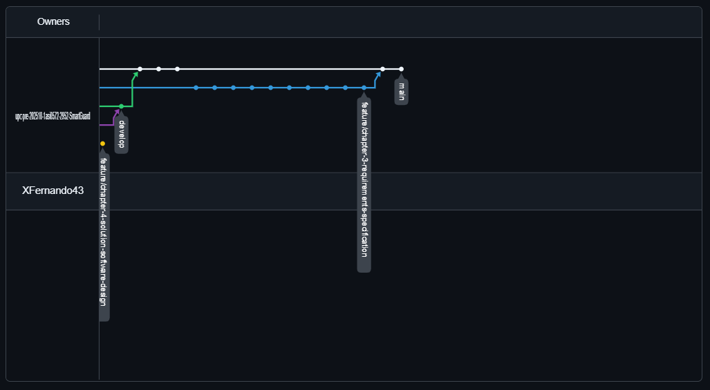
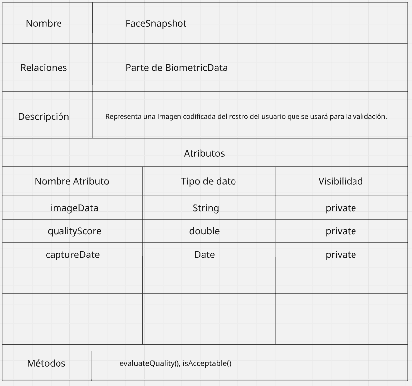
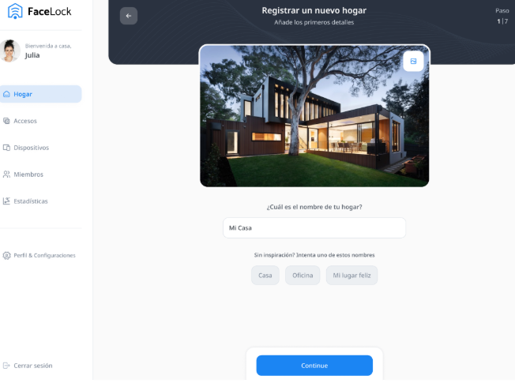
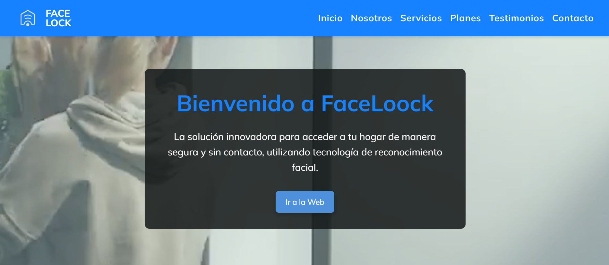

# 
COURSE PROJECT

    <strong>Universidad Peruana de Ciencias Aplicadas</strong> 
    </img> 
    <strong>Ingeniería de Software</strong> 
    <strong>2025-10 </strong>
    <strong>1ASI0572 Desarrollo de Soluciones IOT - 2952</strong> 
    <strong>Profesor: Marco Antonio Leon Baca</strong> 
     <strong>Informe del Trabajo Final </strong>
    <strong>Grupo 3</strong>

    <strong>Startup: SmartGuard</strong> 
    <strong>Producto: FaceLoock </strong>

    <h3>Team Members:</h3>
    <table align="center">
        <tr>
            <th style="text-align:center;">Member</th>
            <th style="text-align:center;">Code</th>
        </tr>
        <tr>
            <td>Fernando Aquino Iman</td>
            <td>U20171E997</td>
        </tr>
        <tr>
            <td>Pérez García David Alexander</td>
            <td>U202222942</td>
        </tr>
        <tr>
            <td>Gonzales Gomez, Antonella Frida</td>
            <td>U20211c403</td>
        </tr>
        <tr>
            <td>Ramos Najar, Tony Alexander</td>
            <td>u20211a153</td>
        </tr>
        <tr>
            <td>Zárate Gamarra, Luis Alejandro</td>
            <td>u20181h198</td>
        </tr>
    </table>

    <strong>Marzo, 2025</strong>

 

<h1 align="center">Registro de versiones del Informe</h1>
 
<table>
    <thead>
        <tr>
            <th>Versión</th>
            <th>Fecha</th>
            <th>Autor</th>
            <th>Descripción de modificaciones</th>
        </tr>
    </thead>
    <tbody>
        <tr>
            <th>TB1</th>
            <td>20/04/2025</td>
            <td>
                <ul>
                    <li>Fernando Aquino Iman</li>
                    <li>Pérez García David Alexander</li>
                    <li>Gonzales Gomez, Antonella Frida</li>
                    <li>Ramos Najar, Tony Alexander</li>
                    <li>Zárate Gamarra, Luis Alejandro</li>
                </ul>
            </td>
            <td>            
                <ul>
                    <li>Capítulo I: Introducción</li>
                    <li>Capítulo II: Requirements Elicitation & Analysis</li>
                    <li>Capítulo III: Requirements Specification</li>
                    <li>Capítulo IV: Solution Software Design</li>
                    <li>Avance de Conclusiones, Bibliografía y Anexos</li>
                </ul>
            </td>
        </tr>
        <tr>
            <th>TP</th>
            <td></td>
            <td>
                <ul>
                </ul>
            </td>
            <td>            
                <ul>
                </ul>
            </td>
        </tr>
        <tr>
            <th>TB2</th>
            <td></td>
            <td>
                <ul>
                </ul>
            </td>
            <td>            
                <ul>
                </ul>
            </td>
        </tr>
        <tr>
            <th>TF</th>
            <td></td>
            <td>
                <ul>
                </ul>
            </td>
            <td>            
                <ul>
                </ul>
            </td>
        </tr>
    </tbody>
</table>

# Project Report Collaboration Insights

TB1:

TP:

TB2:

TF:

# Contenido
[Student Outcome](#student-outcome)

[Capítulo I: Introducción](#capítulo-i-introducción)
- [1.1. Startup Profile](#11-startup-profile)
  - [1.1.1. Descripción de la Startup](#111-descripción-de-la-startup)
  - [1.1.2. Perfiles de integrantes del equipo](#112-perfiles-de-integrantes-del-equipo)
- [1.2. Solution Profile](#12-solution-profile)
  - [1.2.1 Antecedentes y problemática](#121-antecedentes-y-problemática)
  - [1.2.2 Lean UX Process](#122-lean-ux-process)
    - [1.2.2.1. Lean UX Problem Statements](#1221-lean-ux-problem-statements)
    - [1.2.2.2. Lean UX Assumptions](#1222-lean-ux-assumptions)
    - [1.2.2.3. Lean UX Hypothesis Statements](#1223-lean-ux-hypothesis-statements)
    - [1.2.2.4. Lean UX Canvas](#1224-lean-ux-canvas)
- [1.3. Segmentos objetivo](#13-segmentos-objetivo)

[Capítulo II: Requirements Elicitation & Analysis](#capítulo-ii-requirements-elicitation--analysis)
- [2.1. Competidores](#21-competidores)
  - [2.1.1. Análisis competitivo](#211-análisis-competitivo)
  - [2.1.2. Estrategias y tácticas frente a competidores](#212-estrategias-y-tácticas-frente-a-competidores)
- [2.2. Entrevistas](#22-entrevistas)
  - [2.2.1. Diseño de entrevistas](#221-diseño-de-entrevistas)
  - [2.2.2. Registro de entrevistas](#222-registro-de-entrevistas)
  - [2.2.3. Análisis de entrevistas](#223-análisis-de-entrevistas)
- [2.3. Needfinding](#23-needfinding)
  - [2.3.1. User Personas](#231-user-personas)
  - [2.3.2. User Task Matrix](#232-user-task-matrix)
  - [2.3.3. User Journey Mapping](#233-user-journey-mapping)
  - [2.3.4. Empathy Mapping](#234-empathy-mapping)
  - [2.3.5. As-is Scenario Mapping](#235-as-is-scenario-mapping)
- [2.4. Ubiquitous Language](#24-ubiquitous-language)

[Capítulo III: Requirements Specification](#capítulo-iii-requirements-specification)
- [3.1. To-Be Scenario Mapping](#31-to-be-scenario-mapping)
- [3.2. User Stories](#32-user-stories)
- [3.3. Impact Mapping](#33-impact-mapping)
- [3.4. Product Backlog](#34-product-backlog)

[Capítulo IV: Solution Software Design](#capítulo-iv-solution-software-design)
- [4.1. Strategic-Level Domain-Driven Design](#41-strategic-level-domain-driven-design)
  - [4.1.1. EventStorming](#411-eventstorming)
    - [4.1.1.1. Candidate Context Discovery](#4111-candidate-context-discovery)
    - [4.1.1.2. Domain Message Flows Modeling](#4112-domain-message-flows-modeling)
    - [4.1.1.3. Bounded Context Canvases](#4113-bounded-context-canvases)
  - [4.1.2. Context Mapping](#412-context-mapping)
  - [4.1.3. Software Architecture](#413-software-architecture)
    - [4.1.3.1. Software Architecture System Landscape Diagram](#4131-software-architecture-system-landscape-diagram)
    - [4.1.3.2. Software Architecture Context Level Diagrams](#4132-software-architecture-context-level-diagrams)
    - [4.1.3.3. Software Architecture Container Level Diagrams](#4133-software-architecture-container-level-diagrams)
    - [4.1.3.4. Software Architecture Deployment Diagrams](#4134-software-architecture-deployment-diagrams)
- [4.2. Tactical-Level Domain-Driven Design](#42-tactical-level-domain-driven-design)
  - [4.2.1. Bounded Context: <Bounded Context Name>](#421-bounded-context-bounded-context-name)
    - [4.2.1.1. Domain Layer](#4211-domain-layer)
    - [4.2.1.2. Interface Layer](#4212-interface-layer)
    - [4.2.1.3. Application Layer](#4213-application-layer)
    - [4.2.1.4. Infrastructure Layer](#4214-infrastructure-layer)
    - [4.2.1.5. Bounded Context Software Architecture Component Level Diagrams](#4215-bounded-context-software-architecture-component-level-diagrams)
    - [4.2.1.6. Bounded Context Software Architecture Code Level Diagrams](#4216-bounded-context-software-architecture-code-level-diagrams)
      - [4.2.1.6.1 Bounded Context Domain Layer Class Diagrams](#42161-bounded-context-domain-layer-class-diagrams)
      - [4.2.1.6.2 Bounded Context Database Design Diagram](#42162-bounded-context-database-design-diagram)

[Capítulo V: Solution UI/UX Design](#capítulo-v-solution-uiux-design)  
- [5.1. Style Guidelines](#51-style-guidelines)  
  - [5.1.1. General Style Guidelines](#511-general-style-guidelines)  
  - [5.1.2. Web, Mobile and IoT Style Guidelines](#512-web-mobile-and-iot-style-guidelines)  
- [5.2. Information Architecture](#52-information-architecture)  
  - [5.2.1. Organization Systems](#521-organization-systems)  
  - [5.2.2. Labeling Systems](#522-labeling-systems)  
  - [5.2.3. SEO Tags and Meta Tags](#523-seo-tags-and-meta-tags)  
  - [5.2.4. Searching Systems](#524-searching-systems)  
  - [5.2.5. Navigation Systems](#525-navigation-systems)  
- [5.3. Landing Page UI Design](#53-landing-page-ui-design)  
  - [5.3.1. Landing Page Wireframe](#531-landing-page-wireframe)  
  - [5.3.2. Landing Page Mock-up](#532-landing-page-mock-up)  
- [5.4. Applications UX/UI Design](#54-applications-uxui-design)  
  - [5.4.1. Applications Wireframes](#541-applications-wireframes)  
  - [5.4.2. Applications Wireflow Diagrams](#542-applications-wireflow-diagrams)  
  - [5.4.2. Applications Mock-ups](#542-applications-mock-ups)  
  - [5.4.3. Applications User Flow Diagrams](#543-applications-user-flow-diagrams)  
- [5.5. Applications Prototyping](#55-applications-prototyping)

[Capítulo VI: Product Implementation, Validation & Deployment](#capítulo-vi-product-implementation-validation--deployment)  
- [6.1. Software Configuration Management](#61-software-configuration-management)  
  - [6.1.1. Software Development Environment Configuration](#611-software-development-environment-configuration)  
  - [6.1.2. Source Code Management](#612-source-code-management)  
  - [6.1.3. Source Code Style Guide & Conventions](#613-source-code-style-guide--conventions)  
  - [6.1.4. Software Deployment Configuration](#614-software-deployment-configuration)  
- [6.2. Landing Page, Services & Applications Implementation](#62-landing-page-services--applications-implementation)  
  - [6.2.X. Sprint n](#62x-sprint-n)  
    - [6.2.X.1. Sprint Planning n](#62x1-sprint-planning-n)  
    - [6.2.X.2.](#62x2)  
    - [6.2.X.3.](#62x3)  
    - [6.2.X.4.](#62x4)  
    - [6.2.X.5.](#62x5)  
    - [6.2.X.6.](#62x6)  
    - [6.2.X.7.](#62x7)  
    - [6.2.X.8.](#62x8)  
    - [6.2.X.9.](#62x9)  
- [6.3. Validation Interviews](#63-validation-interviews)  
  - [6.3.1. Diseño de Entrevistas](#631-diseño-de-entrevistas)  
  - [6.3.2. Registro de Entrevistas](#632-registro-de-entrevistas)  
  - [6.3.3. Evaluaciones según heurísticas](#633-evaluaciones-según-heurísticas)  
- [6.4. Video About-the-Product](#64-video-about-the-product)

[Conclusiones](#conclusiones)
- [Conclusiones y recomendaciones](#conclusiones-y-recomendaciones)
- [Video About-the-Team](#video-about-the-team)

[Bibliografía](#bibliografía)

[Anexos](#anexos)

# Student Outcome
ABET – EAC - Student Outcome 5

Criterio: La capacidad de funcionar efectivamente en un equipo cuyos miembros juntos proporcionan liderazgo, crean un entorno de colaboración e inclusivo, establecen objetivos, planifican tareas y cumplen objetivos

<table>
  <tr>
    <td><b>Criterio específico</b></td>
    <td><b>Acciones realizadas</b></td>
    <td><b>Conclusiones</b></td>
  </tr>

  <tr>
    <td><b>Trabajo en equipo para proporcionar liderazgo en forma conjunta.</b></td>
    <td>
      <b>Luis Alejandro Zárate Gamarra</b>  Al desarrollar el capítulo 1, lideré la estructuración del perfil de nuestra startup y colaboré activamente en la redacción de la misión, visión y descripción de la solución tecnológica propuesta. También participé en sesiones de EventStorming y Context Mapping, proponiendo ideas clave para definir los bounded contexts del sistema FaceLoock.  
      <b>Gonzales Gomez, Antonella Frida</b>  Desarrollé el capítulo 4 sobre Context Mapping, creando diagramas de arquitectura de software a nivel de contexto, componentes y contenedores. También realicé los diagramas de clases y base de datos para los dos bounded contexts.  
      <b>Pérez García, David Alexander</b> <b>TB1</b>  Desarrollé el capítulo 2, el cual abarca el análisis de los potenciales competidores, así como la definición de los user persona para cada segmento objetivo, incluyendo las matrices de segmentación (user tax metrics), el user journey mapping, el empathy mapping, y el as-is scenario mapping.  
        <b>TP</b> En esta entrega se realizó la configuración del deployment en Netlify para la aplicación web. Asimismo, se había desarrollado previamente la codificación de la aplicación web siguiendo las vistas definidas en el prototipo de Figma.  
      <b>Ramos Najar, Tony Alexander</b>  <b>TB1</b> En esta entrega del proyecto, me encargué de diseñar el desarrollo de los 10 pasos del Domain-Driven Design. Desde la definición de eventos de dominio hasta la identificación de los bounded contexts, propuse ideas y enfoqué el trabajo para que todos estuviéramos alineados. Usamos herramientas como Miro para organizarnos mejor y entender el dominio del sistema en conjunto, lo que ayudó bastante a que todos pudiéramos aportar de forma clara y con objetivos comunes.  <b>TP</b>  Durante la entrega del TP, me enfoque en diseñar los wireframes y Mockups de nuestro sitio web para una correcta interaccion con el usuario, ademas de que sea intuitiva 
        <b>Aquino Iman Herly Fernando</b>  Me encargué del desarrollo del capítulo 3, que abarca la Especificación de Requerimientos. Validé y prioricé los requisitos funcionales y no funcionales del sistema en coordinación con el equipo. Además, elaboré los artefactos To-Be Scenario Mapping e Impact Mapping, los cuales orientaron la alineación entre objetivos estratégicos y funcionalidades clave del sistema.
    </td>
    <td>Consideramos que la participación activa facilitó el desarrollo de esta primera fase del proyecto, promoviendo una visión clara de la idea y contribuyendo al avance coordinado hacia los objetivos planteados.</td>
  </tr>

  <tr>
    <td><b>Creo condiciones para el trabajo articulado, priorizo tareas y cumplo los objetivos establecidos.</b></td>
    <td>
      <b>Luis Alejandro Zárate Gamarra</b>  Durante el desarrollo del capítulo 1, promoví un ambiente de trabajo colaborativo e inclusivo. Aporté en la planificación de tareas y organización de entregables del equipo, especialmente en el diseño de la arquitectura del sistema a nivel de contenedores y despliegue. Coordiné tiempos y responsabilidades para asegurar el cumplimiento de los objetivos del proyecto.  
      <b>Gonzales Gomez, Antonella Frida</b>  Trabajé de manera colaborativa en la planificación y diseño de los diagramas y modelos del sistema, cumpliendo con los plazos establecidos y asegurando una alineación constante con el equipo para realizar las entregas a tiempo.  
      <b>Pérez García, David Alexander</b>  Fomenté un entorno colaborativo e inclusivo, establecí metas claras, planifiqué las tareas correspondientes a cada capítulo del reporte y aseguré el cumplimiento de los objetivos establecidos.  
      <b>Ramos Najar, Tony Alexander</b>  <b>TB1</b> Me encargué de dividir dos bounded contexts en capas (interfaz, dominio e infraestructura), para ordenar mejor el diseño de la solución. Usé Visual Paradigm para armar diagramas C4 que ayudaron a que todo el equipo entienda cómo se conecta cada parte del sistema. Gracias a esto, logramos organizarnos mejor, establecer metas claras y avanzar en el desarrollo respetando los tiempos que nos propusimos.  
        <b>TP</b>  Los mockups fueron importantes para ver el flujo que tendra nuestro sitio web con el usuario, ademas el prototipo de pantalla ayudo a organizar mejor nuestras ideas
        <b>Aquino Iman Herly Fernando</b>  Desarrollé el capítulo 3: Especificación de Requerimientos, coordinando con el equipo para validar y priorizar los requisitos funcionales y no funcionales del sistema. Además, elaboré los artefactos To-Be Scenario Mapping e Impact Mapping, los cuales guiaron la definición de objetivos estratégicos y su alineación con las funcionalidades del sistema. Promoví un entorno de trabajo colaborativo al integrar los aportes del equipo en los entregables y asegurar la coherencia entre las secciones del documento. Establecí metas claras, planifiqué las tareas con plazos definidos y cumplí con los entregables en los tiempos acordados, contribuyendo al avance ordenado del proyecto.
    </td>
    <td>Gracias a una planificación efectiva y una comunicación constante entre los integrantes del equipo, logramos cumplir con los objetivos propuestos, demostrando un trabajo en equipo cohesionado y orientado al logro.</td>
  </tr>
</table>

# Capítulo I: Introducción
## 1.1. Startup Profile
A continuación, procederemos a informar sobre a lo que se dedica nuestra startup “SmartGuard”, así como la presentación del equipo de desarrollo del producto, software presentado anteriormente, “FaceLoock”.
### 1.1.1. Descripción de la Startup

    <strong>SmartGuard</strong> es una startup tecnológica orientada a desarrollar soluciones de seguridad residencial inteligentes.
    Nuestra misión es transformar la forma en que las personas protegen sus hogares mediante el uso de tecnologías avanzadas, confiables y fáciles de usar.
    Apostamos por la innovación y la comodidad como ejes principales en el desarrollo de nuestros productos.
  

  

    El primer producto de SmartGuard es <strong>"FaceLoock"</strong>, un sistema de reconocimiento facial para el acceso a viviendas,
    que busca reemplazar el uso de llaves tradicionales por una solución segura y sin contacto físico.
    FaceLoock se enfoca en usuarios que desean modernizar la seguridad de su hogar mediante tecnología biométrica.
  

  <h4><strong>Misión</strong></h4>
  

    Transformar la forma en que las personas protegen sus hogares mediante el uso de tecnologías avanzadas, confiables y fáciles de usar.
  

  <h4><strong>Visión</strong></h4>
  

    Ser líderes en soluciones de seguridad residencial inteligente en América Latina,
    ofreciendo productos innovadores que mejoren la calidad de vida de nuestros usuarios.
  

### 1.1.2. Perfiles de integrantes del equipo

<table border="1" cellpadding="10" cellspacing="0">
  <thead>
    <tr>
      <th>Perfil</th>
      <th>Descripción</th>
    </tr>
  </thead>
  <tbody>
    <tr>
      <td></td>
      <td>Mi nombre es Tony Ramos, estoy cursando el 9no ciclo de la carrera de Ingeniería de Software. Me considero hábil en el ámbito de la programación en los lenguajes, Python, Javascript, y últimamente estoy aprendiendo Angular. Con respeto a mi, me considero una persona responsable, con ganas de aprender y a superarme a mi mismo.</td>
    </tr>
    <tr>
      <td></td>
      <td>Mi nombre es Antonella, actualmente estoy cursando el 9no ciclo de la carrera de ingeniería de software. Tengo conocimientos de distintos lenguajes de programación como Java, Node.js, C#, y diferentes frameworks. Me gusta trabajar en equipo responsablemente.</td>
    </tr>
    <tr>
      <td></td>
      <td>Mi nombre es Fernando, actualmente estoy cursando el 8vo ciclo de la carrera de ingeniería de software. Tengo conocimiento desarrollando plataformas web para la gestión empresarial, me encanta la innovación y el aprendizaje constante. Cada desafío es una oportunidad de avanzar y desarrollarme profesionalmente.</td>
    </tr>
    <tr>
      <td></td>
      <td>Mi nombre es David, actualmente soy estudiante de Ingeniería de Software (7mo ciclo). Me especializo en el desarrollo de aplicaciones web, trabajando de forma independiente en proyectos de programación. Tengo experiencia en lenguajes como  TypeScript, Java y PHP, utilizando tecnologías modernas como React, Next.js, Spring Boot, Express y Laravel. Apasionado por la tecnología y el aprendizaje continuo, siempre busco mejorar mis habilidades y asumir nuevos desafíos en el mundo del desarrollo de software.</td>
    </tr>
    <tr>
      <td></td>
      <td>Mi nombre es Alejandro, actualmente curso el 7mo ciclo de la carrera de Ingeniería de Software. Tengo experiencia en programación con lenguajes como Python, JavaScript y Java, y he trabajado con frameworks como React y tecnologías como .NET. Me considero una persona responsable, proactiva y con un fuerte compromiso por seguir aprendiendo y superándome constantemente en el ámbito profesional y personal.</td>
    </tr>
  </tbody>
</table>

## 1.2. Solution Profile
### 1.2.1 Antecedentes y problemática

<h3>Antecedente</h3>
  

    En la actualidad, el uso de llaves físicas continúa siendo el método más común para acceder a viviendas. 
    Sin embargo, este sistema presenta diversas vulnerabilidades: extravío de llaves, duplicación no autorizada, robos o situaciones de emergencia 
    donde el acceso rápido se ve limitado. Estas condiciones generan un entorno propenso a riesgos y afectan la percepción de seguridad de los usuarios 
    en sus propios hogares.
  

  <h3>Problemática – Enfoque con las 5W + 2H</h3>
  <ul>
    <li><strong>What?</strong> Las personas enfrentan problemas de seguridad y practicidad debido a la dependencia de llaves físicas para el ingreso a sus hogares.</li>
    <li><strong>Why?</strong> Porque las llaves pueden perderse, duplicarse sin permiso o ser robadas, generando inseguridad. Además, su uso requiere contacto físico, lo cual puede ser incómodo o riesgoso en ciertas circunstancias.</li>
    <li><strong>Who?</strong> A propietarios de viviendas, familias y personas que buscan mejorar la seguridad y accesibilidad en su entorno residencial.</li>
    <li><strong>When?</strong> De manera cotidiana, especialmente en situaciones imprevistas como olvidos, emergencias médicas, o pérdida de llaves.</li>
    <li><strong>Where?</strong> En zonas residenciales urbanas y suburbanas donde aún se emplean métodos de acceso tradicionales.</li>
    <li><strong>How?</strong> A través de experiencias negativas como bloqueos de acceso, necesidad de copias físicas adicionales, o temor a intrusiones por pérdida o robo de llaves.</li>
    <li><strong>How Much?</strong> El impacto varía, pero puede traducirse en costos económicos (cambio de cerraduras), pérdida de tiempo, estrés y una constante sensación de vulnerabilidad.</li>
  </ul>

### 1.2.2 Antecedentes y problemática
#### 1.2.2.1 Lean UX Hypothesis Statements

  <article>
    <h3>Propietarios de viviendas</h3>
    

      Las personas que poseen una vivienda desean garantizar la seguridad de su hogar, pero muchas veces confían únicamente en llaves físicas 
      que pueden perderse, ser duplicadas sin consentimiento o forzadas. Además, no siempre se tiene control sobre quién ha ingresado o en qué momento.
    

    
<strong>¿Cómo pueden los propietarios acceder a sus hogares y gestionar el acceso de forma segura, moderna y sin depender de llaves físicas?</strong>

  </article>

  <article>
    <h3>Adultos mayores o personas con movilidad reducida</h3>
    

      Este grupo enfrenta dificultades al manipular llaves físicas, lo cual puede limitar su autonomía o poner en riesgo su seguridad en situaciones urgentes.
    

    
<strong>¿Cómo pueden acceder fácilmente a sus viviendas sin depender del uso físico de llaves o ayuda de terceros?</strong>

  </article>

#### 1.2.2.2  Lean UX Assumptions
<section id="business-assumptions">
  <h4>Business Assumptions</h4>
  <ul>
    <li>Creemos que nuestros clientes necesitan una solución moderna, segura y sin contacto físico para acceder a sus hogares.</li>
    <li>Estas necesidades pueden resolverse mediante un sistema de reconocimiento facial que permita a los usuarios entrar a su vivienda sin necesidad de llaves tradicionales ni tarjetas.</li>
    <li>Nuestros clientes iniciales son propietarios de viviendas tecnológicas, personas interesadas en domótica, y usuarios preocupados por mejorar los niveles de seguridad de sus hogares.</li>
    <li>El valor número 1 que un cliente busca en nuestros servicios es la seguridad sin fricciones, es decir, poder ingresar a su hogar de forma segura, rápida y sin complicaciones.</li>
    <li>El cliente también puede obtener estos servicios adicionales:
      <ul>
        <li>Control de acceso mediante aplicación móvil</li>
        <li>Historial de accesos por usuario</li>
        <li>Integración con sistemas de domótica</li>
        <li>Notificaciones en tiempo real ante intentos fallidos de reconocimiento</li>
      </ul>
    </li>
    <li>Vamos a adquirir la mayoría de nuestros clientes a través de estrategias de marketing digital en redes sociales como Instagram, YouTube y LinkedIn, así como demostraciones en ferias de tecnología y alianzas con inmobiliarias o empresas de domótica.</li>
    <li>Haremos dinero mediante la venta del sistema FaceLoock y un modelo de suscripción mensual para funciones premium (notificaciones avanzadas, respaldo en la nube, control remoto, integración con múltiples dispositivos).</li>
    <li>La competencia principal en el mercado nacional es limitada, ya que la mayoría de sistemas similares son importados y no están optimizados para el contexto local. A nivel internacional, existen sistemas de reconocimiento facial para acceso, pero sus precios son elevados y no están pensados para residencias en América Latina.</li>
    <li>Nuestra ventaja competitiva radica en el precio accesible, la facilidad de instalación, la personalización local y las integraciones con otros sistemas del hogar.</li>
    <li>Nuestro mayor riesgo es la desconfianza en la precisión y seguridad del reconocimiento facial. Resolveremos esto mediante campañas de sensibilización, pruebas públicas de eficacia, garantías de satisfacción, y auditorías de seguridad que validen la calidad del sistema.</li>
  </ul>
</section>

<section id="business-outcomes">
  <h4>Business Outcomes</h4>
  <ul>
    <li>Incremento en la percepción de seguridad residencial: Mejorar la percepción de seguridad en los hogares de nuestros usuarios en un 30% dentro de los primeros 12 meses, a través de encuestas y reportes post-implementación.</li>
    <li>Adopción tecnológica masiva en hogares: Lograr una adopción del sistema FaceLoock en al menos el 10% de residencias con sistemas de domótica dentro del primer año.</li>
    <li>Reconocimiento de marca y confianza: Alcanzar una tasa de reconocimiento de marca del 35% entre los usuarios interesados en seguridad inteligente dentro de los primeros 18 meses, reforzada por influencers tecnológicos y alianzas estratégicas.</li>
    <li>Ingresos sostenibles: Alcanzar un crecimiento del 15% mensual en ventas del sistema FaceLoock y suscripciones premium, generando ingresos recurrentes estables.</li>
    <li>Liderazgo en el mercado nacional: Posicionarnos como la primera opción de seguridad inteligente residencial en Perú y expandirnos a otros países de América Latina en un plazo de 24 meses.</li>
  </ul>
</section>

<section id="user-assumptions">
  <h4>User Assumptions</h4>
  <ul>
    <li><strong>Seguridad y conveniencia:</strong> Los usuarios desean una solución que garantice un alto nivel de seguridad mientras les permite ingresar a sus hogares de manera rápida y sin complicaciones. Prefieren la comodidad de no depender de llaves físicas ni tarjetas.</li>
    <li><strong>Preocupación por la privacidad:</strong> Los usuarios valoran la privacidad de sus datos y buscan sistemas de reconocimiento facial que ofrezcan garantías de seguridad, con almacenamiento de datos mínimamente accesibles y encriptados.</li>
    <li><strong>Facilidad de uso:</strong> Los usuarios desean un sistema intuitivo, fácil de instalar y utilizar, con opciones claras y accesibles para gestionar el acceso y configurar notificaciones a través de una aplicación móvil.</li>
    <li><strong>Interconexión con otros dispositivos:</strong> Los usuarios valoran la capacidad de integración del sistema de reconocimiento facial con otros dispositivos de domótica ya presentes en sus hogares, como cámaras de seguridad, sistemas de luces inteligentes y termostatos.</li>
    <li><strong>Seguridad en caso de fallos:</strong> Los usuarios esperan que el sistema ofrezca opciones alternativas de acceso en caso de fallos en el reconocimiento facial, como códigos temporales o acceso remoto mediante la aplicación móvil.</li>
    <li><strong>Confianza en la tecnología:</strong> Los usuarios tienen dudas sobre la precisión y seguridad del sistema de reconocimiento facial, especialmente en condiciones de poca luz o ante personas con características similares. Esperan pruebas públicas y auditorías que validen la eficacia del sistema.</li>
  </ul>
</section>

<section id="user-outcomes">
  <h4>User Outcomes</h4>
  <ul>
    <li><strong>Acceso sin fricciones:</strong> Los usuarios pueden ingresar a su hogar de manera rápida y sin inconvenientes, sin necesidad de llaves o tarjetas. El sistema reconoce a los usuarios con alta precisión y eficacia.</li>
    <li><strong>Mayor control sobre la seguridad del hogar:</strong> Los usuarios reciben notificaciones en tiempo real sobre intentos fallidos de acceso y pueden revisar el historial de entradas para tener visibilidad sobre las personas que acceden a su hogar.</li>
    <li><strong>Tranquilidad y confianza:</strong> Los usuarios sienten que sus hogares están mejor protegidos gracias a un sistema de seguridad robusto que les brinda un control total y acceso remoto. Además, tienen confianza en que sus datos están seguros gracias a las auditorías de seguridad.</li>
    <li><strong>Satisfacción con la integración domótica:</strong> Los usuarios disfrutan de la interconexión del sistema de reconocimiento facial con otros dispositivos inteligentes en el hogar, como luces y cámaras, para mejorar la comodidad y el control.</li>
    <li><strong>Flexibilidad en el acceso:</strong> En caso de problemas con el reconocimiento facial, los usuarios tienen opciones alternativas para acceder a su hogar sin complicaciones, como códigos de acceso temporales o control remoto.</li>
  </ul>
</section>

<section id="features">
  <h4>Features</h4>
  <ul>
    <li><strong>Reconocimiento Facial Avanzado:</strong> Sistema de reconocimiento facial rápido, preciso y con alta tasa de fiabilidad en diversas condiciones de luz y distancia.</li>
    <li><strong>Aplicación Móvil de Control:</strong> Aplicación móvil que permite gestionar accesos, recibir notificaciones, revisar el historial de entradas y controlar remotamente las funciones del sistema.</li>
    <li><strong>Integración Domótica:</strong> Funcionalidad de integración con otros dispositivos inteligentes en el hogar, como cámaras, luces, y termostatos, para un control unificado.</li>
    <li><strong>Historial de Accesos:</strong> Registro detallado de todas las entradas al hogar, mostrando la hora, fecha y usuario que accedió, disponible en la aplicación móvil.</li>
    <li><strong>Notificaciones en Tiempo Real:</strong> Alertas instantáneas en la aplicación móvil ante intentos fallidos de reconocimiento facial, proporcionando detalles sobre la ubicación y la hora del intento.</li>
    <li><strong>Acceso Alternativo:</strong> Opciones de acceso alternativo en caso de fallos en el reconocimiento facial, como códigos temporales o acceso remoto a través de la aplicación móvil.</li>
    <li><strong>Ajustes de Seguridad Avanzados:</strong> Funciones adicionales de seguridad, como la encriptación de datos y auditorías periódicas, para garantizar la privacidad y la protección de los usuarios.</li>
    <li><strong>Suscripción Premium:</strong> Acceso a funciones avanzadas, como almacenamiento en la nube, soporte prioritario y control de múltiples dispositivos a través de un modelo de suscripción mensual.</li>
  </ul>
</section>

#### 1.2.2.3  Lean UX Hypothesis Statements

<section id="hipotesis-solucion">
  <ul>
    <li>
      <strong>Hipótesis sobre la solución de reconocimiento facial:</strong>  
      Creemos que si desarrollamos un sistema de reconocimiento facial eficiente y preciso, los usuarios podrán acceder a sus viviendas de manera más segura y conveniente que utilizando llaves tradicionales. Esta solución puede satisfacer sus necesidades de seguridad, control de acceso y conveniencia, brindando una experiencia sin fricciones y un alto nivel de confianza en la protección de sus hogares.
    </li>
    <li>
      <strong>Hipótesis sobre la experiencia de usuario y control móvil:</strong>  
      Creemos que si los usuarios pueden gestionar los accesos a través de una aplicación móvil intuitiva, recibir notificaciones en tiempo real sobre intentos fallidos de acceso y revisar el historial de entradas, estarán más satisfechos con el control y la seguridad de su hogar. Esto aumentará la percepción de seguridad y permitirá una experiencia fluida y moderna en su vida diaria.
    </li>
    <li>
      <strong>Hipótesis sobre la integración con sistemas domóticos:</strong>  
      Creemos que si integramos nuestro sistema de reconocimiento facial con otros dispositivos de domótica como cámaras, luces y termostatos, los usuarios experimentarán una mayor comodidad y control de su entorno, lo que les permitirá optimizar la seguridad y la eficiencia energética en su hogar. Esta integración será una característica valorada por los usuarios interesados en soluciones tecnológicas avanzadas.
    </li>
    <li>
      <strong>Hipótesis sobre la confianza en la tecnología:</strong>  
      Creemos que si proporcionamos pruebas públicas y auditorías de seguridad que validen la eficacia del sistema de reconocimiento facial, los usuarios ganarán confianza en la tecnología, especialmente aquellos que inicialmente tienen dudas sobre la precisión y seguridad del sistema. Esto reducirá el riesgo de desconfianza y aumentará la adopción del sistema.
    </li>
    <li>
      <strong>Hipótesis sobre el acceso alternativo:</strong>  
      Creemos que si ofrecemos opciones alternativas de acceso, como códigos temporales o acceso remoto a través de la aplicación móvil en caso de fallos en el reconocimiento facial, los usuarios se sentirán más seguros y respaldados, sabiendo que siempre tendrán una solución para acceder a su hogar sin inconvenientes, incluso si hay fallos técnicos en el sistema de reconocimiento facial.
    </li>
  </ul>
</section>

#### 1.2.2.4. Lean UX Canvas  

## 1.3. Segmentos objetivo

<section id="segmentos-usuarios">

  <article>
    <h4>Propietarios de Viviendas Tecnológicas</h4>
    

      Este segmento está compuesto por individuos que ya están familiarizados con la tecnología y buscan integrar soluciones inteligentes en sus hogares. 
      Los propietarios de viviendas tecnológicas desean modernizar sus sistemas de seguridad mediante soluciones avanzadas, como el reconocimiento facial. 
      Este grupo valora la innovación, la comodidad y la automatización de sus hogares, y está dispuesto a invertir en productos que mejoren la seguridad y eficiencia de su vida diaria.
    

    <h4>Características clave:</h4>
    <ul>
      <li>Interés en soluciones de domótica y hogares inteligentes.</li>
      <li>Preocupación por la seguridad y el control de acceso.</li>
      <li>Valoración de la comodidad y la conveniencia.</li>
      <li>Propietarios de casas unifamiliares o apartamentos con enfoque en tecnología avanzada.</li>
    </ul>
  </article>

  <article>
    <h4>Adultos Mayores o Personas con Movilidad Reducida</h4>
    

      Este segmento incluye personas mayores o individuos con movilidad reducida que enfrentan dificultades al manipular llaves tradicionales. 
      Buscan una solución que les permita acceder a sus hogares sin esfuerzo físico, mejorando su autonomía y reduciendo el riesgo de accidentes o fallos en situaciones de emergencia. 
      La solución de reconocimiento facial representa una forma accesible y segura para ingresar a su vivienda sin depender de la ayuda de terceros.
    

    <h4>Características clave:</h4>
    <ul>
      <li>Necesidad de soluciones de fácil acceso y sin contacto físico.</li>
      <li>Preocupación por la seguridad personal y la autonomía.</li>
      <li>Valoran la facilidad de uso y la confiabilidad del sistema.</li>
      <li>Pueden vivir en viviendas unifamiliares o departamentos, especialmente en comunidades de adultos mayores.</li>
    </ul>
  </article>
</section>

# **Capítulo II: Requirements Elicitation & Analysis**

## 2.1. Competidores.

<table>
    <thead>
        <tr>
            <th>Nombre del Competidor</th>
            <th>Descripción</th>
        </tr>
    </thead>
    <tbody>
        <tr>
            <td rowspan="2" align="center">
                
                 Ring (Amazon)
            </td>
            <td>Ring ofrece un sistema completo de seguridad para el hogar, incluyendo videoporteros y cámaras de seguridad conectadas. Está integrado con Alexa y los servicios de Amazon.</td>
        </tr>
        <tr>
            <td>Página web: <a href="https://ring.com" target="_blank">https://ring.com</a></td>
        </tr>
        <tr>
            <td rowspan="2" align="center">
                
                 Nest (Google)
            </td>
            <td>Nest ofrece un ecosistema de automatización del hogar con productos como cámaras, termostatos, sensores y sistemas de seguridad. Está fuertemente integrado con Google Home.</td>
        </tr>
        <tr>
            <td>Página web: <a href="https://store.google.com/us/category/connected_home" target="_blank">https://store.google.com/us/category/connected_home</a></td>
        </tr>
        <tr>
            <td rowspan="2" align="center">
                
                 August
            </td>
            <td>August es conocida por sus cerraduras inteligentes y soluciones de acceso sin llaves. Compatible con Alexa, Google Assistant y Siri para control remoto y acceso inteligente.</td>
        </tr>
               <tr>
            <td>Página web: <a href="https://august.com/" target="_blank">https://august.com</a></td>
        </tr>
    </tbody>
</table>

### 2.1.1. Análisis competitivo.

<table style="width: 100%;">
  <tr>
    <th colspan="6" style="padding: 8px; text-align: center;"> Competitive Analysis Landscape</th>
  </tr>
  <tr>
    <td>¿Por qué llevar a cabo este análisis?</td>
    <td colspan="5">Para identificar fortalezas, oportunidades y áreas de mejora frente a los competidores; posicionar mejor el producto FaceLoock en el mercado y tomar decisiones estratégicas de desarrollo, marketing y precios.
</td>
  </tr>
  <tr>
    <td colspan="2"></td>
  <td align="center"> </td>
  <td align="center"> </td>
  <td align="center"> </td>
  <td align="center"> </td>
  </tr>
<tr>
  <td rowspan="2" align="center">Perfil</td>
  <td align="center">Overview</td>
  <td>Sistema de seguridad inteligente con enfoque en videoporteros y cámaras conectadas, con fuerte integración en el ecosistema de Amazon y Alexa.</td>
  <td>Solución integral de domótica y seguridad, integrada completamente con Google Home, que incluye cámaras, sensores y automatización del hogar.</td>
  <td>Empresa especializada en cerraduras inteligentes enfocadas en accesos remotos sin llaves, con compatibilidad con Siri, Alexa y Google Assistant.</td>
  <td>Sistema de acceso residencial basado en reconocimiento facial, diseñado para ofrecer seguridad manos libres, especialmente para personas con movilidad reducida.</td>
</tr>
<tr>
  <td>Ventaja competitiva ¿Qué valor ofrece a los clientes?</td>
  <td>Integración nativa con Amazon, dispositivos múltiples, y monitoreo en tiempo real accesible desde cualquier lugar.</td>
  <td>Automatización total del hogar con inteligencia artificial, respaldado por la infraestructura de Google.</td>
  <td>Acceso sin llaves cómodo, instalación sencilla y control remoto seguro desde el smartphone.</td>
  <td>Acceso 100% biométrico sin contacto, pensado para usabilidad inclusiva y seguridad avanzada sin necesidad de llaves ni códigos.</td>
</tr>
 <tr>
  <td rowspan="2" align="center">Perfil de Marketing</td>
  <td>Mercado objetivo</td>
  <td>Propietarios de viviendas inteligentes, usuarios del ecosistema Amazon, y personas que buscan seguridad conectada.</td>
  <td>Usuarios de productos Google, hogares domóticos, early adopters tecnológicos.</td>
  <td>Usuarios urbanos, tecnófilos, anfitriones de alquiler vacacional.</td>
  <td>Personas con movilidad reducida, adultos mayores, familias que valoran accesibilidad e innovación en seguridad.</td>
</tr>
<tr>
  <td>Estrategias de marketing</td>
  <td>Integración con Amazon Prime, promociones en ecommerce, presencia fuerte en redes sociales y YouTube.</td>
  <td>Marketing digital integrado en Google Ads y YouTube, promociones en Google Store, influencers tech.</td>
  <td>Alianzas con Airbnb y Apple, marketing de producto simple, publicidad en redes.</td>
  <td>Campañas centradas en accesibilidad, ferias tecnológicas, demos en asociaciones de asistencia y canales sociales.</td>
</tr>

<tr>
  <td rowspan="3" align="center">Perfil del Producto</td>
  <td>Productos & Servicios</td>
  <td>Videoporteros, cámaras de seguridad, sensores de movimiento, app de control remoto.</td>
  <td>Cámaras Nest, sensores, termostatos inteligentes, app Nest, Nest Aware.</td>
  <td>Cerraduras inteligentes, sensores de puerta, teclados inalámbricos, app móvil.</td>
  <td>Dispositivo de reconocimiento facial, app de control, integración con asistentes y domótica.</td>
</tr>
<tr>
  <td>Precios & Costos</td>
  <td>$99–$349 + suscripciones mensuales desde $3</td>
  <td>$129–$399 + Nest Aware desde $6/mes</td>
  <td>$149–$250 por cerradura, sin suscripción obligatoria</td>
  <td>$120–$200 por dispositivo, sin suscripción obligatoria (estimado)</td>
</tr>
<tr>
  <td>Canales de distribución (Web y/o Móvil)</td>
  <td>Amazon, Web oficial, App (iOS/Android), tiendas físicas</td>
  <td>Google Store, Web oficial, App (iOS/Android), minoristas</td>
  <td>Apple Store, Amazon, Web oficial, App (iOS/Android)</td>
  <td>Web oficial, App (iOS/Android), asociaciones, tiendas aliadas</td>
</tr>

<tr>
  <td rowspan="4" align="center">Análisis SWOT</td>
  <td>Fortalezas</td>
  <td>Reconocimiento global, ecosistema Amazon, facilidad de uso</td>
  <td>Infraestructura de Google, IA integrada, diseño avanzado</td>
  <td>Instalación fácil, integración con múltiples asistentes, diseño moderno</td>
  <td>Innovación en accesibilidad, enfoque en biometría, uso manos libres</td>
</tr>
<tr>
  <td>Debilidades</td>
  <td>Problemas de privacidad, dependencia del ecosistema Amazon</td>
  <td>Costos elevados, dependencia del ecosistema Google</td>
  <td>Enfoque limitado al acceso, sin oferta integral de seguridad</td>
  <td>Marca nueva, poca visibilidad aún, sin historial de confianza</td>
</tr>
<tr>
  <td>Oportunidades</td>
  <td>Crecimiento del mercado smart home, expansión internacional</td>
  <td>Mejoras en IA, sinergia con otros dispositivos Google</td>
  <td>Alianzas con plataformas de alojamiento y empresas de seguridad</td>
  <td>Mercado no atendido (PMR), regulación que impulse accesibilidad</td>
</tr>
<tr>
  <td>Amenazas</td>
  <td>Competencia intensa, regulación sobre vigilancia</td>
  <td>Competencia directa con Amazon, saturación de mercado</td>
  <td>Competidores más grandes replicando su tecnología</td>
  <td>Copias de grandes marcas, barreras de entrada al retail</td>
</tr>
<table>

### 2.1.2. Estrategias y tácticas frente a competidores.

**Estrategias:**  
- **Diferenciación por accesibilidad biométrica:** Enfocar la propuesta de valor en el acceso facial sin contacto como una solución única frente a sistemas tradicionales basados en llaves, códigos o móviles.  
- **Segmentación en nichos desatendidos:** Atacar segmentos poco explotados por los grandes competidores, como personas con movilidad reducida, adultos mayores y familias con necesidades de accesibilidad.  
- **Innovación continua centrada en el usuario:** Iterar el producto con base en retroalimentación de usuarios reales, con mejoras funcionales y de UX que los gigantes no adaptan con rapidez.

**<strong>Tácticas:</strong>**  
- **Demostraciones en asociaciones y eventos de salud:** Presentar el producto en espacios donde los beneficios de accesibilidad y seguridad inclusiva tengan mayor impacto.  
- **Campañas de contenido educativo:** Crear contenido enfocado en explicar los riesgos de seguridad actuales y cómo FaceLoock los soluciona sin fricción.  
- **Alianzas estratégicas con organizaciones de asistencia:** Colaborar con entidades que trabajen con personas con discapacidad o adultos mayores para validar, distribuir y promover el producto.

## 2.2. Entrevistas.

El objetivo de las entrevistas es obtener una comprensión profunda de las experiencias, perspectivas y opiniones de los segmentos de mercado seleccionados. Nuestra meta es recopilar información valiosa que nos permita entender mejor a nuestro público objetivo y mejorar nuestra comprensión de los usuarios. Estas conversaciones nos proporcionarán una visión más clara de las necesidades y deseos de nuestros usuarios, lo que nos ayudará a adaptar nuestros productos o servicios de manera más efectiva a sus requisitos.

### 2.2.1. Diseño de entrevistas.

En esta parte, se han formulado varias preguntas destinadas a nuestros segmentos de interés con el fin de obtener información cualitativa, como opiniones o descripciones. Esta información será crucial para el desarrollo de nuestra solución.

**Preguntas Generales:**

- ¿Qué importancia tiene para ti la seguridad en casa al momento de elegir una tecnología?

-  ¿Cómo gestionas actualmente el acceso a tu vivienda? (llaves, cerraduras inteligentes, etc.)

- ¿Has considerado usar tecnologías biométricas (como reconocimiento facial) para acceder a tu hogar?

- ¿Qué valoras más en un sistema de acceso inteligente? (seguridad, comodidad, rapidez, etc.)

- ¿Qué limitaciones o frustraciones has tenido con los sistemas de seguridad actuales?

- ¿Qué te motivaría a comprar una solución como FaceLoock? 

**Preguntas para el Segmento Objetivo 1 - Propietarios de viviendas tecnológicas:**

- ¿Qué dispositivos inteligentes usas para controlar tu hogar?

- ¿Qué tan importante es que el sistema tenga control remoto desde una app móvil o una interfaz web?

- ¿Con qué frecuencia accedes o controlas tus dispositivos de seguridad desde fuera de casa?

- ¿Preferirías gestionar el sistema desde una app móvil, una plataforma web? ¿Por qué?

- ¿Qué tipo de funcionalidades te gustaría ver en la app (ej. historial de accesos, alertas, control remoto)?

- ¿Qué tan confiable necesitas que sea la conexión a internet para sentir seguridad en este tipo de sistema?

- ¿Estarías dispuesto a reemplazar completamente las llaves tradicionales por un sistema facial si fuera seguro?

**Preguntas para el Segmento Objetivo 2 - Adultos mayores  o personas con movilidad reducida:**

- ¿Qué tan fácil o difícil es para ti abrir la puerta de tu casa actualmente?

- ¿Te resulta complicado usar llaves o tienes alguna limitación física?

- ¿Has tenido alguna experiencia en la que no pudiste entrar a tu casa por perder las llaves?

- ¿Te gustaría poder entrar sin llaves ni necesidad de usar una app o teléfono?

- ¿Qué tan cómodo(a) te sentirías usando una aplicación para gestionar el acceso a tu casa?

- ¿Te gustaría que un familiar reciba alertas o pueda ayudarte a controlar el sistema desde su propio teléfono?

- ¿Tienes acceso frecuente a internet en tu casa?

### 2.2.2. Registro de entrevistas.

**Entrevista para el Segmento Objetivo 1 - Propietarios de viviendas tecnológicas:**

- **Entrevista 1:**
**Entrevistador:** Zárate Gamarra, Luis Alejandro 
**Entrevistado:** Marco Eduardo Ricardo Colca Chipana
**Sexo:** Masculino
**Edad:** 38 años
**Domicilio:** Miraflores
**Inicio de la Entrevista:** 0:00
**Duración de la Entrevista:** 3:30 
 

- **Resumen:** 
El entrevistado es un propietario de vivienda tecnológica que utiliza un ecosistema integrado de dispositivos inteligentes: luces automatizadas, cámaras, sensores de movimiento, cerradura digital y un asistente virtual tipo Alexa. Destaca la importancia del control remoto a través de una app móvil, permitiéndole gestionar su hogar incluso estando fuera, con ejemplos como abrir la puerta a familiares o simular presencia. Accede a su sistema 4 o 5 veces por semana desde fuera. Prefiere claramente la app móvil por su inmediatez y portabilidad, aunque acepta la web para configuraciones avanzadas. Desea funciones como historial detallado de accesos, notificaciones en tiempo real ante intentos de ingreso no autorizados o fallos, y opciones para otorgar accesos temporales. Resalta la necesidad de una conexión a internet confiable, pero también considera vital que el sistema funcione localmente en caso de cortes. Estaría dispuesto a reemplazar completamente las llaves tradicionales por reconocimiento facial, siempre que sea seguro y cuente con respaldo ante fallos.

Enlace al video: [https://drive.google.com/file/d/1Mo2DsHCd5W85YeI7AvBBWDPgul9eh7PE/view?usp=drive_link](https://drive.google.com/file/d/1Mo2DsHCd5W85YeI7AvBBWDPgul9eh7PE/view?usp=drive_link)
- **Entrevista 2:**
**Entrevistador:** Gonzales Gomez, Antonella Frida 
**Entrevistado:** Cristian Antony montalvo 
**Sexo:** Masculino
**Edad:** 24 años
**Domicilio:** Lima
**Inicio de la Entrevista:** 0:00
**Duración de la Entrevista:** 7:12 
 

- **Resumen:** 
Cristian Anthony Montalvo, estudiante de ingeniería y analista junior, participó en una entrevista sobre el uso de tecnologías inteligentes para la seguridad del hogar. Actualmente utiliza cerraduras tradicionales, como es común en Lima, pero mostró gran interés en implementar soluciones biométricas como el reconocimiento facial. Para él, lo más importante en un sistema de acceso inteligente es la comodidad, seguida de la seguridad, ya que permitiría evitar cargar llaves y simplificar el acceso diario. Ha tenido experiencias con la pérdida de llaves y considera que este tipo de tecnologías podrían prevenir esos inconvenientes. Está dispuesto a usar aplicaciones móviles para gestionar el acceso a su vivienda, siempre que sean fáciles de usar y le brinden control sobre quién puede entrar. Además, le parecería útil que familiares cercanos pudieran recibir alertas o ayudar a controlar el sistema desde sus propios dispositivos. Finalmente, comentó que cuenta con conexión a internet tanto en su hogar como en el móvil, lo que considera esencial para el funcionamiento de este tipo de soluciones. En resumen, Cristian ve con buenos ojos las tecnologías de seguridad basadas en IoT, siempre que ofrezcan confiabilidad, simplicidad y control.

Enlace al video: [https://drive.google.com/file/d/1fKyc2_ngx8cclktp1epBMCgF-LroQAZu/view?usp=drive_link](https://drive.google.com/file/d/1fKyc2_ngx8cclktp1epBMCgF-LroQAZu/view?usp=drive_link)

- **Entrevista 3:**
**Entrevistador:** Ramos Najar, Tony Alexander
**Entrevistado:** Sandy Ingaruca
**Sexo:** Mujer
**Edad:** 29 años
**Domicilio:** Lima
**Inicio de la Entrevista:** 0:00
**Duración de la Entrevista:** 3:34 
 

- **Resumen:** 
La entrevistada, Sandy Ingaruca, expresa gran interés en tecnologías de seguridad para el hogar, especialmente aquellas que ofrecen protección confiable, comodidad y control remoto. Actualmente utiliza llaves físicas, aunque reconoce los riesgos asociados, como la pérdida o duplicación. Manifiesta interés en tecnologías biométricas, como el reconocimiento facial, y valora la posibilidad de control remoto mediante app móvil. Sandy usa dispositivos como cámaras, enchufes inteligentes y asistentes como Alexa, y accede a ellos con frecuencia cuando está fuera. Prefiere controlar estos sistemas mediante una aplicación móvil por su practicidad. También le interesan funciones como historial de accesos, notificaciones en tiempo real y perfiles personalizados. Finalmente, estaría dispuesta a reemplazar completamente las llaves tradicionales si el sistema facial es seguro y estable.

Enlace al video: [https://drive.google.com/file/d/1TMcOckJDZniVaKipFdkIkufUpT3pWIAj/view?usp=drive_link](https://drive.google.com/file/d/1TMcOckJDZniVaKipFdkIkufUpT3pWIAj/view?usp=drive_link)

- **Entrevista 4:**
**Entrevistador:** Fernando Aquino Iman
**Entrevistado:** Gerson Suelo Carrera
**Sexo:** Hombre
**Edad:** 32 años
**Domicilio:** Comas
**Inicio de la Entrevista:** 0:00
**Duración de la Entrevista:** 3:34 
 

- **Resumen:** 
En la entrevista, Gerson Carrera expresa su interés en mejorar la seguridad de su hogar mediante tecnología inteligente, mostrando apertura hacia el uso de sistemas con reconocimiento facial como Faceelock. Actualmente utiliza llaves tradicionales, pero valora la posibilidad de automatizar el acceso por seguridad, comodidad y rapidez. Considera que el costo y la disponibilidad son limitaciones de los sistemas actuales. Ya utiliza dispositivos como Alexa y aplicaciones móviles para controlar cámaras de seguridad, por lo que ve como fundamental que el nuevo sistema tenga control remoto y funciones como historial de accesos y alertas. Está dispuesto a reemplazar las llaves tradicionales si el sistema garantiza confiabilidad y efectividad.

Enlace al video: [https://drive.google.com/file/d/16C7ZcuZatIejrDAFQ3RePuQLpxMRKYHs/view?usp=drive_link](https://drive.google.com/file/d/16C7ZcuZatIejrDAFQ3RePuQLpxMRKYHs/view?usp=drive_link)
**Entrevista para el Segmento Objetivo 2 - Adultos mayores  o personas con movilidad reducida:**

- **Entrevista 5:**
**Entrevistador:** David Alexander Pérez García
**Entrevistado:** Delfina Ames García
**Sexo:** Mujer
**Edad:** 45 años
**Domicilio:** Lima
**Inicio de la Entrevista:** 0:00
**Duración de la Entrevista:** 4:01 
 

- **Resumen:** 
En esta entrevista, Delfina Ames García, una mujer de 45 años, comparte su experiencia como parte del segmento dirigido a adultos mayores o personas con movilidad reducida. Destaca la importancia de la seguridad en el hogar y expresa su interés en tecnologías de acceso inteligente, especialmente aquellas que eviten el uso de llaves, debido a experiencias negativas como olvidar o romper llaves y las dificultades para conseguir cerrajeros. Valora especialmente la facilidad de uso, la rapidez y la posibilidad de control mediante una aplicación móvil, siempre que reciba orientación para usarla. Además, le parece útil que familiares puedan recibir alertas y ayudar en el control de acceso desde sus propios dispositivos.
Enlace al video: [https://drive.google.com/file/d/1b7dupsyRCYM38QB9auwEHKcBO0BDDzm_/view?usp=drive_link](https://drive.google.com/file/d/1b7dupsyRCYM38QB9auwEHKcBO0BDDzm_/view?usp=drive_link)
### 2.2.3. Análisis de entrevistas.
#### Propietarios de viviendas tecnológicas

| **Preguntas** | **Acciones realizadas** |
|---------------|-------------------------------------------------------------|
| ¿Qué importancia tiene para ti la seguridad en casa al momento de elegir una tecnología? | 100% la consideran muy importante para elegir tecnología de hogar. |
| ¿Cómo gestionas actualmente el acceso a tu vivienda? | 67% usan llaves tradicionales , 33% usa cerradura digital (Propietario tecnológico). |
| ¿Has considerado usar tecnologías biométricas (como reconocimiento facial) para acceder a tu hogar? | 100% están interesados o dispuestos a implementar reconocimiento facial. |
| ¿Qué valoras más en un sistema de acceso inteligente? | 67% priorizan comodidad (Cristian y Sandy), 33% seguridad y control remoto (Propietario tecnológico). |
| ¿Qué limitaciones o frustraciones has tenido con los sistemas de seguridad actuales? | 67% mencionaron pérdida de llaves como problema. |
| ¿Qué te motivaría a comprar una solución como FaceLoock? | 67% destacaron seguridad, comodidad, control remoto y respaldo ante fallos como motivadores clave. |
| ¿Qué dispositivos inteligentes usas para controlar tu hogar? | 67% usa ecosistema con luces, cámaras, sensores, cerradura digital, Alexa. |
| ¿Qué tan importante es que el sistema tenga control remoto desde una app móvil o interfaz web? | 100% lo consideran muy importante, especialmente mediante app móvil. |
| ¿Con qué frecuencia accedes o controlas tus dispositivos desde fuera de casa? | 67% accede 4–5 veces por semana desde fuera. |
| ¿Preferirías gestionar el sistema desde una app móvil o web? ¿Por qué? | 67% prefieren app móvil por portabilidad; usan web para configuraciones avanzadas. |
| ¿Qué funcionalidades te gustaría en la app? | 100% desean historial de accesos, alertas en tiempo real, accesos temporales. |
| ¿Qué tan confiable necesitas que sea la conexión a internet? | 67% consideran esencial la confiabilidad, pero también necesitan respaldo local. |
| ¿Estarías dispuesto a reemplazar llaves por sistema facial seguro? | 100% sí, siempre que haya seguridad y respaldo en caso de fallos. |

#### Adultos mayores  o personas con movilidad reducida

## 2.3. Needfinding.
El Needfinding es una metodología centrada en descubrir necesidades reales de los usuarios antes de diseñar una solución. En nuestro proyecto FaceLoock, se aplica para entender cómo las personas gestionan actualmente el acceso a sus hogares, qué frustraciones enfrentan (como pérdida de llaves, inseguridad o dificultad física), y qué esperan de una solución moderna como el reconocimiento facial. A través de observaciones, entrevistas y mapeo de experiencias, se busca identificar necesidades expresas, latentes y ocultas en 2 segmentos clave: propietarios tecnológicos, adultos mayores/personas con movilidad reducida.

### 2.3.1. User Personas.

- **Segmento Objetivo 1 - Propietarios de viviendas tecnológicas**

 

- **Segmento Objetivo 2 - Adultos mayores  o personas con movilidad reducida**

 

### 2.3.2. User Task Matrix.
El siguiente cuadro muestra las tareas que completan los segmentos Propietarios de viviendas tecnológicas y Adultos mayores  o personas con movilidad reducida.

***Segmento 1: Milagros Pérez -  Propietarios de viviendas tecnológicas***

| **Actividad**                                                                 | **Frecuencia** | **Importancia** |
|:-----------------------------------------------------------------------------:|:--------------:|:----------------:|
|Controlar el acceso a la vivienda desde el celular                             | Alta           | Alta             |
|Revisar historial de accesos a la casa                                         | Media          | Alta             |
|Compartir acceso temporal a familiares o técnicos                              | Media          | Alta             |
|Automatizar rutinas de llegada o salida del hogar                              | Media          | Media            |
|Recibir notificaciones de accesos no autorizados                               | Alta           | Alta             |
|Conectar y sincronizar dispositivos del hogar inteligente                      | Media          | Alta             |
|Monitorear cámaras o sensores desde fuera del hogar                            | Alta           | Alta             |
|Evitar el uso de llaves físicas                                                | Alta           | Alta             |

***Segmento 2: Maria Amez - Adultos mayores  o personas con movilidad reducida***

| **Actividad**                                                                 | **Frecuencia** | **Importancia** |
|:-----------------------------------------------------------------------------:|:--------------:|:----------------:|
|Entrar y salir del hogar sin usar llaves                                       | Alta           | Alta             |
|Evitar el uso de cerraduras físicas complejas                                  | Alta           | Alta             |
|Recibir asistencia remota por parte de familiares                              | Media          | Alta             |
|Sentirse segura estando sola en casa                                           | Alta           | Alta             |
|Usar métodos simples y sin esfuerzo para acceder                               | Alta           | Alta             |
|Mantener su independencia al ingresar al hogar                                 | Alta           | Alta             |
|Evitar bloqueos o quedarse fuera por pérdida de llaves                         | Media          | Alta             |
|Evitar el uso constante de aplicaciones complejas                              | Alta           | Media            |

### 2.3.3. User Journey Mapping.

- **Primer segmento: Propietarios de viviendas tecnológica**

  

- **Segundo segmento: Adultos mayores  o personas con movilidad reducida**

  

### 2.3.4. Empathy Mapping.
El Empathy Map nos permitió comprender a fondo las emociones, necesidades y frustraciones de nuestros dos segmentos clave: propietarios de viviendas tecnológicas y adultos mayores o personas con movilidad reducida. A través de esta herramienta, identificamos preocupaciones como la pérdida de llaves, la dificultad de acceso y el deseo de mayor seguridad y control. Esta visión nos ayudó a diseñar una solución centrada en el usuario, que responda a sus verdaderas motivaciones y problemas, asegurando que FaceLoock sea accesible, confiable y adaptado a las realidades de cada perfil.

- **Primer segmento: Propietarios de viviendas tecnológica**
  

- **Segundo segmento: Adultos mayores  o personas con movilidad reducida**
  

### 2.3.5. As-is Scenario Mapping.

- **Primer segmento: Propietarios de viviendas tecnológica**
  

Miro: [https://miro.com/app/board/uXjVKOI5DF8=/?share_link_id=949304225961](https://miro.com/app/board/uXjVKOI5DF8=/?share_link_id=949304225961)

- **Segundo segmento: Adultos mayores  o personas con movilidad reducida**
  

Miro: [https://miro.com/app/board/uXjVKOI5DF8=/?share_link_id=949304225961](https://miro.com/app/board/uXjVKOI5DF8=/?share_link_id=949304225961)

## 2.4. Ubiquitous Language.
En el desarrollo de FaceLoock, es fundamental que todos los integrantes del equipo desde diseñadores, desarrolladores y testers hasta stakeholders hablen el mismo idioma. El Ubiquitous Language es un lenguaje compartido que facilita la comunicación clara, precisa y coherente durante todas las etapas del proyecto. Se construye a partir de conceptos clave extraídos directamente de las experiencias, necesidades y expectativas de los usuarios. Al definir este lenguaje común, se eliminan malentendidos, se alinean objetivos y se asegura que el producto final responda fielmente a los problemas que busca resolver.

| Término                        | Definición                                                                                                                                     |
|-------------------------------|------------------------------------------------------------------------------------------------------------------------------------------------|
| FaceLoock                     | Producto de SmartGuard basado en reconocimiento facial para controlar el acceso a viviendas sin llaves físicas.                              |
| Reconocimiento facial         | Tecnología biométrica que permite identificar personas a través de los rasgos de su rostro.                                                   |
| Acceso inteligente            | Sistema de apertura automatizada que no requiere interacción física con llaves o tarjetas.                                                   |
| Propietario de vivienda tecnológica | Persona que adopta soluciones de domótica y valora la seguridad, automatización y control remoto del hogar.                            |
| Adulto mayor / Movilidad reducida | Usuario con necesidades de accesibilidad que busca una solución simple y sin esfuerzo físico para entrar a su vivienda.               |
| Control remoto de acceso      | Funcionalidad que permite autorizar o bloquear el ingreso desde una app móvil o plataforma web.                                              |
| Historial de accesos          | Registro cronológico de entradas y salidas capturado por el sistema FaceLoock.                                                               |
| Notificación de acceso        | Alerta que se envía cuando alguien intenta acceder a la vivienda, ya sea autorizado o no.                                                    |
| Gestión de usuarios           | Administración de permisos y perfiles de personas autorizadas a ingresar mediante la app.                                                    |
| Interfaz accesible            | Diseño pensado para ser utilizado fácilmente por adultos mayores o personas con dificultades motoras.                                       |
| Punto de dolor (Pain Point)   | Problema real que experimenta el usuario con los métodos actuales de acceso a su vivienda.                                                   |
| Escenario As-Is               | Mapeo de la experiencia actual del usuario sin la implementación de FaceLoock.                                                               |
| Escenario To-Be               | Mapeo de la experiencia deseada del usuario una vez implementado FaceLoock.                                                                  |
| Empathy Map                   | Herramienta que permite visualizar lo que el usuario piensa, siente, dice y hace en relación con el problema que enfrenta.                  |
| User Persona                  | Representación ficticia de un usuario real basada en datos, que refleja sus objetivos, frustraciones y comportamientos.                    |

# Capítulo III: Requirements Specification
## 3.1. To-Be Scenario Mapping

## 3.2. User Stories

<table border="1" style="width: 100%; border-collapse: collapse;">
    <thead>
      <tr>
        <th>Epic/Story</th>
        <th>Título</th>
        <th>Descripción</th>
        <th>Relacionado con (Epic ID)</th>
      </tr>
    </thead>
    <tbody>
      <tr>
        <td>001</td>
        <td>Identificación automática mediante reconocimiento facial</td>
        <td>Como propietario, quiero que la cerradura identifique automáticamente a las personas mediante reconocimiento facial, para saber si son conocidas o extrañas y decidir si permitir el acceso o recibir una alerta.</td>
        <td>EP01 - Reconocimiento Facial</td>
      </tr>
      <tr>
        <td>002</td>
        <td>Registro de rostros autorizados</td>
        <td>Como propietario, quiero registrar los rostros de personas autorizadas (familiares, amigos) para que puedan ingresar sin necesidad de que yo intervenga manualmente.</td>
        <td>EP01 - Reconocimiento Facial</td>
      </tr>
      <tr>
        <td>003</td>
        <td>Notificación por detección de persona desconocida</td>
        <td>Como propietario, quiero recibir una notificación en mi celular cuando una persona desconocida esté frente a la puerta, para poder tomar decisiones rápidas sobre la seguridad de mi hogar.</td>
        <td>EP02 - Comunicación Remota</td>
      </tr>
      <tr>
        <td>004</td>
        <td>Inicio de sesión con credenciales predeterminadas</td>
        <td>Como propietario, quiero poder iniciar sesión rápidamente en la aplicación usando las credenciales predeterminadas de la cerradura, para acceder a la configuración inicial sin complicaciones.</td>
        <td>EP02 - Comunicación Remota</td>
      </tr>
      <tr>
        <td>005</td>
        <td>Visualización en tiempo real del rostro frente a la puerta</td>
        <td>Como propietario, quiero ver en tiempo real el rostro de la persona que está frente a la puerta, para decidir si es seguro abrir o no la cerradura.</td>
        <td>EP02 - Comunicación Remota</td>
      </tr>
      <tr>
        <td>006</td>
        <td>Botones de acción remota en la app (abrir puerta o llamar a la policía)</td>
        <td>Como propietario, quiero tener botones en la app para abrir la puerta remotamente o llamar a la policía en caso de amenaza, para actuar rápidamente según la situación detectada.</td>
        <td>EP02 - Comunicación Remota</td>
      </tr>
      <tr>
        <td>007</td>
        <td>Consulta de historial de acceso</td>
        <td>Como propietario, quiero consultar un historial de accesos, para saber quién y cuándo ha intentado ingresar a mi casa, ya sea con éxito o sin autorización.</td>
        <td>EP03 - Registro y Seguridad</td>
      </tr>
      <tr>
        <td>008</td>
        <td>Visualización de evidencias visuales de visitas anteriores</td>
        <td>Como propietario, quiero ver imágenes o clips cortos de las visitas anteriores, para tener evidencia en caso de incidentes o situaciones sospechosas.</td>
        <td>EP03 - Registro y Seguridad</td>
      </tr>
      <tr>
        <td>009</td>
        <td>Configuración de alertas personalizadas</td>
        <td>Como propietario, quiero poder configurar alertas personalizadas, para recibir notificaciones específicas (como si alguien intenta forzar la cerradura) y poder tomar medidas rápidamente.</td>
        <td>EP03 - Registro y Seguridad</td>
      </tr>
      <tr>
        <td>010</td>
        <td>Configuración de horarios de acceso para personas autorizada</td>
        <td>Como propietario, deseo poder configurar las fechas y horas en las que una persona autorizada puede ingresar a mi casa, para tener mayor control sobre los accesos y limitar el ingreso según horarios permitidos.</td>
        <td>EP03 - Registro y Seguridad</td>
      </tr>
    </tbody>
  </table>

## Criterios de Aceptacion

<table>
        <thead>
            <tr>
                <th colspan="2" class="hu-header">HU001 Identificación automática mediante reconocimiento facial</th>
            </tr>
            <tr>
                <th width="20%">Escenario</th>
                <th width="80%">Detalles</th>
            </tr>
        </thead>
        <tbody>
            <tr>
                <td class="scenario-title">Escenario 1: Persona registrada</td>
                <td class="scenario-details">
                    
<strong>Given:</strong> Que una persona registrada se presenta frente a la cerradura.

                    
<strong>When:</strong> El sistema realiza el escaneo facial.

                    
<strong>Then:</strong> Debe reconocerla como "conocida" y notificar al propietario que se ha detectado un rostro autorizado.

                </td>
            </tr>
            <tr>
                <td class="scenario-title">Escenario 2: Persona no registrada</td>
                <td class="scenario-details">
                    
<strong>Given:</strong> Que una persona no registrada se presenta frente a la cerradura.

                    
<strong>When:</strong> El sistema realiza el escaneo facial.

                    
<strong>Then:</strong> Debe marcarla como "extraña", enviar una alerta al propietario y mostrar una opción para tomar acción (permitir acceso o contactar a la policía).

                </td>
            </tr>
            <tr>
                <td class="scenario-title">Escenario 3: Error de reconocimiento</td>
                <td class="scenario-details">
                    
<strong>Given:</strong> Que el sistema no puede identificar claramente un rostro (por mala iluminación o ángulo).

                    
<strong>When:</strong> Ocurre un intento de reconocimiento.

                    
<strong>Then:</strong> Se registrará un mensaje de error y se repetirá el escaneo automáticamente hasta tres intentos.

                </td>
            </tr>
        </tbody>
</table>

 <table>
        <thead>
            <tr>
                <th colspan="2" class="hu-header">HU002 Registro de rostros autorizados</th>
            </tr>
            <tr>
                <th width="20%">Escenario</th>
                <th width="80%">Detalles</th>
            </tr>
        </thead>
        <tbody>
            <tr>
                <td class="scenario-title">Escenario 1: Registro exitoso de rostro</td>
                <td class="scenario-details">
                    
<strong>Given:</strong> Que el propietario accede a la función de registro.

                    
<strong>When:</strong> Toma una foto del rostro de la persona autorizada y confirma los datos.

                    
<strong>Then:</strong> El sistema debe guardar el rostro en la base de datos y mostrar un mensaje de confirmación.

                </td>
            </tr>
            <tr>
                <td class="scenario-title">Escenario 2: Registro duplicado</td>
                <td class="scenario-details">
                    
<strong>Given:</strong> Que el propietario intenta registrar a una persona cuyo rostro ya está en el sistema.

                    
<strong>When:</strong> El sistema detecta la coincidencia.

                    
<strong>Then:</strong> Debe notificar que el rostro ya está registrado y evitar duplicados.

                </td>
            </tr>
            <tr>
                <td class="scenario-title">Escenario 3: Registro fallido</td>
                <td class="scenario-details">
                    
<strong>Given:</strong> Que el escaneo facial no es claro (por mala iluminación o movimiento).

                    
<strong>When:</strong> Se intenta registrar un rostro.

                    
<strong>Then:</strong> Se registrará un mensaje de error y permitirá repetir el proceso.

                </td>
            </tr>
        </tbody>
    </table>

<table>
        <thead>
            <tr>
                <th colspan="2" class="hu-header">HU003 Notificación por detección de persona desconocida</th>
            </tr>
            <tr>
                <th width="20%">Escenario</th>
                <th width="80%">Detalles</th>
            </tr>
        </thead>
        <tbody>
            <tr>
                <td class="scenario-title">Escenario 1: Detección de persona no registrada</td>
                <td class="scenario-details">
                    
<strong>Given:</strong> Que una persona no registrada se presenta frente a la cerradura.

                    
<strong>When:</strong> El sistema realiza el reconocimiento facial.

                    
<strong>Then:</strong> Debe enviar una notificación inmediata al celular del propietario con una imagen y la hora de detección.

                </td>
            </tr>
            <tr>
                <td class="scenario-title">Escenario 2: Registro duplicado</td>
                <td class="scenario-details">
                    
<strong>Given:</strong> Que la misma persona desconocida permanece frente a la puerta durante más de 1 minuto.

                    
<strong>When:</strong> El sistema ya ha enviado una notificación previa.

                    
<strong>Then:</strong> Debe evitar enviar notificaciones duplicadas y, en su lugar, actualizar la alerta en curso.

                </td>
            </tr>
            <tr>
                <td class="scenario-title">Escenario 3: Registro fallido</td>
                <td class="scenario-details">
                    
<strong>Given:</strong> Que el sistema no logra comunicarse con el celular del propietario.

                    
<strong>When:</strong> Ocurre una detección de desconocido.

                    
<strong>Then:</strong> Debe almacenar el evento localmente y reintentar el envío de la notificación cuando se restablezca la conexión.

                </td>
            </tr>
        </tbody>
    </table>

<table>
        <thead>
            <tr>
                <th colspan="2" class="hu-header">HU004  Inicio de sesión con credenciales predeterminadas</th>
            </tr>
            <tr>
                <th width="20%">Escenario</th>
                <th width="80%">Detalles</th>
            </tr>
        </thead>
        <tbody>
            <tr>
                <td class="scenario-title">Escenario 1: Inicio de sesión exitoso con credenciales por defecto</td>
                <td class="scenario-details">
                    
<strong>Given:</strong> Que la cerradura ha sido instalada por primera vez.

                    
<strong>When:</strong>El propietario abre la app e ingresa las credenciales por defecto.

                    
<strong>Then:</strong>Debe iniciar sesión correctamente y redirigir a la pantalla principal de configuración.

                </td>
            </tr>
            <tr>
                <td class="scenario-title">Escenario 2: Inicio de sesión fallido por credenciales incorrectas</td>
                <td class="scenario-details">
                    
<strong>Given:</strong>Que el usuario introduzca credenciales incorrectas.

                    
<strong>When:</strong>Intenta iniciar sesión.

                    
<strong>Then:</strong>El sistema debe mostrar un mensaje de error e impedir el acceso.

                </td>
            </tr>
            <tr>
                <td class="scenario-title">Escenario 3: Recomendación de cambio de credenciales</td>
                <td class="scenario-details">
                    
<strong>Given:</strong>que el propietario ha iniciado sesión por primera vez con las credenciales por defecto.

                    
<strong>When:</strong>Accede al sistema.

                    
<strong>Then:</strong>Se debe mostrar una recomendación para cambiar la contraseña por seguridad.

                </td>
            </tr>
        </tbody>
    </table>

<table>
    <thead>
        <tr>
            <th colspan="2" class="hu-header">HU005 Visualización en tiempo real del rostro frente a la puerta</th>
        </tr>
        <tr>
            <th width="20%">Escenario</th>
            <th width="80%">Detalles</th>
        </tr>
    </thead>
    <tbody>
        <tr>
            <td class="scenario-title">Escenario 1: Visualización en tiempo real de rostro desconocido</td>
            <td class="scenario-details">
                
<strong>Given:</strong> Que una persona se posiciona frente a la cerradura y no está registrada.

                
<strong>When:</strong> El sistema detecta su presencia.

                
<strong>Then:</strong> Debe enviar una notificación al celular del propietario y mostrar en tiempo real el rostro captado por la cámara.

            </td>
        </tr>
        <tr>
            <td class="scenario-title">Escenario 2: Visualización de rostro conocido</td>
            <td class="scenario-details">
                
<strong>Given:</strong> Que una persona registrada se presenta frente a la cerradura.

                
<strong>When:</strong> El propietario abre la app.

                
<strong>Then:</strong> Debe poder visualizar igualmente la transmisión en vivo si lo desea.

            </td>
        </tr>
        <tr>
            <td class="scenario-title">Escenario 3: Fallo en la transmisión en vivo</td>
            <td class="scenario-details">
                
<strong>Given:</strong> Que existe un problema de red o la cámara no responde.

                
<strong>When:</strong> El propietario intenta ver la transmisión.

                
<strong>Then:</strong> El sistema debe mostrar un mensaje de error e intentar reconectarse automáticamente.

            </td>
        </tr>
    </tbody>
</table>

<table>
    <thead>
        <tr>
            <th colspan="2">HU006 Botones de acción remota en la app (abrir puerta o llamar a la policía)</th>
        </tr>
        <tr>
            <th>Escenario</th>
            <th>Detalles</th>
        </tr>
    </thead>
    <tbody>
        <tr>
            <td><strong>Escenario 1: Abrir la puerta remotamente</strong></td>
            <td>
                
<strong>Given:</strong> Que una persona se posiciona frente a la cerradura y no está registrada.

                
<strong>When:</strong> El sistema detecta su presencia.

                
<strong>Then:</strong> Debe enviar una notificación al celular del propietario y mostrar en tiempo real el rostro captado por la cámara.

            </td>
        </tr>
        <tr>
            <td><strong>Escenario 2: Llamada a la policía ante una amenaza</strong></td>
            <td>
                
<strong>Given:</strong> Que una persona registrada se presenta frente a la cerradura.

                
<strong>When:</strong> El propietario abre la app.

                
<strong>Then:</strong> Debe poder visualizar igualmente la transmisión en vivo si lo desea.

            </td>
        </tr>
        <tr>
            <td><strong>Escenario 3: Botones deshabilitados si no hay conexión</strong></td>
            <td>
                
<strong>Given:</strong> Que no hay conexión entre la app y la cerradura.

                
<strong>When:</strong> El propietario intenta usar cualquiera de los botones.

                
<strong>Then:</strong> El sistema debe mostrar un mensaje de error indicando la falta de conectividad y deshabilitar temporalmente las acciones.

            </td>
        </tr>
    </tbody>
</table>

<table>
    <thead>
        <tr>
            <th colspan="2">HU007 Consulta de historial de accesos</th>
        </tr>
        <tr>
            <th>Escenario</th>
            <th>Detalles</th>
        </tr>
    </thead>
    <tbody>
        <tr>
            <td><strong>Escenario 1: Visualizar accesos exitosos</strong></td>
            <td>
                
<strong>Given:</strong> Que un usuario registrado accede con éxito.

                
<strong>When:</strong> El sistema detecta su presencia.

                
<strong>Then:</strong> Debe registrar el acceso en el historial con fecha, hora y estado como "Acceso permitido".

            </td>
        </tr>
        <tr>
            <td><strong>Escenario 2: Visualizar intentos de acceso fallidos</strong></td>
            <td>
                
<strong>Given:</strong> Que una persona no registrada intenta ingresar.

                
<strong>When:</strong> El propietario consulta el historial.

                
<strong>Then:</strong> Debe mostrarse la imagen del rostro detectado, fecha, hora y estado como "Acceso denegado".

            </td>
        </tr>
        <tr>
            <td><strong>Escenario 3: Filtro por fechas</strong></td>
            <td>
                
<strong>Given:</strong> Que el historial contiene muchos registros.

                
<strong>When:</strong> El propietario usa el filtro por rango de fechas.

                
<strong>Then:</strong> Debe mostrarse únicamente la lista de accesos dentro del período seleccionado.

            </td>
        </tr>
    </tbody>
</table>

<table>
    <thead>
        <tr>
            <th colspan="2">HU008 Visualización de evidencias visuales de visitas anteriores</th>
        </tr>
        <tr>
            <th>Escenario</th>
            <th>Detalles</th>
        </tr>
    </thead>
    <tbody>
        <tr>
            <td><strong>Escenario 1: Acceso al historial visual</strong></td>
            <td>
                
<strong>Given:</strong> Que el sistema ha registrado visitas anteriores.

                
<strong>When:</strong> El propietario accede al historial desde la app.

                
<strong>Then:</strong> Debe poder ver imágenes o clips cortos asociados a cada intento de acceso.

            </td>
        </tr>
        <tr>
            <td><strong>Escenario 2: Visualización de visita específica</strong></td>
            <td>
                
<strong>Given:</strong> Que el propietario desea revisar una visita en particular.

                
<strong>When:</strong> Selecciona la fecha y hora del registro.

                
<strong>Then:</strong> El sistema debe mostrar la imagen o clip correspondiente con opción de reproducir o ampliar.

            </td>
        </tr>
        <tr>
            <td><strong>Escenario 3: Almacenamiento limitado</strong></td>
            <td>
                
<strong>Given:</strong> Que el sistema tiene espacio limitado para almacenar evidencias.

                
<strong>When:</strong> Se llena el espacio disponible.

                
<strong>Then:</strong> Debe eliminar automáticamente los registros más antiguos, mostrando una advertencia al propietario si se desea conservar algún clip manualmente.

            </td>
        </tr>
    </tbody>
</table>

<!-- HU009 Configuración de alertas personalizadas -->
<table>
    <thead>
        <tr>
            <th colspan="2">HU009 Configuración de alertas personalizadas</th>
        </tr>
        <tr>
            <th>Escenario</th>
            <th>Detalles</th>
        </tr>
    </thead>
    <tbody>
        <tr>
            <td><strong>Escenario 1: Configuración de alerta personalizada</strong></td>
            <td>
                
<strong>Given:</strong> Que el propietario está en la sección de configuración de alertas.

                
<strong>When:</strong> Selecciona el tipo de alerta (por ejemplo, intento de forzar la cerradura).

                
<strong>Then:</strong> Debe poder configurar los parámetros (tipo de notificación, frecuencia, etc.) y guardar la alerta.

            </td>
        </tr>
        <tr>
            <td><strong>Escenario 2: Activación de alerta por intento de forzar la cerradura</strong></td>
            <td>
                
<strong>Given:</strong> Que alguien intenta forzar la cerradura.

                
<strong>When:</strong> El sistema detecta la acción.

                
<strong>Then:</strong> Debe activar la alerta configurada y enviar la notificación al propietario (por ejemplo, en la app, correo electrónico o mensaje de texto).

            </td>
        </tr>
        <tr>
            <td><strong>Escenario 3: Desactivación de alertas</strong></td>
            <td>
                
<strong>Given:</strong> Que el propietario desea desactivar una alerta.

                
<strong>When:</strong> Accede a la configuración de alertas y la desactiva.

                
<strong>Then:</strong> El sistema debe dejar de enviar las notificaciones correspondientes a esa alerta.

            </td>
        </tr>
    </tbody>
</table>

<!-- HU010 Configuración de horarios de acceso para personas autorizadas -->
<table>
    <thead>
        <tr>
            <th colspan="2">HU010 Configuración de horarios de acceso para personas autorizadas</th>
        </tr>
        <tr>
            <th>Escenario</th>
            <th>Detalles</th>
        </tr>
    </thead>
    <tbody>
        <tr>
            <td><strong>Escenario 1: Establecer horario de acceso</strong></td>
            <td>
                
<strong>Given:</strong> Que el propietario ha registrado a una persona autorizada.

                
<strong>When:</strong> Accede a la configuración de horarios para esa persona.

                
<strong>Then:</strong> Debe poder establecer un rango de fechas y horas en que se permite el acceso.

            </td>
        </tr>
        <tr>
            <td><strong>Escenario 2: Intento de acceso fuera del horario</strong></td>
            <td>
                
<strong>Given:</strong> Que una persona autorizada intenta ingresar fuera del horario establecido.

                
<strong>When:</strong> El sistema valida el intento.

                
<strong>Then:</strong> Debe denegar el acceso y notificar al propietario.

            </td>
        </tr>
        <tr>
            <td><strong>Escenario 3: Edición de horarios</strong></td>
            <td>
                
<strong>Given:</strong> Que el propietario desea cambiar el horario permitido.

                
<strong>When:</strong> Accede a la configuración del perfil del usuario.

                
<strong>Then:</strong> Debe poder modificar fácilmente el horario y guardar los cambios.

            </td>
        </tr>
    </tbody>
</table>

## 3.3. Impact Mapping

## 3.4. Product Backlog

  <table border="1" style="border-collapse: collapse; width: 90%; text-align: center;">
    <thead>
      <tr>
        <th>#Orden</th>
        <th>ID</th>
        <th>Titulo</th>
        <th>Descripción</th>
        <th>Story Point</th>
        <th>Usuario</th>
      </tr>
    </thead>
    <tbody>
      <tr>
        <td>001</td>
        <td>US001</td>
        <td>Identificación automática mediante reconocimiento facial</td>
        <td>Como propietario, quiero que la cerradura identifique automáticamente a las personas mediante reconocimiento facial, para saber si son conocidas o extrañas y decidir si permitir el acceso o recibir una alerta.</td>
        <td>8</td>
        <td>Propietario</td>
      </tr>
      <tr>
        <td>002</td>
        <td>US002</td>
        <td>Registro de rostros autorizados</td>
        <td>Como propietario, quiero registrar los rostros de personas autorizadas (familiares, amigos), para que puedan ingresar sin necesidad de que yo intervenga manualmente.</td>
        <td>3</td>
        <td>Propietario</td>
      </tr>
      <tr>
        <td>003</td>
        <td>US003</td>
        <td>Notificación por detección de persona desconocida</td>
        <td>Como propietario, quiero recibir una notificación en mi celular cuando una persona desconocida esté frente a la puerta, para poder tomar decisiones rápidas sobre la seguridad de mi hogar.</td>
        <td>3</td>
        <td>Propietario</td>
      </tr>
      <tr>
        <td>004</td>
        <td>US004</td>
        <td>Inicio de sesión con credenciales predeterminadas</td>
        <td>Como propietario, quiero poder iniciar sesión en la aplicación usando las credenciales predeterminadas de la cerradura, para acceder rápidamente a la configuración inicial.</td>
        <td>2</td>
        <td>Propietario</td>
      </tr>
      <tr>
        <td>005</td>
        <td>US005</td>
        <td>Visualización en tiempo real del rostro frente a la puerta</td>
        <td>Como propietario, quiero ver en tiempo real el rostro de la persona que está frente a la puerta, para decidir si es seguro abrir o no la cerradura.</td>
        <td>8</td>
        <td>Propietario</td>
      </tr>
      <tr>
        <td>006</td>
        <td>US006</td>
        <td>Botones de acción remota en la app</td>
        <td>Como propietario, quiero tener botones en la app para abrir la puerta remotamente o llamar a la policía en caso de amenaza, para actuar rápidamente según la situación.</td>
        <td>5</td>
        <td>Propietario</td>
      </tr>
      <tr>
        <td>007</td>
        <td>US007</td>
        <td>Consulta de historial de acceso</td>
        <td>Como propietario, quiero consultar un historial de accesos, para saber quién y cuándo ha intentado ingresar a mi casa, ya sea con éxito o sin autorización.</td>
        <td>3</td>
        <td>Propietario</td>
      </tr>
      <tr>
        <td>008</td>
        <td>US008</td>
        <td>Visualización de evidencias visuales de visitas anteriores</td>
        <td>Como propietario, quiero ver imágenes o clips cortos de las visitas anteriores, para tener evidencia en caso de incidentes o situaciones sospechosas.</td>
        <td>5</td>
        <td>Propietario</td>
      </tr>
      <tr>
        <td>009</td>
        <td>US009</td>
        <td>Configuración de alertas personalizadas</td>
        <td>Como propietario, quiero poder configurar alertas personalizadas (por ejemplo, si alguien intenta forzar la cerradura), para recibir notificaciones específicas y actuar rápido.</td>
        <td>5</td>
        <td>Propietario</td>
      </tr>
      <tr>
        <td>010</td>
        <td>US010</td>
        <td>Configuración de horarios de acceso para personas autorizada</td>
        <td>Como propietario, deseo poder configurar las fechas y horas en las que una persona autorizada puede ingresar a mi casa, para tener mayor control sobre los accesos.</td>
        <td>5</td>
        <td>Propietario</td>
      </tr>
    </tbody>
  </table>

# Capítulo IV: Solution Software Design

## 4.1. Strategic-Level Domain-Driven Design
### 4.1.1. EventStorming  

El proceso de EventStorming lo llevamos a cabo utilizando la herramienta colaborativa MIRO, donde desarrollamos todas las etapas correspondientes.
Comenzamos con la fase inicial, conocida como BrainStorming, en la cual analizamos el dominio de SmartGuard y compartimos ideas sobre los posibles eventos clave relacionados con el uso y funcionamiento de nuestro producto, FaceLoock.
Para definir estos eventos, consideramos criterios como la relevancia dentro del flujo del sistema, la frecuencia con la que ocurren y su orden o relación temporal, asegurándonos de cubrir aquellos que impactan directamente en la experiencia del usuario y la operatividad del sistema.

*Evidencia del desarrollo del primer paso del DDD*

Luego pasamos a la segunda etapa del proceso, conocida como Timelines, donde nos enfocamos en discutir y organizar el flujo de los eventos dentro del dominio de SmartGuard. En esta fase, establecimos el orden cronológico en el que ocurren los eventos relacionados con el uso de FaceLoock, permitiéndonos visualizar de manera más clara la secuencia lógica del sistema y su comportamiento desde la perspectiva del usuario.

*Evidencia del desarrollo del segundo paso del DDD*

#### 4.1.1.1. Candidate Context Discovery  

Como parte del proceso para identificar nuestros Candidate Contexts, avanzamos al paso 3: Pain Points, donde analizamos los eventos dentro del flujo de uso de nuestra solución “FaceLoock” que podrían representar cuellos de botella o pasos manuales susceptibles de ser automatizados. Este análisis nos permitirá detectar oportunidades clave para optimizar la experiencia del usuario y mejorar la eficiencia del sistema de seguridad inteligente que ofrece nuestra startup SmartGuard.

*Evidencia del desarrollo del tercer paso del DDD*

Después, comenzamos con el cuarto paso del DDD llamado Pivotal Points, donde identificamos puntos o eventos comerciales importantes que indican un cambio en el contexto o la fase aplicado a nuestro startup

*Evidencia del desarrollo del cuarto paso del DDD*

Con base en lo anterior, iniciamos con la etapa de Commands, en la cual definimos los desencadenantes de determinados eventos dentro del dominio, así como el actor responsable de ejecutarlos

*Evidencia del desarrollo del quinto paso del DDD*

Posteriormente, avanzamos al paso 6: Policies, donde identificamos aquellos eventos que debían ejecutarse de forma automática o que requerían la aplicación de alguna política específica para su correcta ejecución. 

*Evidencia del desarrollo del sexto paso del DDD*

Con ello, procedemos a discutir los modelos de lectura de datos, logrando identificar algunos relevantes dentro del dominio de seguridad residencial, como por ejemplo el propietario del hogar, quien necesita monitorear y gestionar el acceso a su vivienda. Para esta identificación se tomaron en cuenta criterios como la complejidad del modelo, su relevancia dentro del sistema y la frecuencia de actualización de la información.

*Evidencia del desarrollo del séptimo paso del DDD*

Posteriormente empezamos a discutir el uso de sistemas externos, y los que encontramos entre ellos estaban relacionados a los pagos y el sistema de monitoreo

*Evidencia del desarrollo del octavo paso del DDD*

Posteriormente, iniciamos con la identificación de los Aggregates dentro del dominio de nuestra solución. Para ello, consideramos criterios como la granularidad, la consistencia de los datos y la estabilidad a lo largo del tiempo. Con base en estos criterios, procedimos a seleccionar los Aggregates más representativos, los cuales fueron los siguientes:

*Evidencia del desarrollo del noveno paso del DDD*

Y para finalizar, después de un análisis y discusión grupal, los siguientes bounded contexts fueron seleccionados:

*Evidencia del desarrollo del desarrollo completo del DDD*

Para una mejor visualización del tablero, se puede acceder directamente a nuestro MIRO mediante este enlace: [Complete DDD MIRO](https://miro.com/app/board/uXjVIEDKwK4=/)

#### 4.1.1.2. Domain Message Flows Modeling  

En relación con los flujos de mensajería, se seleccionaron aquellos más relevantes para el núcleo del negocio de SmartGuard, descartando flujos más generales como el registro básico de usuario o el procesamiento de pagos. En su lugar, se definieron los siguientes flujos clave de mensajería, directamente vinculados con el funcionamiento de FaceLoock:

- Escenario 1:
Registro inicial del usuario y captura de datos biométricos: El usuario crea su cuenta en el sistema y registra su rostro para habilitar el acceso facial a su hogar mediante FaceLoock.

- Escenario 2:
Detección de intento de acceso sospechoso: El sistema detecta un rostro no autorizado intentando acceder a la vivienda y genera una alerta al propietario.

- Escenario 3:
Renovación de suscripción para acceder a funciones premium: El usuario renueva su suscripción para mantener o desbloquear funciones avanzadas del sistema, como historial de accesos o control remoto.

#### 4.1.1.3. Bounded Context Canvases  

De acuerdo con los bounded contexts definidos en puntos anteriores, se crearon sus respectivos Canvases: 

### 4.1.2. Context Mapping  

Los diferentes Bounded Contexts de SmartGuard están estrechamente relacionados para ofrecer una solución integral de seguridad residencial:

- User Management se relaciona con Biometric Data Management, ya que los usuarios deben gestionar sus cuentas para registrar, actualizar o eliminar sus datos biométricos, esenciales para el funcionamiento del sistema FaceLoock.
- Biometric Data Management se vincula con Security Monitoring, dado que los datos biométricos son utilizados para validar accesos en tiempo real y activar mecanismos de seguridad ante intentos sospechosos.
- Security Monitoring está relacionado con Subscription Management, ya que ciertas funciones avanzadas del monitoreo (como notificaciones en tiempo real, historial de accesos o alertas automáticas) están disponibles solo para usuarios con una suscripción activa.
- Subscription Management está relacionado con User Management, ya que un usuario al adquirir o renovar su suscripción, seguirá vigente sus credenciales y funcionamiento en el sistema.

Estas relaciones reflejan cómo los distintos aspectos del sistema están integrados para brindar una experiencia segura, automatizada y personalizada, desde la gestión del usuario hasta el monitoreo inteligente y la administración de servicios premium. 
Diagrama relacionado:

### 4.1.3. Software Architecture
#### 4.1.3.1 Software Architecture System Landscape Diagram  
El diagrama ilustra los componentes tecnológicos fundamentales (FaceLoock, Gateway, Servidor Central, App Móvil y App Web), sus interrelaciones funcionales y los flujos de comunicación. Esta representación de alto nivel permite visualizar cómo los propietarios interactúan con el sistema de seguridad residencial basado en reconocimiento facial, facilitando la comprensión de las dependencias y responsabilidades de cada componente dentro del ecosistema IoT propuesto.

#### 4.1.3.2 Software Architecture Context Level Diagrams  
El diagrama ilustra el contexto del sistema FaceLoock, mostrando las interacciones entre el componente central (la cerradura inteligente con reconocimiento facial) y sus sistemas externos. En esta representación se visualizan claramente los límites del sistema y sus principales integraciones. El componente central FaceLoock interactúa con los propietarios, quienes gestionan el acceso y monitorean la seguridad. Se integra con sistemas externos clave: el Sistema de Notificaciones Push, los Servicios de Nube para almacenamiento de datos, la API de Reconocimiento Facial para la validación de identidades, y un Servicio de Pasarela de Pagos para gestionar suscripciones. Esta vista de contexto define el alcance del sistema, estableciendo sus fronteras operativas y las interfaces con actores externos, proporcionando una comprensión clara de las responsabilidades y dependencias del sistema FaceLoock en su entorno operativo.

#### 4.1.3.3 Software Architecture Container Level Diagrams  
El diagrama muestra los diferentes contenedores tecnológicos dentro del sistema FaceLoock y cómo interactúan entre sí. Los propietarios de viviendas interactúan con aplicaciones móviles y web para gestionar la seguridad y controlar el acceso a sus hogares. Estas aplicaciones se conectan a un API que gestiona las interacciones con los dispositivos. Los datos operacionales y los eventos se almacenan en una base de datos central, que recopila información sobre los dispositivos IoT, como el sistema FaceLoock. Además, el sistema se integra con servicios externos como el sistema de notificaciones push, servicios de nube para almacenar fotos, videos y otros datos relacionados con los accesos y eventos, y pasarelas de pago para gestionar las suscripciones. Este diagrama ilustra la arquitectura y la infraestructura que respalda el funcionamiento seguro y eficiente del sistema.

#### 4.1.3.4 Software Architecture Deployment Diagrams  
El diagrama muestra cómo se despliegan y comunican los diferentes componentes tecnológicos del sistema FaceLoock. Los usuarios interactúan con la aplicación móvil que hace solicitudes API al servidor backend. Este servidor gestiona la lógica del negocio y las interacciones con otros servicios, además de hacer llamadas a la base de datos, donde se almacenan los datos de usuarios, configuraciones y registros de acceso. El sistema también incluye una página de aterrizaje que interactúa con la aplicación web accesible desde cualquier navegador, proporcionando una interfaz adicional para los usuarios. Esta representación de despliegue ilustra cómo los componentes de software están organizados para asegurar la operación fluida del sistema.

## 4.2. Tactical-Level Domain-Driven Design

## 4.2.1. Bounded Context: User Management

El dominio User Management en el sistema FaceLoock de la startup SmartGuard se encarga de gestionar los perfiles de usuario, permisos de acceso, cuentas vinculadas y eventos relacionados, como notificaciones y respaldos de información. Este módulo es esencial para garantizar una administración segura y personalizada de la identidad digital de los usuarios, así como un control preciso del acceso a los hogares mediante tecnología biométrica. 
- **Diccionario de Clases:**  
El Diccionario de Clases es una herramienta clave en el diseño y desarrollo de FaceLoock, ya que proporciona una descripción detallada de las clases esenciales que conforman el modelo de dominio del sistema. Este diccionario facilita la colaboración entre los miembros del equipo de desarrollo y asegura una base sólida para la evolución del producto.

### 4.2.1.1. Domain Layer

Dentro del dominio de User Management en el sistema FaceLoock, se encuentran entidades clave que permiten gestionar la identidad de los usuarios, controlar sus permisos de acceso, sincronizar datos biométricos (reconocimiento facial) y mantener un historial seguro de accesos y notificaciones.
Estas entidades son fundamentales para garantizar una experiencia segura y eficiente en el uso del sistema, ya que permiten administrar con precisión quién accede a una vivienda, en qué momento y bajo qué condiciones.
A continuación, se muestran los objetos relacionados con el dominio:

#### Aggregates

#### Entities

#### Value Objects

#### Domain Services

#### Repositories

### 4.2.1.2. Interface Layer

En esta sección, presentamos la Capa de Interfaz de nuestra plataforma de seguridad inteligente FaceLoock, la cual representa el punto de entrada para las interacciones entre los usuarios y el sistema. Esta capa está compuesta por una serie de controladores REST que manejan las peticiones entrantes desde dispositivos móviles o aplicaciones web, procesan los datos mediante servicios de aplicación y devuelven respuestas adecuadas.
La Capa de Interfaz permite una comunicación eficiente y segura entre el sistema y sus usuarios, facilitando tareas como la gestión de perfiles, permisos de acceso, reconocimiento facial, alertas y configuración de notificaciones.
Contexto de esta capa – Controladores principales:

- **UserProfileController**: 
Maneja todas las operaciones relacionadas con la creación y administración del perfil de usuario.

- **AccessControlController**: 
Administrar permisos de acceso y relaciones entre usuarios y dispositivos autorizados para ingresar al inmueble.

- **FaceRecognitionController**: 
Encargado de recibir datos biométricos faciales y validar accesos mediante reconocimiento.

- **AlertsController**: 
Gestiona las alertas generadas por accesos sospechosos, horarios no permitidos o errores de autenticación.

- **NotificationController**: 
Controla la configuración de notificaciones enviadas al usuario ante diferentes eventos del sistema.

### 4.2.1.3. Application Layer

La Capa de Aplicación de FaceLoock coordina la lógica entre el dominio y la infraestructura. No contiene lógica de negocio compleja, sino que orquesta tareas, maneja comandos, eventos y delega operaciones. Sus principales componentes son:

- **Command Handlers:** 
Gestionan acciones como registrar usuarios o subir capturas faciales.

- **Event Handlers:** 
Procesan eventos del sistema como accesos fallidos o alertas fuera de horario.

### 4.2.1.4. Infrastructure Layer

En esta sección, presentamos la Capa de Infraestructura (Infrastructure Layer) dentro del enfoque de diseño Domain-Driven Design (DDD) aplicado al sistema FaceLoock, nuestra plataforma de seguridad inteligente.
Esta capa se encarga de proveer los recursos técnicos y de soporte necesarios para el correcto funcionamiento del sistema, actuando como puente entre la lógica del dominio y la tecnología subyacente.

### 4.2.1.5. Bounded Context Software Architecture Component Level Diagrams

### 4.2.1.6. Bounded Context Software Architecture Code Level Diagrams

#### 4.2.1.6.1. Bounded Context Domain Layer Class Diagrams

#### 4.2.1.6.2. Bounded Context Database Design Diagram

## 4.2.1. Bounded Context: Biometric Data Management

El dominio Biometric Data Management en FaceLoock gestiona de forma segura y trazable los datos faciales de los usuarios, permitiendo su registro, actualización, eliminación y respaldo. Es clave para el reconocimiento de identidad y colabora con los módulos de autenticación, auditoría y gestión de usuarios, garantizando seguridad e integración en todo el sistema.

### 4.2.1.1. Domain Layer

La capa de dominio encapsula la lógica del negocio central. Aquí se encuentran los Aggregates, Entities, Value Objects, Domain Services y Repositories que representan la lógica pura del sistema, independiente de la infraestructura.

#### Aggregates

#### Entities

#### Value Objects

#### Domain Services

#### Repositories

### 4.2.1.2. Interface Layer

La capa de interfaz representa el punto de entrada del sistema. Aquí se encuentran los Controllers que reciben las solicitudes externas (por ejemplo, desde una app móvil o web) y se encargan de invocar los servicios de aplicación.

### 4.2.1.3. Application Layer

La capa de aplicación gestiona el flujo entre la interfaz y el dominio. Aquí se definen los Commands, EventHandlers y CommandHandlers. Es donde se orquesta la lógica de casos de uso.

### 4.2.1.4. Infrastructure Layer

La capa de infraestructura gestiona la persistencia y los detalles técnicos de bajo nivel. Aquí se encuentran las implementaciones de los JPA Repositories, que interactúan directamente con la base de datos.

### 4.2.1.5. Bounded Context Software Architecture Component Level Diagrams

### 4.2.1.6. Bounded Context Software Architecture Code Level Diagrams

#### 4.2.1.6.1. Bounded Context Domain Layer Class Diagrams

#### 4.2.1.6.2. Bounded Context Database Design Diagram

## 4.2.1. Bounded Context: monitorización de seguridad

Este contexto se centra en la capacidad del sistema para detectar accesos sospechosos mediante el reconocimiento facial y activar las alertas de seguridad correspondientes para asegurar la protección del hogar.

### 4.2.1.1. Domain Layer

#### Entidades

- **SecurityAlert**: Representa una alerta generada cuando el sistema detecta un acceso sospechoso o una intrusión en la vivienda.
- **AccessAttempt**: Registra un intento de acceso al hogar, ya sea exitoso o fallido, incluyendo el rostro capturado, la hora, y la identificación del usuario.
- **AlarmSystem**: Representa el sistema de alarmas que se activa cuando se detecta un acceso no autorizado o un evento de seguridad.

#### Objetos de Valor

- **IntrusionDetection**: Contiene los detalles de un acceso no autorizado o intrusión detectada, como la identificación del rostro y la hora del intento.
- **AlertMetadata**: Contiene detalles sobre la alerta, como el tipo de evento (intento fallido, intrusión, etc.) y la gravedad de la alerta.

#### Repositorios

- **SecurityAlertRepository**: Maneja la persistencia de las alertas de seguridad generadas por el sistema.
- **AccessAttemptRepository**: Maneja la persistencia de los intentos de acceso al sistema.
- **AlarmRepository**: Maneja la persistencia de los estados de las alarmas activadas.

### 4.2.1.2. Interface Layer

#### Controladores

- **SecurityAlertController**: Gestiona las operaciones relacionadas con las alertas de seguridad, permitiendo generar, activar y notificar sobre los eventos de seguridad en tiempo real.
- **AccessAttemptController**: Se encarga de gestionar los registros de intentos de acceso, proporcionando visibilidad sobre quién y cuándo ha intentado acceder al hogar.
- **AlarmController**: Se encarga de gestionar las alarmas, activando o desactivando las alarmas cuando se detecta un evento de seguridad.

### 4.2.1.3. Application Layer

La capa de aplicación para "Monitorización de Seguridad" gestiona las funcionalidades que permiten al sistema detectar accesos sospechosos y activar las alertas de seguridad en el hogar. Esta capa interactúa con los repositorios para registrar los intentos de acceso y las alertas, además de manejar la lógica de activación de alarmas.

#### Command Handlers

- **DetectSuspiciousAccessCommandHandler**: Procesa las solicitudes de detección de accesos sospechosos, evaluando los intentos fallidos y activando las alertas si es necesario.
- **ActivateAlarmCommandHandler**: Se encarga de activar las alarmas en caso de intrusión, enviando notificaciones a los propietarios de la vivienda.

#### Event Handlers

- **SuspiciousAccessDetectedEventHandler**: Maneja los eventos que indican que un acceso sospechoso ha sido detectado, generando alertas y activando respuestas automatizadas.
- **AlarmActivatedEventHandler**: Maneja los eventos que indican que una alarma ha sido activada, enviando notificaciones y actualizando el estado del sistema.

### 4.2.1.4. Infrastructure Layer

La capa de infraestructura se encarga de la gestión de la base de datos para almacenar las alertas, los intentos de acceso y el estado de las alarmas. También implementa conexiones con servicios externos necesarios, como notificaciones push y activación de alarmas de forma remota.

#### Gestión de bases de datos

- **Tablas**: Creación y gestión de tablas para almacenar las alertas generadas, los intentos de acceso y los estados de las alarmas.

#### Caché

- Implementación de almacenamiento en caché para mejorar la eficiencia en la detección de eventos recientes y reducir la latencia en la activación de alertas.

#### Copias de seguridad

- Mantenimiento de copias de seguridad de los registros de seguridad, para garantizar la integridad y la disponibilidad de los datos históricos de accesos y alertas.

#### Seguridad

- **Autenticación**: Implementación de autenticación para garantizar que solo los usuarios autorizados puedan gestionar las configuraciones de alertas y alarmas, y acceder a los registros de seguridad.

#### 4.2.1.5. Bounded Context Software Architecture Component Level Diagrams  

#### 4.2.1.6. Bounded Context Software Architecture Code Level Diagrams  
##### 4.2.1.6.1. Bounded Context Domain Layer Class Diagrams  

##### 4.2.1.6.2. Bounded Context Database Design Diagram  

## 4.2.1. Bounded Context: gestión de suscripciones

Este contexto se centra en la gestión de las suscripciones de los usuarios, permitiendo a los propietarios acceder a funciones premium y gestionar sus pagos. Incluye la activación, renovación y cancelación de sus suscripciones a los servicios adicionales del sistema.

### 4.2.1.1. Domain Layer

#### Entidades

- **Subscription**: Representa una suscripción activa a los servicios premium del sistema, que permite acceder a funciones avanzadas como notificaciones en tiempo real, acceso remoto y almacenamiento en la nube.
- **Payment**: Registra los pagos realizados por los usuarios para activar o renovar sus suscripciones.
- **User**: Representa al propietario de la vivienda que tiene una suscripción activa o pendiente.

#### Objetos de Valor

- **PaymentDetails**: Contiene la información del pago, como el monto, la fecha de pago y el método de pago.
- **SubscriptionPlan**: Define los planes de suscripción, sus características y los beneficios asociados (por ejemplo, plan básico, plan premium).

#### Repositorios

- **SubscriptionRepository**: Maneja la persistencia de las suscripciones, permitiendo consultar, renovar y cancelar suscripciones.
- **PaymentRepository**: Maneja la persistencia de los pagos realizados por los usuarios para las suscripciones.
- **UserRepository**: Maneja la persistencia de la información de los usuarios y su estado de suscripción.

### 4.2.1.2. Interface Layer

#### Controladores

- **SubscriptionController**: Gestiona las operaciones relacionadas con las suscripciones, como la creación, cancelación, y renovación de suscripciones.
- **PaymentController**: Se encarga de gestionar el proceso de pago, incluyendo la validación de pagos y la actualización de la suscripción tras el pago.
- **UserController**: Administra la información del usuario y su estado de suscripción, permitiendo modificar detalles del perfil y ver el historial de pagos.

### 4.2.1.3. Application Layer

La capa de aplicación para "Gestión de Suscripciones" gestiona las funcionalidades que permiten a los usuarios suscribirse a servicios premium, gestionar pagos y renovar sus suscripciones. Esta capa interactúa con los repositorios para almacenar información de pagos y suscripciones.

#### Command Handlers

- **SubscribeUserCommandHandler**: Procesa la solicitud de un usuario para suscribirse a un plan premium y valida el pago asociado.
- **RenewSubscriptionCommandHandler**: Procesa la renovación de una suscripción y el pago relacionado.
- **CancelSubscriptionCommandHandler**: Se encarga de la cancelación de suscripciones y la actualización de la base de datos.

#### Event Handlers

- **SubscriptionActivatedEventHandler**: Maneja los eventos que indican que una suscripción ha sido activada, enviando notificaciones o actualizando el estado del usuario.
- **PaymentProcessedEventHandler**: Maneja los eventos que indican que un pago ha sido procesado exitosamente, activando o renovando la suscripción.

### 4.2.1.4. Infrastructure Layer

La capa de infraestructura se encarga de la gestión de la base de datos para almacenar información relacionada con las suscripciones y pagos. También implementa las conexiones a servicios externos necesarios para la gestión de pagos (pasarelas de pago).

#### Gestión de bases de datos

- **Tablas**: Creación y gestión de tablas relacionadas con las suscripciones, pagos y usuarios.

#### Caché

- Implementación de almacenamiento en caché para mejorar la velocidad de consulta de las suscripciones y pagos más recientes.

#### Pasarelas de pago

- Implementación de pasarelas de pago externas (por ejemplo, Stripe, PayPal) para gestionar los pagos de los usuarios.

#### Seguridad

- **Autenticación y autorización**: Implementación de medidas de seguridad para garantizar que solo los usuarios autenticados puedan gestionar sus suscripciones y realizar pagos.

### 4.2.1.5. Bounded Context Software Architecture Component Level Diagrams

### 4.2.1.6. Bounded Context Software Architecture Code Level Diagrams

#### 4.2.1.6.1. Bounded Context Domain Layer Class Diagrams

#### 4.2.1.6.2. Bounded Context Database Design Diagram

# Capítulo V: Solution UI/UX Design  
## 5.1. Style Guidelines  
Se presentan las bases del repositorio central y organizado de uso común para todo el equipo con el fin de mantener una presentación consistente. Se incluyen secciones para General Style Guidelines, Web Style Guidelines y Mobile Style Guidelines.
### 5.1.1. General Style Guidelines  
Para garantizar una experiencia coherente y profesional en todas las plataformas del ecosistema FaceLoock, se ha establecido una guía general de estilos de uso común para todo el equipo de diseño y desarrollo. Estas directrices buscan alinear los principios visuales con la propuesta de valor de SmartGuard y su producto insignia, FaceLoock.
Nombre del proyecto: FaceLoock
Startup: SmartGuard
Fecha de versión: Mayo 2025
Misión de la marca
Transformar la forma en que las personas protegen sus hogares mediante el uso de tecnologías avanzadas, confiables y fáciles de usar.
Visión de la marca
Ser líderes en soluciones de seguridad residencial inteligente en América Latina, ofreciendo productos innovadores que mejoren la calidad de vida de nuestros usuarios.
Público objetivo
Propietarios de viviendas tecnológicas interesados en domótica y soluciones inteligentes.

Adultos mayores o personas con movilidad reducida que requieren accesos más seguros, cómodos y sin contacto físico.

Personalidad de la marca
La personalidad de la marca es tecnológica, confiable y cercana, enfocada en transmitir seguridad sin perder la calidez. La solución FaceLoock se comunica con claridad, respeto y serenidad, brindando confianza y facilidad de uso.
Valores fundamentales de la marca
Seguridad: Brindamos protección integral mediante tecnología avanzada.

- Confianza: Nos comprometemos con la privacidad y la fiabilidad del sistema.

- Innovación: Apostamos por soluciones tecnológicas disruptivas.

- Accesibilidad: Creamos experiencias intuitivas para todos los perfiles de usuario.

- Integridad: Operamos con transparencia, respeto y responsabilidad.

  

Tono de comunicación
El tono será sereno, profesional y directo, especialmente en mensajes dentro de la aplicación, la web y la interacción con usuarios finales. Se prioriza la claridad y la confianza, evitando tecnicismos innecesarios y fomentando la tranquilidad del usuario.
Lineamientos visuales generales
<table border="1" cellspacing="0" cellpadding="10" style="border-collapse: collapse; width: 100%; font-family: Arial, sans-serif;">
  <thead>
    <tr>
      <th style="text-align: left;">Elemento</th>
      <th style="text-align: left;">Lineamiento</th>
    </tr>
  </thead>
  <tbody>
    <tr>
      <td>Logotipo</td>
      <td>El logo de FaceLoock representa una casa estilizada con ondas, en color azul moderno, destacando el concepto de hogar inteligente y seguridad sin contacto. Debe usarse sobre fondos claros para máxima legibilidad.</td>
    </tr>
    <tr>
      <td>Tipografía</td>
      <td>Uso preferente de Sans Serif modernas (como Montserrat o Inter) para transmitir modernidad y simplicidad. Evitar fuentes decorativas o con serifas.</td>
    </tr>
    <tr>
      <td>Colores</td>
      <td>El color azul celeste (#1E90FF aprox.) simboliza seguridad, tecnología y confianza. Se complementa con tonos neutros como blanco, gris claro y negro para una estética limpia y profesional.</td>
    </tr>
    <tr>
      <td>Iconografía</td>
      <td>Íconos minimalistas y universales. Deben ser intuitivos y coherentes con el diseño global. Se prioriza el uso de iconografía lineal.</td>
    </tr>
    <tr>
      <td>Espaciado</td>
      <td>Se mantiene un espaciado generoso y coherente para evitar sobrecarga visual y mejorar la legibilidad.</td>
    </tr>
    <tr>
      <td>Diseño responsivo</td>
      <td>Todas las interfaces deben estar optimizadas para distintos tamaños de pantalla (móvil, tablet, web). Las proporciones y tipografías se ajustan dinámicamente.</td>
    </tr>
  </tbody>
</table>

  
  

  
Consideraciones de accesibilidad
Contraste suficiente entre texto y fondo.

- Tamaño mínimo de texto recomendado: 16px.

- Botones accesibles para personas con movilidad reducida.

- Textos descriptivos en botones e íconos clave.

- Compatibilidad con lectores de pantalla.

### 5.1.2. Web, Mobile and IoT Style Guidelines  

En esta sección se describen las pautas específicas de diseño para las plataformas Web, Mobile e IoT del sistema FaceLoock, asegurando una presentación visual coherente, centrada en el usuario y adaptada a las características de cada canal.
Principios generales
- Consistencia visual y funcional: Todos los elementos visuales y de navegación deben mantener coherencia en estilo, color, tipografía y jerarquía, sin importar la plataforma.

- Priorización de contenido: Las funciones más relevantes deben destacarse mediante la barra lateral (Web) o la navegación inferior (Mobile).

- Interacción accesible: Uso de fuentes legibles y de buen tamaño, contrastes adecuados y componentes claramente distinguibles para facilitar la navegación.

- Adaptabilidad: Interfaces adaptadas para una experiencia fluida en distintos dispositivos y condiciones de uso.

  

Web Style Guidelines
- Estilo de diseño: Se implementa un diseño tipo Dashboard, permitiendo una vista general del estado del sistema (usuarios autorizados, eventos recientes, alertas).

- Sidebar de navegación: Presenta las secciones clave como Inicio, Accesos, Notificaciones, Configuración, Membresía, entre otras. Facilita la exploración jerárquica de la plataforma.

- Diseño responsivo: La interfaz web se adapta automáticamente a diferentes tamaños de pantalla (PC, tablet, móviles).

- Tipografía clara y moderna: Uso de fuentes sans serif legibles, con un tamaño mínimo recomendado de 16px para texto base.

- Contrastes visuales: Se utilizan colores contrastantes (por ejemplo, azul celeste sobre blanco o negro) para resaltar botones, alertas o notificaciones.

- Componentes reutilizables: Formularios, botones y tarjetas siguen un mismo diseño reutilizable que puede aplicarse en toda la web.

  

## 5.2. Information Architecture  

La arquitectura de información de FaceLoock está diseñada para ofrecer una experiencia intuitiva, eficiente y accesible a todos los perfiles de usuario. Nuestra meta es estructurar el contenido y las funcionalidades de forma lógica y predecible, asegurando que el usuario pueda navegar y encontrar lo que necesita sin fricciones.

### 5.2.1. Organization Systems  

Para ofrecer una experiencia de usuario fluida, intuitiva y centrada en la seguridad, se ha definido una estrategia de organización del contenido que combina distintas estructuras de presentación según el propósito de cada módulo funcional dentro de FaceLoock. A continuación, se describen los principales enfoques aplicados:
Organización Visual del Contenido
- Jerárquica (Visual Hierarchy):
 Se utiliza en la página de inicio y en el panel principal del Dashboard Web. Las alertas de seguridad, el acceso rápido al botón de apertura de puerta y la vista en vivo se ubican en la parte superior izquierda. Elementos secundarios como el historial, configuración y membresía se disponen en secciones subordinadas, siguiendo una jerarquía clara.

- Secuencial (Step-by-Step):
 Se aplica en flujos como la sincronización inicial del dispositivo IoT, el registro de usuarios y la configuración del reconocimiento facial. Las tareas se presentan paso a paso con validación progresiva para evitar errores y asegurar una configuración exitosa.

- Matricial:
 En secciones como el historial de accesos o la visualización de eventos, los datos se organizan en tablas o cuadrículas que permiten comparar múltiples parámetros (fecha, hora, tipo de usuario, estado del acceso) de manera simultánea y multidimensional.

Esquemas de Categorización de Contenido
- Alfabético:
 Se aplica en la lista de usuarios registrados en la plataforma o miembros autorizados por vivienda. La organización alfabética por nombre facilita búsquedas rápidas.

- Cronológico:
 Utilizado en el historial de accesos y en las alertas de seguridad, donde los eventos se ordenan del más reciente al más antiguo, permitiendo un seguimiento lógico de la actividad del sistema.

- Por Tópicos:
 Empleado en la sección de configuración, donde se agrupan funciones según su tipo: privacidad, notificaciones, biometría, dispositivos, etc. Esto permite al usuario identificar y gestionar fácilmente las funcionalidades según su categoría.

### 5.2.2. Labeling Systems  

La estrategia de etiquetado en SmartGuard – FaceLoock prioriza la claridad, la simplicidad y la familiaridad con conceptos del ámbito de seguridad tecnológica y domótica. Se busca evitar ambigüedades y guiar a los usuarios mediante nombres de secciones y botones que reflejen exactamente su funcionalidad.
Principios de etiquetado
- Etiquetas Simples y Claras:
 Todas las etiquetas contienen 1 a 3 palabras clave, sin tecnicismos. Ejemplo: “Ver historial”, “Agregar rostro”, “Modo noche”.

- Asociaciones Coherentes:
 Cada etiqueta está estrictamente alineada con su contenido funcional. Por ejemplo, “Dispositivo sincronizado” solo se utiliza cuando el FaceLoock ha sido correctamente vinculado con una vivienda.

Etiquetas utilizadas en la plataforma
<table border="1" cellspacing="0" cellpadding="10" style="border-collapse: collapse; width: 100%; font-family: Arial, sans-serif;">
  <thead>
    <tr>
      <th style="text-align: left;">Etiqueta</th>
      <th style="text-align: left;">Descripción</th>
    </tr>
  </thead>
  <tbody>
    <tr>
      <td>Inicio</td>
      <td>Pantalla principal del Dashboard donde se muestran alertas, eventos recientes y control rápido.</td>
    </tr>
    <tr>
      <td>Agregar rostro</td>
      <td>Botón que abre el formulario para registrar un nuevo usuario autorizado.</td>
    </tr>
    <tr>
      <td>Ver historial</td>
      <td>Sección con registros de accesos, denegaciones e intentos fallidos.</td>
    </tr>
    <tr>
      <td>Notificaciones</td>
      <td>Centro de alertas configurables.</td>
    </tr>
    <tr>
      <td>Configuración</td>
      <td>Preferencias de cuenta, ajustes del dispositivo y opciones de seguridad.</td>
    </tr>
    <tr>
      <td>Membresía</td>
      <td>Visualización del plan activo, opciones de renovación y detalles de beneficios.</td>
    </tr>
    <tr>
      <td>Dispositivo IoT</td>
      <td>Estado de conexión, configuración del hardware FaceLoock y diagnóstico.</td>
    </tr>
    <tr>
      <td>Miembros autorizados</td>
      <td>Lista editable de personas habilitadas para ingresar al hogar.</td>
    </tr>
    <tr>
      <td>Cerrar sesión</td>
      <td>Opción para cerrar la sesión de usuario en app web o móvil.</td>
    </tr>
  </tbody>
</table>

### 5.2.3. SEO Tags and Meta Tags  

La estrategia SEO de *FaceLoock* tiene como objetivo posicionar eficazmente el producto en buscadores y mejorar la visibilidad tanto en web como en tiendas de aplicaciones.

## Para Sitio Web (Landing Page y Plataforma Web)

- ### Title

  - **Landing Page:**  
*"Bienvenido a FaceLoock - La solución innovadora para acceder a tu hogar de manera segura y sin contacto"*

  - **Web App:**  
*"Convertimos tu hogar más seguro e inteligente que nunca 💡"*

- ### Meta Description

  - *"Consigue tu cerradura inteligente y dale mayor seguridad a tu hogar."*

- ### Meta Keywords

  - *seguridad inteligente, acceso facial, datos biométricos, domótica, casa inteligente, cerradura sin llave, control de accesos, SmartGuard, FaceLoock*

- ### Author

  - **Landing Page & Web Application:** *SmartGuard*

## Open Graph Tags (para compartir en redes)

  - **title:** *FaceLoock - Accede a tu hogar con tecnología facial*  
  - **description:** *SmartGuard es una startup innovadora dedicada a crear soluciones de seguridad inteligente mediante tecnología avanzada, proporcionando una forma moderna y segura de acceder a tu hogar.*  
  - **image:**
      
  - **url:** [https://upc-pre-202510-1asi0572-2952-smartguard.github.io/landing-page/](https://upc-pre-202510-1asi0572-2952-smartguard.github.io/landing-page/)

### 5.2.4. Searching Systems  

El sistema de búsqueda en **FaceLoock** está optimizado para que los usuarios puedan acceder rápidamente a información específica, incluso dentro de conjuntos de datos complejos como historiales, dispositivos y perfiles.

---

### Opciones de Búsqueda

- **Búsqueda por Palabras Clave**:  
  Permite localizar registros por nombre de usuario, fecha, tipo de acceso o estado del dispositivo.

- **Búsqueda Avanzada**:  
  Incluye filtros combinados para consultas más precisas (por ejemplo, “accesos fallidos del 1 al 5 de mayo por usuario X”).

---

### Filtros Disponibles

- **Por Categoría**:  
  Accesos, Dispositivos, Usuarios, Estadísticas, Configuración.

- **Por Fecha**:  
  Desde-hasta, o intervalos comunes (última semana, mes actual).

- **Por Estado**:  
  Éxito, fallido, manual, automático, remoto.

- **Por Tipo de Dispositivo**:  
  Cámara, cerradura, panel de control.

---

### Presentación de Resultados

- Los resultados se mostrarán en **tarjetas** o **listas jerarquizadas** según relevancia o fecha.
- Cada resultado incluye:
  - Resumen visual (ícono, color de estado)
  - Fecha y hora
  - Usuario implicado
- Se ofrecerá una **vista detallada** al hacer clic en cualquier resultado, con opción de **exportar registros**.

---

Este sistema mejora la **eficiencia operativa** y la **trazabilidad**, fundamentales en un entorno de seguridad residencial.

### 5.2.5. Navigation Systems  

Nuestra estrategia de navegación para FaceLoock está orientada a ofrecer una experiencia fluida, clara y orientada a objetivos tanto en la Landing Page como en nuestras aplicaciones web y móviles. Se busca minimizar la fricción, facilitar la exploración y ayudar a los usuarios a alcanzar sus metas rápidamente, especialmente en contextos sensibles como el acceso a una vivienda.

---

### Para el Landing Page

- **Menú de Navegación Claro:**  
Se implementará un menú superior fijo y accesible, con enlaces directos a las secciones clave como:  
“¿Cómo funciona?”, “Características”, “Planes”, “Descargar app” y “Soporte”.  
El menú será responsivo, adaptándose a dispositivos móviles con una versión tipo “hamburguesa” para facilitar su uso.

- **Llamadas a la Acción (CTA) Destacadas:**  
Los botones de CTA estarán ubicados estratégicamente a lo largo del sitio, especialmente en la primera pantalla (“hero section”), el área de beneficios y la sección final de contacto.  
Ejemplos:

  - “Descargar App”
  - “Solicita una demostración”
  - “Activa tu FaceLoock”

Estas llamadas estarán diseñadas con alto contraste y texto persuasivo, invitando a la acción inmediata.

- **Scroll Suave y Secciones Bien Definidas:**  
La página contará con desplazamiento fluido (“smooth scroll”) y diseño seccional (por bloques), donde cada segmento tendrá un título claro, íconos ilustrativos y contenido breve.  
Esto mejorará la comprensión del contenido y evitará que el usuario se sienta perdido al navegar.

---

### Para las Aplicaciones

- **Interfaz Intuitiva y Fácil de Usar:**  
Las aplicaciones presentan una estructura simple, centrada en tareas.  
Los íconos son reconocibles y las acciones principales están a no más de dos toques o clics de distancia.  
El diseño está orientado a facilitar su uso por todo tipo de usuarios, incluidos adultos mayores o personas no técnicas.

- **Barra de Navegación Inferior (App Móvil) y Lateral (App Web):**

  - En la aplicación móvil, se implementa una barra inferior con acceso directo a:  
  Inicio, Cámara en Vivo, Historial, Notificaciones y Ajustes.

  - En la aplicación web, se emplea una barra lateral con módulos como:  
  Dashboard, Usuarios, Dispositivo IoT, Seguridad, Perfil y Membresía.

Estas barras aseguran que las funciones más utilizadas estén siempre visibles y accesibles.

- **Flujo de Tareas Guiado:**  
Funciones como registrar un nuevo rostro, configurar el dispositivo o revisar eventos de seguridad se presentan mediante un flujo paso a paso con instrucciones claras.  
Este enfoque reduce la tasa de errores y aumenta la confianza del usuario al operar el sistema.

---

Al aplicar estos principios de navegación tanto en la web como en las aplicaciones móviles, garantizamos una experiencia centrada en el usuario, fácil de comprender y con una curva de aprendizaje mínima.  
Esto es fundamental para un sistema como FaceLoock, cuyo éxito depende de la confianza, la rapidez de uso y la seguridad percibida.

## 5.3. Landing Page UI Design

### 5.3.1. Landing Page Wireframe

- Sección Inicio
 

- Sección Sobre Nosotros  

    
- Sección Servicios  

- Sección de Planes de Suscripción  

- Sección Testimonios  

- Sección Contacto  

### 5.3.2. Landing Page Mock-up

- Sección Inicio  

- Sección Sobre Nosotros  

- Sección Servicios  

- Sección de Planes de Suscripción  

- Sección Testimonios  

- Sección Contacto  

  
## 5.4. Applications UX/UI Design  
### 5.4.1. Applications Wireframes  

### Web Application

- **Sección “Vista General”**

*Draft de la sección Vista General*

- **Sección “Login”**

*Draft de la sección Login*

- **Sección “Home”**

*Draft de la sección Home*

- **Sección “Agregar nueva vivienda”**

*Draft de la sección Agregar Nueva Vivienda*

- **Sección “Membresía”**

*Draft de la sección Membresía*

- **Sección “Estadísticas”**

*Draft de la sección Estadísticas*

- **Sección “Miembros”**

*Draft de la sección Miembros*

- **Sección “Configuración”**

*Draft de la sección Configuración*

- **Sección “Perfil de Usuario”**

*Draft de la sección Perfil de Usuario*

### 5.4.2. Applications Wireflow Diagrams  

User Goal 1: Ver y editar su perfil de usuario
Taskflow:
- Abrir la aplicación (Home View)

- Seleccionar "Perfil de Usuario"

- Visualizar datos personales (Nombre, Rol, Dirección, etc.)

- Pulsar "Editar"

- Modificar los campos deseados

- Guardar cambios

- Confirmación de actualización

User Goal 2: Configurar alertas y opciones generales
Taskflow:
- Desde el Home, ir a "Configuración"

- Elegir la pestaña "Alertas"

- Activar o desactivar opciones (alert option 1, 2, 3...)

- Regresar y seleccionar "General"

- Configurar preferencias generales

- Guardar cambios

User Goal 3: Registrar un nuevo hogar
Taskflow:
- Desde la vista "Listado de Hogares Activos"

- Pulsar "Registrar"

- Ingresar los datos del hogar (Nombre, Categoría)

- Seleccionar número de miembros

- Confirmar el registro

- Acceder al nuevo hogar desde el listado

User Goal 4: Gestionar los miembros del hogar
Taskflow:
- Desde el menú, ir a "Miembros"

- Visualizar listado de miembros (nombre, rol, edad)

- Pulsar en un miembro específico

- Editar rol o información

- Guardar cambios

- Agregar o eliminar miembros según se requiera

User Goal 5: Consultar estadísticas de acceso
Taskflow:
- Ingresar al apartado "Estadísticas"

- Elegir vista por día o por miembro

- Filtrar por fechas o dispositivos

- Analizar gráficos de accesos, incidentes o uso

- Exportar o compartir resultados (opcional)

### 5.4.3. Applications Mock-ups  

### Web Application

- **Sección “Vista General”**

En esta sección se podrá ver nuestro slogan con una pequeña descripción de lo que nuestra Startup representa.

- **Sección “Login”**

En la presente sección, el usuario podrá ingresar a nuestro sitio web con las credenciales como Email y Contraseña, además podrá registrarse completamente gratis, y como última opción podrá iniciar sesión con Google, Facebook o Apple

- **Sección “Home”**

En la sección Home de nuestro sitio web, se visualizará la opción principal de poder registrar tu hogar para que el sistema IoT se adhiera correctamente, en este caso La Cerradura Inteligente. Además, se mostrará diversas opciones con vistas a otras funcionalidades

- **Sección “Agregar nueva vivienda”**

En la sección Agregar nueva vivienda, el usuario podrá interactuar con nuestro sitio web y seguir un formulario con la finalidad de registrar su hogar predeterminado, contará con 7 pasos en los cuales se solicitará información clave como el nombre, la dirección, el tipo de hogar, etc.

- **Sección “Perfil”**

En la sección Perfil de Usuario, se podrá visualizar una vista la cual mostrará datos del usuario registrado como Nombre, Email, Telefono Celular, Rol de Usuario, Ubicación y Dirección. Además, existirán 2 opciones para editar los datos del usuario o para cambiar la contraseña de la cuenta.

- **Sección “Configuracion”**

En la vista de Configuración, estarán todos las configuraciones que nuestro web application ofrece. Existirán campos como Alertas, la cual será la encargada de notificar y enviar señales de aviso al usuario sobre el acceso o advertencias del sistema. Y también se encuentra la sub opción General, que serán todos los ajustes generales que puede ofrecer nuestro sitio web

- **Sección “Miembros”**

En la sección Miembros, se registrará los miembros que están correctamente registrados y validados por el Usuario Administrador/a, además de contener una pequeña descripción de ellos y mostrar datos de relevancia como la edad, el tipo de parentesco y el rol.
Finalmente, existirá la posibilidad de agregar más miembros o eliminarlos a dichos, pero con otra condición previa.

- **Sección “Estadisticas”**

En la sección Estadísticas, se mostrará una opción para filtrar el sitio y la frecuencia al que desea consultar para visualizar la actividad, dicha actividad consta de controlar los: Accesos (cuantas personas entrarán a tu hogar asegurado), Miembros (quienes de los miembros registrados fue admitido), Dispositivos (aquellos dispositivos al cual admitieron o denegaron un acceso), Incidentes (factores de riesgo que podrían afectar la integridad y seguridad del Administrado, como intento de ingreso frustrado). Además de mostrar gráficos estadísticos como Accesos por día y Accesos por Miembro.

- **Sección “Membresía”**

Con respecto a la sección Membresía, mostrará un mensaje de por qué optar por nuestra membresía ofrecida, que beneficios este tendrá en contraste con el plan gratis o “Free” que inicialmente se otorga predeterminadamente y por consiguiente, cuanto es el costo de dicha membresía de opciones premiums

### 5.4.4. Applications User Flow Diagrams  

User Flow 1: Ver y editar su perfil de usuario
Taskflow:
- Abrir la aplicación (Home View)

- Seleccionar "Perfil de Usuario"

- Visualizar datos personales (Nombre, Rol, Dirección, etc.)

- Pulsar "Editar"

- Modificar los campos deseados

- Guardar cambios

- Confirmación de actualización

User Flow 2: Configurar alertas y opciones generales
Taskflow:
- Desde el Home, ir a "Configuración"

- Elegir la pestaña "Alertas"

- Activar o desactivar opciones (alert option 1, 2, 3...)

- Regresar y seleccionar "General"

- Configurar preferencias generales

- Guardar cambios

User Flow 3: Registrar un nuevo hogar
Taskflow:
- Desde la vista "Listado de Hogares Activos"

- Pulsar "Registrar"

- Ingresar los datos del hogar (Nombre, Categoría)

- Seleccionar número de miembros

- Confirmar el registro

- Acceder al nuevo hogar desde el listado

User Flow 4: Gestionar los miembros del hogar
Taskflow:
- Desde el menú, ir a "Miembros"

- Visualizar listado de miembros (nombre, rol, edad)

- Pulsar en un miembro específico

- Editar rol o información

- Guardar cambios

- Agregar o eliminar miembros según se requiera

User Flow 5: Consultar estadísticas de acceso
Taskflow:
- Ingresar al apartado "Estadísticas"

- Elegir vista por día o por miembro

- Filtrar por fechas o dispositivos

- Analizar gráficos de accesos, incidentes o uso

- Exportar o compartir resultados (opcional)

## 5.5. Applications Prototyping  

Para garantizar una experiencia fluida y centrada en la seguridad del usuario, hemos desarrollado un prototipo funcional que contempla las principales secciones de nuestra plataforma digital. A continuación, se detallan de forma resumida los componentes clave incluidos en este prototipo:

- **Introducción**: Se presenta una vista inicial con el eslogan y una breve descripción del propósito de la plataforma, orientada a la protección del hogar.

- **Ingreso a la plataforma**: Los usuarios pueden acceder mediante credenciales tradicionales o con cuentas de terceros como Google, Facebook o Apple. También se permite el registro gratuito.

- **Pantalla principal (Home)**: Ofrece acceso rápido a funciones esenciales, como registrar una vivienda y explorar el sistema de cerradura inteligente.

- **Registro de vivienda**: Se guía al usuario mediante un formulario paso a paso para ingresar datos relevantes sobre su hogar.

- **Perfil de usuario**: Muestra la información básica del usuario y permite editarla, así como modificar la contraseña de forma sencilla.

- **Configuraciones**: Se agrupan opciones relacionadas a notificaciones de seguridad y ajustes generales de la aplicación.

- **Gestión de miembros**: Se listan los miembros autorizados, permitiendo su administración según permisos establecidos por el usuario principal.

- **Panel de estadísticas**: Proporciona una vista analítica de la actividad del hogar, incluyendo accesos, dispositivos, alertas y otros indicadores clave.

- **Membresía**: Se informa sobre los beneficios de los planes premium frente al gratuito, destacando mejoras funcionales y costos asociados.

---

El prototipo desarrollado refleja la estructura y flujo de interacción pensados para brindar una experiencia segura, clara y accesible al usuario final. A continuación, se presentará un video que ilustre la interacción de un supuesto Usuario final con nuestro prototipo:

Link del video: [Prototyping](https://drive.google.com/file/d/1FmPEuNleyq4nlumBAlgCWFLUjs9pcSf5/view?usp=sharing)

# Capítulo VI: Product Implementation, Validation & Deployment  
## 6.1. Software Configuration Management  
##### Formato Markdown
- Propósito: Dividir el informe en múltiples archivos con extensión .md, organizados por capítulos, para facilitar su desarrollo y posterior conversión a PDF para su entrega en el aula virtual.
- Ruta: [https://docs.github.com/es/get-started/writing-on-github/getting-started-with-writing-and-formatting-on-github/basic-writing-and-formatting-syntax](https://docs.github.com/es/get-started/writing-on-github/getting-started-with-writing-and-formatting-on-github/basic-writing-and-formatting-syntax)

##### Git y Github
- Propósito: Gestión del control de versiones del proyecto.
- Ruta: [https://git-scm.com/](https://git-scm.com/), [https://github.com/](https://github.com/)

##### Discord
- Propósito: Facilitar la comunicación, organización de reuniones y el intercambio de documentos relevantes entre los miembros del equipo.
- Ruta: [https://discord.com/](https://discord.com/)

##### Pivotal Tracker
- Propósito: Gestión del proyecto mediante la asignación de tareas y seguimiento del progreso del equipo de desarrollo.
- Ruta: [https://www.pivotaltracker.com/dashboard](https://www.pivotaltracker.com/dashboard)

#### Product UX/UI Design:

##### Figma
- Propósito: Crear wireframes, mock-ups y prototipos interactivos.
- Ruta: [https://www.figma.com/](https://www.figma.com/)

##### Miro
- Propósito: Diseño de escenarios actuales (As-Is) y futuros (To-Be).
- Ruta: [https://miro.com/es/](https://miro.com/es/)

##### Structurizr
- Propósito: Generación de diagramas del tipo C4 para representar arquitecturas de software.
- Ruta: [https://structurizr.com/](https://structurizr.com/)

##### UXPressia
- Propósito: Desarrollo de herramientas de experiencia de usuario como User Personas, Empathy Maps, Journey Maps e Impact Maps.
- Ruta: [https://uxpressia.com/](https://uxpressia.com/)

### 6.1.1. Software Development Environment Configuration  

##### Visual Studio Code, Vue.js Framework, .NET y Python Backend, Azure Cloud
- Propósito: Herramientas esenciales para el desarrollo completo del sistema. Visual Studio Code es el editor de código principal utilizado por el equipo. Vue.js Framework (junto con HTML5, CSS3 y JavaScript) se emplea para construir el Frontend de la aplicación web y la Landing Page. En el Backend se utilizan tecnologías como .NET (para APIs robustas y seguras) y Python (para lógica de negocio, procesamiento de datos o integración con servicios externos). Azure es la plataforma de nube utilizada para desplegar, escalar y administrar la infraestructura del proyecto. Para la primera entrega, se utilizó una Fake API mediante Json Server como solución temporal de simulación.
- Ruta: [https://code.visualstudio.com/](https://code.visualstudio.com/), [https://vuejs.org/](https://vuejs.org/), [https://dotnet.microsoft.com/](https://dotnet.microsoft.com/), [https://www.python.org/](https://www.python.org/), [https://azure.microsoft.com/](https://azure.microsoft.com/), [https://www.npmjs.com/package/json-server](https://www.npmjs.com/package/json-server)

##### C++
- Propósito: Lenguaje usado para desarrollar componentes que requieren alto rendimiento o interacción directa con hardware, especialmente en soluciones que integran dispositivos IoT.
- Ruta: [https://cplusplus.com/](https://cplusplus.com/)

#### Software Testing, Software Deployment:

##### GitHub Pages
- Propósito: Hospedaje y despliegue de la Landing Page del proyecto desde el repositorio, facilitando su acceso público.
- Ruta: [https://pages.github.com/](https://pages.github.com/)

##### Netlify
- Propósito: Plataforma utilizada para el despliegue de la Web Application desarrollada en Vue.js, incluyendo integración continua, vista previa por ramas y gestión de entornos.
- Ruta: [https://www.netlify.com/](https://www.netlify.com/)

##### Azure App Service / Azure Functions
- Propósito: Despliegue y ejecución del backend desarrollado en .NET y Python, con escalado automático, monitoreo en tiempo real y configuración continua desde Azure DevOps o GitHub Actions.
- Ruta: [https://azure.microsoft.com/en-us/products/app-service/](https://azure.microsoft.com/en-us/products/app-service/), [https://azure.microsoft.com/en-us/products/functions/](https://azure.microsoft.com/en-us/products/functions/)

##### OpenAPI Specification vía Swagger
- Propósito: Documentación de los Web Services construidos en .NET y Python, permitiendo su exploración e interacción mediante una interfaz intuitiva.
- Ruta: [https://swagger.io/](https://swagger.io/)

##### Arduino
- Propósito: Programación de dispositivos IoT para recolección de datos, control de hardware y procesamiento en entornos Edge o en la nube mediante integración con Azure IoT Hub.
- Ruta: [https://www.arduino.cc/](https://www.arduino.cc/), [https://azure.microsoft.com/en-us/products/iot-hub/](https://azure.microsoft.com/en-us/products/iot-hub/)

### 6.1.2. Source Code Management  

Como se detalló en la sección anterior, GitHub es la plataforma elegida tanto para el hospedaje del repositorio como para el control de versiones del proyecto. Su uso permite el trabajo colaborativo distribuido, el seguimiento detallado del historial de cambios y la integración con flujos de CI/CD automatizados a través de herramientas como GitHub Actions, Azure Pipelines o Netlify.

#### Implementación de Gitflow según Vincent Driessen

Se ha adoptado el modelo de ramificación Gitflow, propuesto por Vincent Driessen, por su claridad para gestionar múltiples entornos (desarrollo, prueba, producción) y facilitar la colaboración estructurada entre equipos. Este enfoque estandariza el proceso de desarrollo, mejora la trazabilidad de cambios y reduce errores en la entrega de software.

- **Master / Main Branch:**  
  Representa la rama de producción. Todo lo que está en `main` se considera estable y desplegable. Cada commit aquí debe estar asociado a una versión lanzada o a un despliegue válido.  
  Notación usada: `main`

- **Develop Branch:**  
  Es la rama donde se integran todas las funcionalidades nuevas antes de ser consideradas para producción. Aquí se hacen las pruebas de integración y se generan builds nocturnos o en staging.  
  Notación usada: `develop`

- **Release Branch:**  
  Utilizada para estabilizar el código de cara a una nueva versión de producción. En esta rama se corrigen bugs menores, se preparan changelogs y se ajustan versiones.  
  Notación usada: `release/[versión]` (ej. `release/1.0.0`)

- **Feature Branch:**  
  Dedicadas al desarrollo de nuevas funcionalidades. Se crean desde `develop` y, una vez finalizadas, se fusionan de vuelta. Esta estrategia permite a los desarrolladores trabajar en paralelo sin afectar la rama principal de desarrollo.  
  Notación usada: `feature/[nombre-de-la-funcionalidad]` o simplemente `[nombre-de-la-funcionalidad]`

- **Hotfix Branch:**  
  Ramas críticas creadas desde `main` para corregir fallos en producción de manera urgente. Una vez solucionado el problema, se fusionan tanto en `main` como en `develop` para mantener la consistencia.  
  Notación usada: `hotfix/[versión]` (ej. `hotfix/1.0.1`)

Este esquema de ramificación asegura control, trazabilidad y calidad en los cambios incorporados al proyecto, especialmente cuando se trabaja en entornos CI/CD y múltiples versiones en paralelo.

#### Commits Convencionales (Conventional Commits)

Para garantizar un historial de commits legible, ordenado y automatizable (ideal para generación de changelogs y análisis de versiones), se utiliza la especificación **Conventional Commits 2.0.0**. Esta convención permite clasificar cada cambio según su propósito, lo que facilita la comprensión del historial de desarrollo y mejora la integración con herramientas

##### Repositorios:
- Landing page: [https://github.com/upc-pre-202510-1asi0572-2952-SmartGuard/landing-page](https://github.com/upc-pre-202510-1asi0572-2952-SmartGuard/landing-page)
- Frontend Web Application: [https://github.com/upc-pre-202510-1asi0572-2952-SmartGuard/aplication-web](https://github.com/upc-pre-202510-1asi0572-2952-SmartGuard/aplication-web)
- Frontent Movile Application: [https://github.com/upc-pre-202510-1asi0572-2952-SmartGuard/aplication-web](https://github.com/upc-pre-202510-1asi0572-2952-SmartGuard/aplication-web)
- Informe: [https://github.com/upc-pre-202510-1asi0572-2952-SmartGuard/Report](https://github.com/upc-pre-202510-1asi0572-2952-SmartGuard/Report)

### 6.1.3. Source Code Style Guide & Conventions  
#### HTML Style Guide para el proyecto
- Siempre declarar el `<!DOCTYPE html>` para asegurar una correcta interpretación del documento por los navegadores.
- Utilizar **minúsculas** para nombres de etiquetas y atributos: `div`, `p`, `class`, `href`, etc.
- Todos los atributos deben ir **entre comillas dobles**: `class="container"`, `id="app"`
- Respetar la indentación y anidar correctamente los elementos para mejorar la legibilidad.
- Evitar etiquetas vacías innecesarias. Si es necesario dejar una etiqueta sin contenido, incluir un comentario que justifique su uso.

#### Gherkin Specifications:
- Los escenarios deben seguir la estructura estándar de BDD: `Given`, `When`, `Then`, utilizando `And` para pasos adicionales.
- Se recomienda mantener la redacción clara y en lenguaje natural, enfocado en comportamiento observable del sistema.
Ejemplo:
- Feature: Registro de usuario
- Scenario: Registro exitoso
- Given el usuario se encuentra en la página de registro
- When completa el formulario con datos válidos
- And presiona el botón "Registrar"
- Then debería ver un mensaje de éxito
#### Code Style Guide

- **Single Responsibility Principle (SRP):**
  - Cada componente debe enfocarse en una sola función o unidad lógica. Componentes que hagan demasiado tienden a ser difíciles de mantener y testear.
  - Divide vistas complejas en subcomponentes reutilizables.

- **Funciones pequeñas y reutilizables:**
  - Las funciones (métodos, computed, watchers) no deben exceder las 75 líneas. Mantener la lógica dividida y clara permite mayor facilidad de prueba y mantenimiento.
  
- **Convenciones de nombres:**
  - Archivos de componentes deben seguir el patrón: `NombreComponente.vue`, usando UpperCamelCase.
  - Los nombres de archivos deben describir su propósito y tipo. Ejemplos:
    - `UserCard.vue` (componente de UI)
    - `useAuth.js` (composable de autenticación)
    - `auth.service.js` (servicio para autenticación)
    - `AuthForm.vue` (formulario de autenticación)

- **Estructura de archivo Vue:**
  - Seguir el orden: `<template>`, `<script>`, `<style>`. Este orden ayuda a mantener coherencia y legibilidad.
  - Utilizar `setup()` con la Composition API si se desea una mayor organización y reuso de lógica.
  - Evitar lógica compleja en el template. Llevar la lógica al script y usar computed o métodos según corresponda.

- **Estilo y convenciones:**
  - Usar kebab-case en nombres de componentes dentro del template: `<user-card />`
  - Prefiere SCSS o CSS Modules para estilos organizados. Si se usan estilos globales, declararlos de forma clara.
  - En `<style>`, siempre usar `scoped` si el estilo es exclusivo del componente.
  - Evita repetir código. Usa slots y props para hacer componentes reutilizables y dinámicos.

[Referencia oficial Vue Style Guide](https://vuejs.org/style-guide/)

### 6.1.4. Software Deployment Configuration  
#### Despliegue de la aplicacion web en netlify:

1. **Crear un nuevo proyecto en Netlify**  
   Inicia sesión en Netlify y haz clic en **"Add new site"**. Este paso te permitirá crear un nuevo proyecto para que Netlify gestione automáticamente el despliegue desde tu repositorio.  
   

2. **Seleccionar el repositorio desde GitHub**  
   Conecta tu cuenta de GitHub (si no lo hiciste previamente) y selecciona el repositorio que contiene el proyecto a desplegar.
   
3. **Configurar la rama y comandos de despliegue**  
   Elige la rama desde la cual deseas hacer el deploy (por ejemplo, `main` o `deploy`) y configura el directorio de salida (por defecto suele ser `dist/` en proyectos Vue.js). Luego, guarda los cambios.  
   
4. **Hacer clic en el botón “Deploy Site”**  
   Finalmente, haz clic en **"Deploy Site"** para que Netlify construya y despliegue tu aplicación automáticamente. Una vez finalizado el proceso, se te proporcionará una URL pública donde tu app estará disponible.  
   

## 6.2. Landing Page, Services & Applications Implementation  

### 6.2.1. Sprint 1

Durante el primer sprint, el equipo se centró en los siguientes entregables clave del proyecto **FaceLoock**:

- Diseño de la arquitectura de software para la solución de acceso inteligente a viviendas.
- Implementación y despliegue exitoso de la landing page del producto.
- Desarrollo y publicación inicial de la Web Application funcional, permitiendo navegación básica y presentación del valor principal de FaceLoock.

---

#### 6.2.1.1. Sprint Planning 1  

- **Sprint #:** 1  
- **Date:** 13/05/2025  
- **Time:** 20:00  
- **Location:** Reunión virtual vía Discord  
- **Prepared By:** Tony Ramos Najar  
- **Attendees:**  
  - Fernando Aquino Iman  
  - Pérez García David Alexander  
  - Gonzales Gomez Antonella Frida  
  - Ramos Najar Tony Alexander  
  - Zárate Gamarra Luis Alejandro  

- **Sprint n – 1 Review Summary:**  
  Acordes de este nuestro primer Sprint

- **Sprint n – 1 Retrospective Summary:**  
  Este es el primer Sprint de nuestro startup

- **Sprint Goal & User Stories:**  
  - **Sprint n Goal:**  
    Ver detalles del informe y correcciones en base a la retroalimentación previa del primer entregable, despliegue de la landing page y del front end

- **Sprint n Velocity:**  
  - **Sum of Story Points:**
    10
    

---

#### 6.2.1.2. Aspect Leaders and Collaborators. 

En esta sección se identifican los responsables principales (leaders) y los colaboradores clave (collaborators) involucrados en el diseño, desarrollo y validación del aspecto específico que se está documentando (por ejemplo, navegación, sistema de búsqueda, seguridad, etc.).

##### Aspecto: Navegación en Application Web

- **Líder del Aspecto:**  
  - Nombre: Tony Ramos  
  - Rol: UX Lead  
  - Responsabilidades: Definición de la experiencia de usuario, coordinación con equipo frontend, validación de prototipos con usuarios.

- **Colaboradores:**  
  - Fernando Aquino Iman — Frontend Developer (implementación en Vue)  
  - Zárate Gamarra, Luis Alejandro — Frontend Developer (implementación en Vue)  
  - Ramos Najar, Tony Alexander — UI Designer (Elaboración de Wireframes y Mockups en Figma, Prototype)  
  - Pérez García David Alexander — UI Designer (Elaboración de Wireframes y Mockups en Figma)

##### Aspecto: Navegación en Landing Page

- **Líder del Aspecto:**  
  - Nombre: Antonella Gonzales  
  - Rol: UI Designer  
  - Responsabilidades: Correcto deploy y funcionamiento de la Landing Page

- **Colaboradores:**  
  - Gonzales Gomez, Antonella Frida — Landing Developer (implementación en HTML y CSS)

Nuestro equipo trabaja en conjunto para asegurar que el aspecto cumpla con los requerimientos funcionales y de experiencia definidos en las etapas anteriores del proyecto.

---

#### 6.2.1.3. Sprint Backlog 1

- **Enlace Trello:**  
  https://trello.com/invite/b/6824f13c7a60a1edbdab2624/ATTI2ecc2bcca31cda8df4e328cb0a20e3e5969404E9/sprint-1-smartguard

---

#### 6.2.1.4. Development Evidence for Sprint Review.  

| Repository       | Branch | Commit Id | Commit Message                                                | Commit On    |
|------------------|--------|-----------|----------------------------------------------------------------|--------------|
| application-web  | main   | 2b13d8e   | Initial Commit                                                 | 14/05/2025   |
| application-web  | main   | 5edd3d9   | Merge remote 'origin/main' with local main                    | 14/05/2025   |
| application-web  | main   | d86a4ca   | Merge branch 'main' of https://github.com/.../aplication-web  | 14/05/2025   |
| application-web  | main   | f25e9ce   | Merge remote 'origin/main' with local main                    | 14/05/2025   |
| application-web  | main   | 09e874c   | add redirections routes                                       | 14/05/2025   |
| application-web  | main   | a81b0e3   | add config netlify                                             | 14/05/2025   |
| application-web  | main   | 947e4e0   | fixed name to route sidebar                                   | 14/05/2025   |
| application-web  | main   | 84c7eaf   | fixed name checkIcon to check                                 | 14/05/2025   |
| application-web  | main   | b575a86   | fixed styles in splashview                                    | 14/05/2025   |

---

#### 6.2.1.5. Testing Suite Evidence for Sprint Review.  

Para este primer sprint, no se realizó ningún tipo de prueba.

#### 6.2.1.6. Execution Evidence for Sprint Review.  

Durante este sprint, se completaron los entregables:

- Primera versión de la Aplicación Web  
- Primera versión de la Landing Page

---

#### 6.2.1.7. Services Documentation Evidence for Sprint Review.  

Durante el desarrollo de este sprint, se utilizó data estática para simular nuestro servicio de backend mientras este se encontraba en desarrollo.

---

#### 6.2.1.8. Software Deployment Evidence for Sprint Review.  

A continuación, brindamos evidencia de lo trabajado en el presente sprint:

- **Landing Page desplegada:**  
  https://upc-pre-202510-1asi0572-2952-smartguard.github.io/landing-page/

- **Web Application desplegada:**  
  https://6824e56fcf04376e4520c2b3--smartguard-web.netlify.app/login

# Conclusiones  
## Conclusiones y recomendaciones  
## Video About-the-Team  

# Bibliografía  

- Xataka. (2023, 10 de diciembre). Las cerraduras inteligentes han conseguido hacerse un hueco en casa: cómo funcionan y qué hay que tener en cuenta. [https://www.xataka.com/domotica-1/cerraduras-inteligentes-han-conseguido-hacerse-hueco-casa-como-funcionan-que-hay-que-tener-cuenta]

- Fuerteco. (2024, 30 de julio). Las mejores 7 cerraduras digitales del 2024. [https://www.fuerteco.com/las-mejores-7-cerraduras-digitales-del-2024/?srsltid=AfmBOopVAOjF1MIAmMpu_-vfwTT6k32zbBV_skDb74tvoI0htL_EWOLv]

- Cerraduras Inteligentes. (2024, 24 de julio). La tecnología IoT en cerraduras inteligentes. [https://cerradurasinteligente.es/la-tecnologia-iot-en-cerraduras-inteligentes/]

- WELOCK. (s. f.). El auge de las cerraduras de puertas inteligentes en los hogares inteligentes (IoT). [https://www.welock.com/es/pages/el-auge-de-las-cerraduras-de-puertas-inteligentes-en-los-hogares-inteligentes-iot]

# Anexos  

Link del repositorio GitHub: [https://github.com/upc-pre-202510-1asi0572-2952-SmartGuard] 
Link del Miro: [https://miro.com/welcomeonboard/bzJkRnIwclovUGhyMHlHZjU3YldPV1dVYTg0SjU3OFBacnpHYjdlSnB3UHpKaWJ5N1phWkRLaEZrOHV2RkE2VFFscTJyZ2QzTFNWWGd0K3hOSFdpeFdEN3IyRDFseFpxOWExdWJPWXpieUR2eURobDZrVzNRQXp4UGF1dHdNOGNBS2NFMDFkcUNFSnM0d3FEN050ekl3PT0hdjE=?share_link_id=373620935301]
