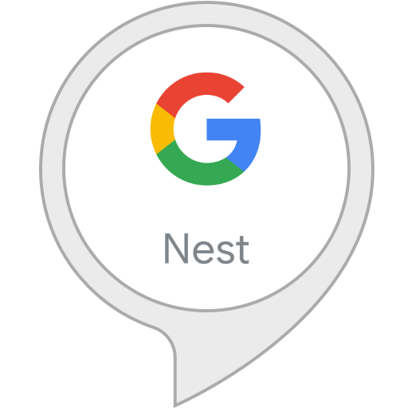
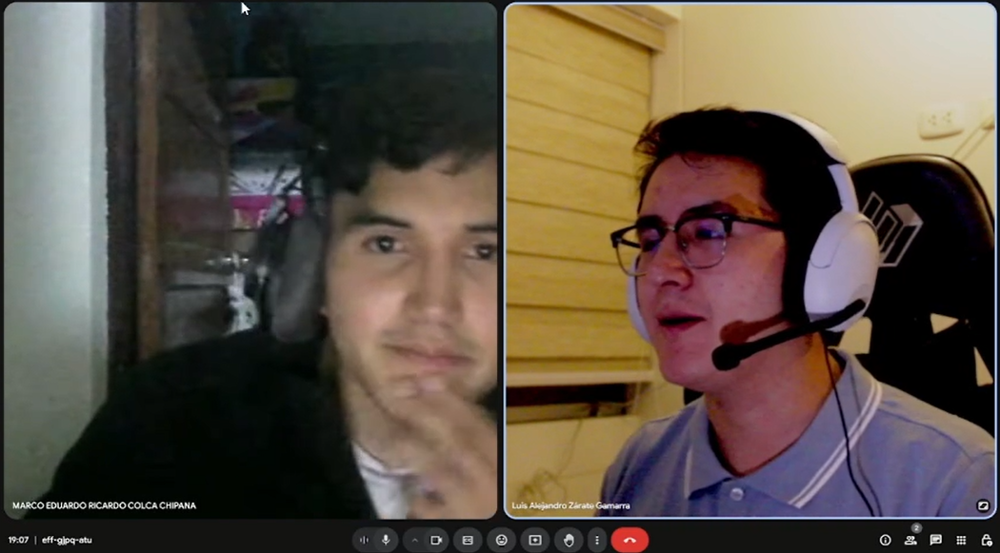
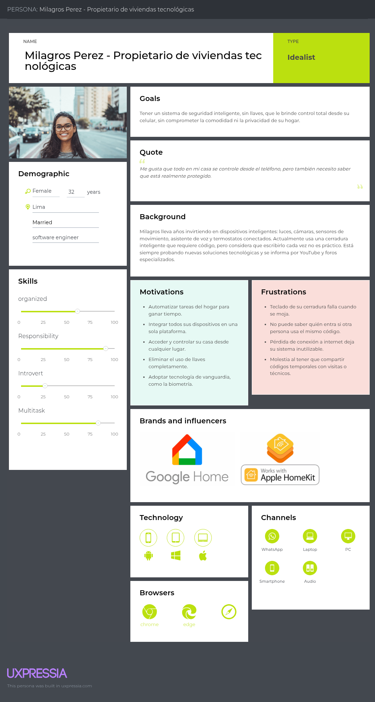
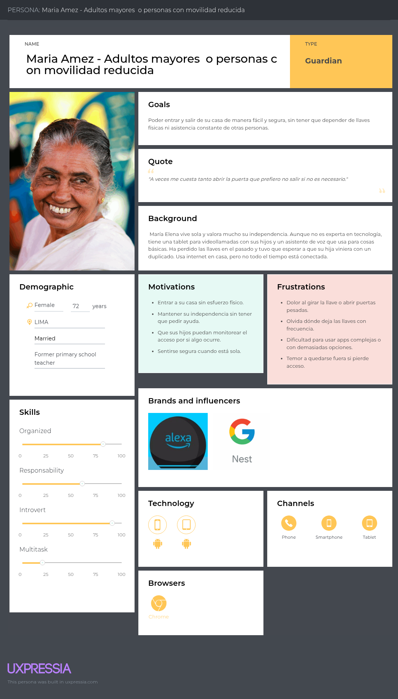
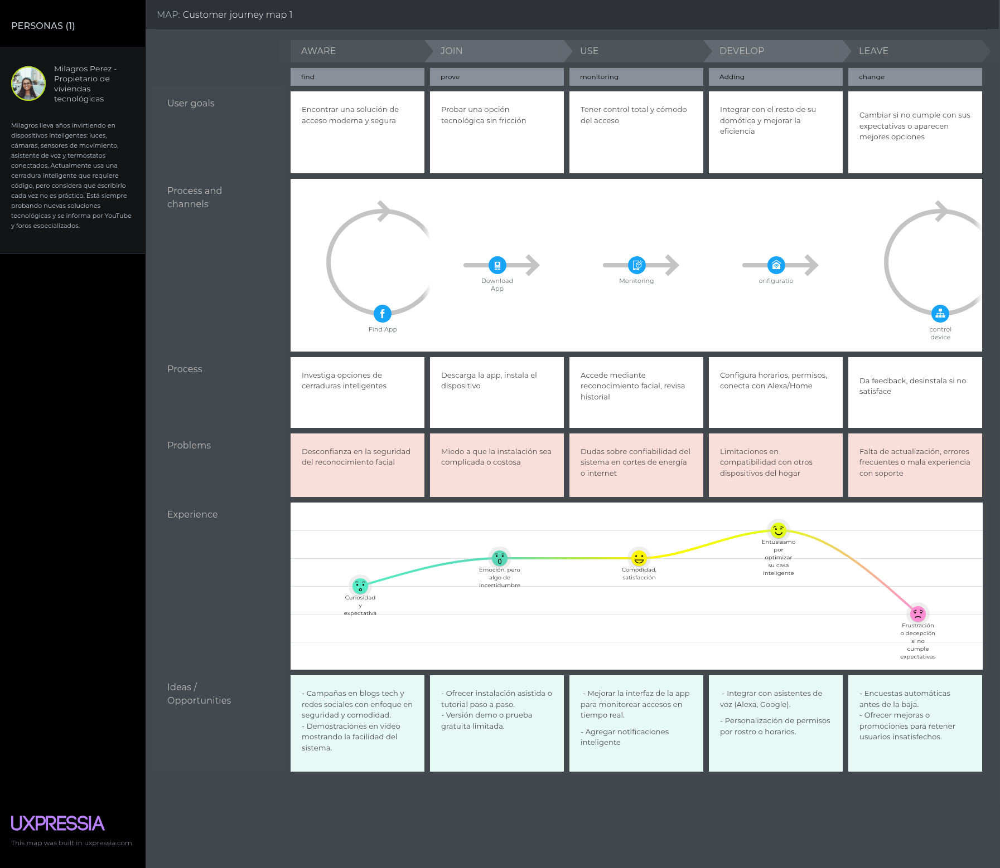
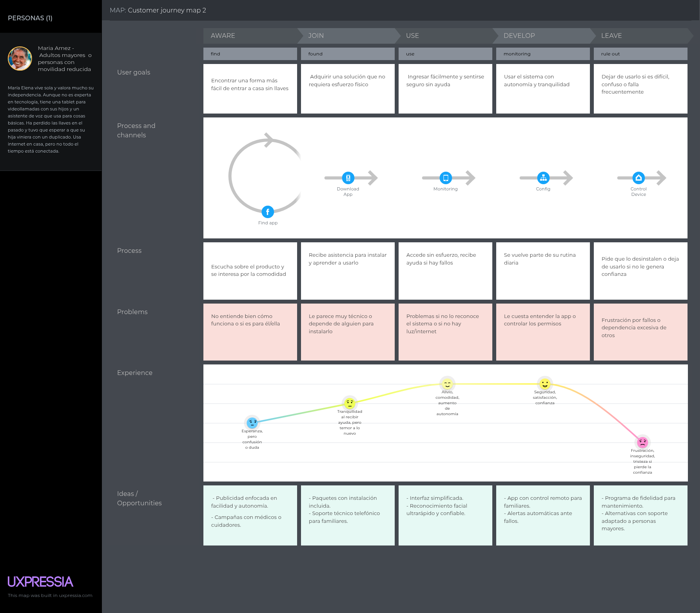
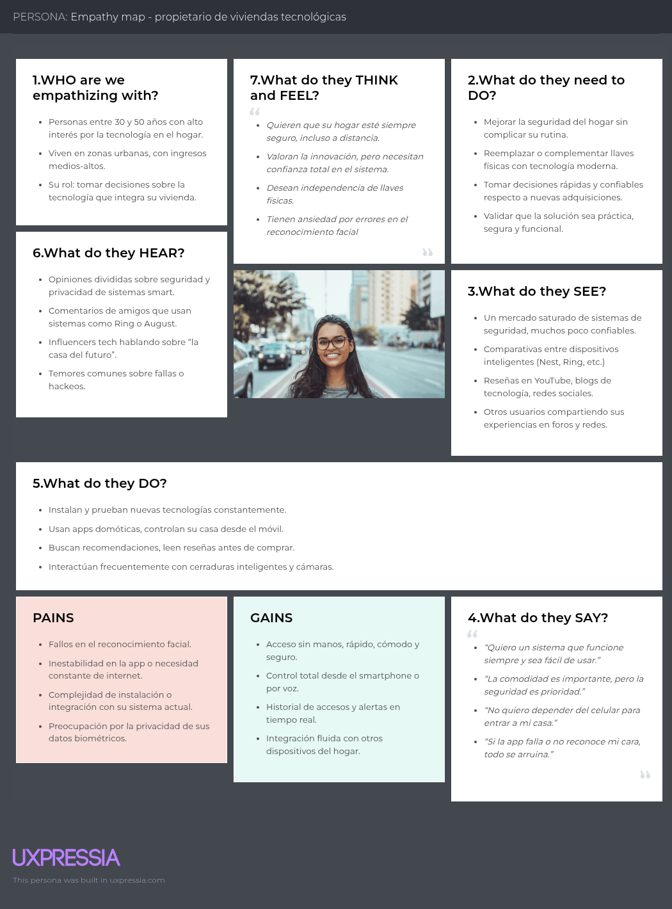
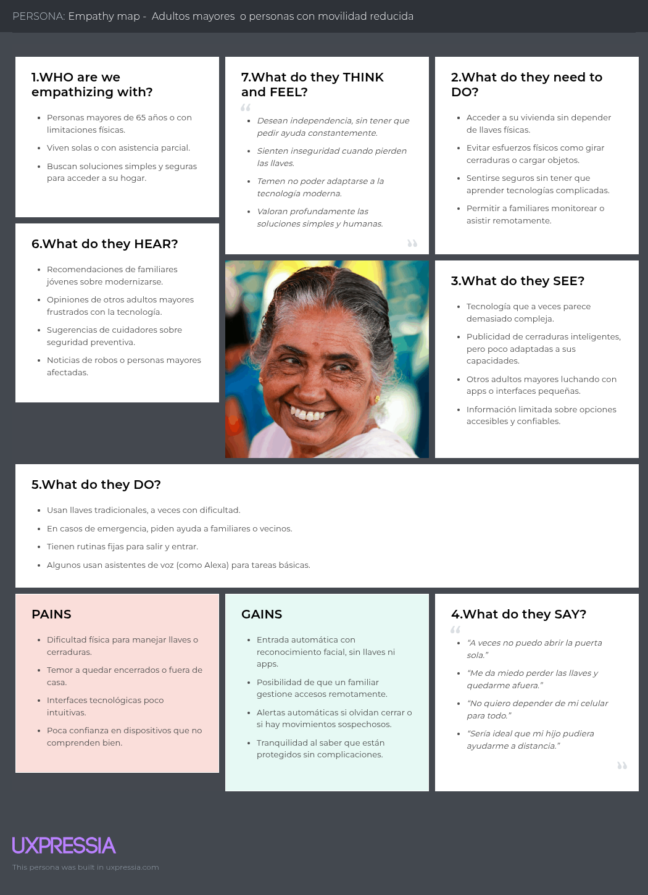
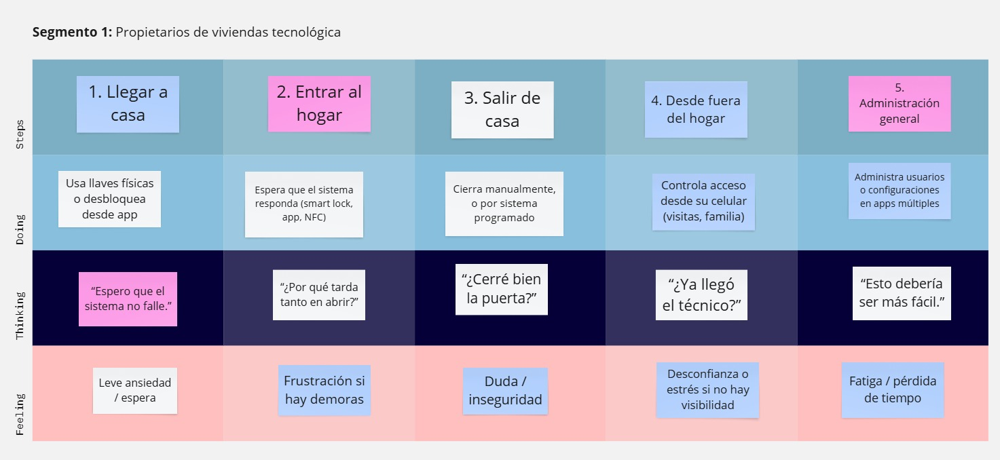
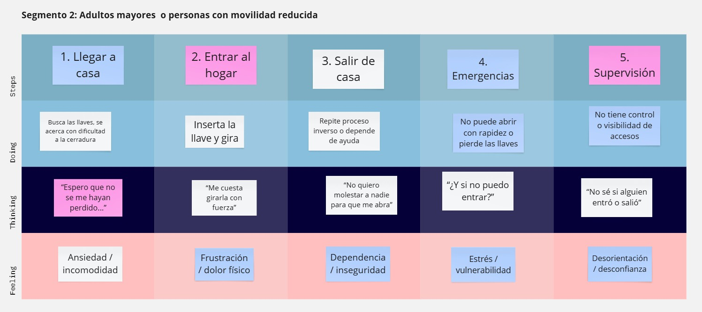

# **Capítulo II: Requirements Elicitation & Analysis**

## 2.1. Competidores.

<table>
    <thead>
        <tr>
            <th>Nombre del Competidor</th>
            <th>Descripción</th>
        </tr>
    </thead>
    <tbody>
        <tr>
            <td rowspan="2" align="center">
                
                 Ring (Amazon)
            </td>
            <td>Ring ofrece un sistema completo de seguridad para el hogar, incluyendo videoporteros y cámaras de seguridad conectadas. Está integrado con Alexa y los servicios de Amazon.</td>
        </tr>
        <tr>
            <td>Página web: <a href="https://ring.com" target="_blank">https://ring.com</a></td>
        </tr>
        <tr>
            <td rowspan="2" align="center">
                
                 Nest (Google)
            </td>
            <td>Nest ofrece un ecosistema de automatización del hogar con productos como cámaras, termostatos, sensores y sistemas de seguridad. Está fuertemente integrado con Google Home.</td>
        </tr>
        <tr>
            <td>Página web: <a href="https://store.google.com/us/category/connected_home" target="_blank">https://store.google.com/us/category/connected_home</a></td>
        </tr>
        <tr>
            <td rowspan="2" align="center">
                
                 August
            </td>
            <td>August es conocida por sus cerraduras inteligentes y soluciones de acceso sin llaves. Compatible con Alexa, Google Assistant y Siri para control remoto y acceso inteligente.</td>
        </tr>
               <tr>
            <td>Página web: <a href="https://august.com/" target="_blank">https://august.com</a></td>
        </tr>
    </tbody>
</table>

### 2.1.1. Análisis competitivo.

<table style="width: 100%;">
  <tr>
    <th colspan="6" style="padding: 8px; text-align: center;"> Competitive Analysis Landscape</th>
  </tr>
  <tr>
    <td>¿Por qué llevar a cabo este análisis?</td>
    <td colspan="5">Para identificar fortalezas, oportunidades y áreas de mejora frente a los competidores; posicionar mejor el producto FaceLoock en el mercado y tomar decisiones estratégicas de desarrollo, marketing y precios.
</td>
  </tr>
  <tr>
    <td colspan="2"></td>
  <td align="center"> </td>
  <td align="center"> </td>
  <td align="center"> </td>
  <td align="center"> </td>
  </tr>
<tr>
  <td rowspan="2" align="center">Perfil</td>
  <td align="center">Overview</td>
  <td>Sistema de seguridad inteligente con enfoque en videoporteros y cámaras conectadas, con fuerte integración en el ecosistema de Amazon y Alexa.</td>
  <td>Solución integral de domótica y seguridad, integrada completamente con Google Home, que incluye cámaras, sensores y automatización del hogar.</td>
  <td>Empresa especializada en cerraduras inteligentes enfocadas en accesos remotos sin llaves, con compatibilidad con Siri, Alexa y Google Assistant.</td>
  <td>Sistema de acceso residencial basado en reconocimiento facial, diseñado para ofrecer seguridad manos libres, especialmente para personas con movilidad reducida.</td>
</tr>
<tr>
  <td>Ventaja competitiva ¿Qué valor ofrece a los clientes?</td>
  <td>Integración nativa con Amazon, dispositivos múltiples, y monitoreo en tiempo real accesible desde cualquier lugar.</td>
  <td>Automatización total del hogar con inteligencia artificial, respaldado por la infraestructura de Google.</td>
  <td>Acceso sin llaves cómodo, instalación sencilla y control remoto seguro desde el smartphone.</td>
  <td>Acceso 100% biométrico sin contacto, pensado para usabilidad inclusiva y seguridad avanzada sin necesidad de llaves ni códigos.</td>
</tr>
 <tr>
  <td rowspan="2" align="center">Perfil de Marketing</td>
  <td>Mercado objetivo</td>
  <td>Propietarios de viviendas inteligentes, usuarios del ecosistema Amazon, y personas que buscan seguridad conectada.</td>
  <td>Usuarios de productos Google, hogares domóticos, early adopters tecnológicos.</td>
  <td>Usuarios urbanos, tecnófilos, anfitriones de alquiler vacacional.</td>
  <td>Personas con movilidad reducida, adultos mayores, familias que valoran accesibilidad e innovación en seguridad.</td>
</tr>
<tr>
  <td>Estrategias de marketing</td>
  <td>Integración con Amazon Prime, promociones en ecommerce, presencia fuerte en redes sociales y YouTube.</td>
  <td>Marketing digital integrado en Google Ads y YouTube, promociones en Google Store, influencers tech.</td>
  <td>Alianzas con Airbnb y Apple, marketing de producto simple, publicidad en redes.</td>
  <td>Campañas centradas en accesibilidad, ferias tecnológicas, demos en asociaciones de asistencia y canales sociales.</td>
</tr>

<tr>
  <td rowspan="3" align="center">Perfil del Producto</td>
  <td>Productos & Servicios</td>
  <td>Videoporteros, cámaras de seguridad, sensores de movimiento, app de control remoto.</td>
  <td>Cámaras Nest, sensores, termostatos inteligentes, app Nest, Nest Aware.</td>
  <td>Cerraduras inteligentes, sensores de puerta, teclados inalámbricos, app móvil.</td>
  <td>Dispositivo de reconocimiento facial, app de control, integración con asistentes y domótica.</td>
</tr>
<tr>
  <td>Precios & Costos</td>
  <td>$99–$349 + suscripciones mensuales desde $3</td>
  <td>$129–$399 + Nest Aware desde $6/mes</td>
  <td>$149–$250 por cerradura, sin suscripción obligatoria</td>
  <td>$120–$200 por dispositivo, sin suscripción obligatoria (estimado)</td>
</tr>
<tr>
  <td>Canales de distribución (Web y/o Móvil)</td>
  <td>Amazon, Web oficial, App (iOS/Android), tiendas físicas</td>
  <td>Google Store, Web oficial, App (iOS/Android), minoristas</td>
  <td>Apple Store, Amazon, Web oficial, App (iOS/Android)</td>
  <td>Web oficial, App (iOS/Android), asociaciones, tiendas aliadas</td>
</tr>

<tr>
  <td rowspan="4" align="center">Análisis SWOT</td>
  <td>Fortalezas</td>
  <td>Reconocimiento global, ecosistema Amazon, facilidad de uso</td>
  <td>Infraestructura de Google, IA integrada, diseño avanzado</td>
  <td>Instalación fácil, integración con múltiples asistentes, diseño moderno</td>
  <td>Innovación en accesibilidad, enfoque en biometría, uso manos libres</td>
</tr>
<tr>
  <td>Debilidades</td>
  <td>Problemas de privacidad, dependencia del ecosistema Amazon</td>
  <td>Costos elevados, dependencia del ecosistema Google</td>
  <td>Enfoque limitado al acceso, sin oferta integral de seguridad</td>
  <td>Marca nueva, poca visibilidad aún, sin historial de confianza</td>
</tr>
<tr>
  <td>Oportunidades</td>
  <td>Crecimiento del mercado smart home, expansión internacional</td>
  <td>Mejoras en IA, sinergia con otros dispositivos Google</td>
  <td>Alianzas con plataformas de alojamiento y empresas de seguridad</td>
  <td>Mercado no atendido (PMR), regulación que impulse accesibilidad</td>
</tr>
<tr>
  <td>Amenazas</td>
  <td>Competencia intensa, regulación sobre vigilancia</td>
  <td>Competencia directa con Amazon, saturación de mercado</td>
  <td>Competidores más grandes replicando su tecnología</td>
  <td>Copias de grandes marcas, barreras de entrada al retail</td>
</tr>
<table>

### 2.1.2. Estrategias y tácticas frente a competidores.

**Estrategias:**  
- **Diferenciación por accesibilidad biométrica:** Enfocar la propuesta de valor en el acceso facial sin contacto como una solución única frente a sistemas tradicionales basados en llaves, códigos o móviles.  
- **Segmentación en nichos desatendidos:** Atacar segmentos poco explotados por los grandes competidores, como personas con movilidad reducida, adultos mayores y familias con necesidades de accesibilidad.  
- **Innovación continua centrada en el usuario:** Iterar el producto con base en retroalimentación de usuarios reales, con mejoras funcionales y de UX que los gigantes no adaptan con rapidez.

**<strong>Tácticas:</strong>**  
- **Demostraciones en asociaciones y eventos de salud:** Presentar el producto en espacios donde los beneficios de accesibilidad y seguridad inclusiva tengan mayor impacto.  
- **Campañas de contenido educativo:** Crear contenido enfocado en explicar los riesgos de seguridad actuales y cómo FaceLoock los soluciona sin fricción.  
- **Alianzas estratégicas con organizaciones de asistencia:** Colaborar con entidades que trabajen con personas con discapacidad o adultos mayores para validar, distribuir y promover el producto.

## 2.2. Entrevistas.

El objetivo de las entrevistas es obtener una comprensión profunda de las experiencias, perspectivas y opiniones de los segmentos de mercado seleccionados. Nuestra meta es recopilar información valiosa que nos permita entender mejor a nuestro público objetivo y mejorar nuestra comprensión de los usuarios. Estas conversaciones nos proporcionarán una visión más clara de las necesidades y deseos de nuestros usuarios, lo que nos ayudará a adaptar nuestros productos o servicios de manera más efectiva a sus requisitos.

### 2.2.1. Diseño de entrevistas.

En esta parte, se han formulado varias preguntas destinadas a nuestros segmentos de interés con el fin de obtener información cualitativa, como opiniones o descripciones. Esta información será crucial para el desarrollo de nuestra solución.

**Preguntas Generales:**

- ¿Qué importancia tiene para ti la seguridad en casa al momento de elegir una tecnología?

-  ¿Cómo gestionas actualmente el acceso a tu vivienda? (llaves, cerraduras inteligentes, etc.)

- ¿Has considerado usar tecnologías biométricas (como reconocimiento facial) para acceder a tu hogar?

- ¿Qué valoras más en un sistema de acceso inteligente? (seguridad, comodidad, rapidez, etc.)

- ¿Qué limitaciones o frustraciones has tenido con los sistemas de seguridad actuales?

- ¿Qué te motivaría a comprar una solución como FaceLoock? 

**Preguntas para el Segmento Objetivo 1 - Propietarios de viviendas tecnológicas:**

- ¿Qué dispositivos inteligentes usas para controlar tu hogar?

- ¿Qué tan importante es que el sistema tenga control remoto desde una app móvil o una interfaz web?

- ¿Con qué frecuencia accedes o controlas tus dispositivos de seguridad desde fuera de casa?

- ¿Preferirías gestionar el sistema desde una app móvil, una plataforma web? ¿Por qué?

- ¿Qué tipo de funcionalidades te gustaría ver en la app (ej. historial de accesos, alertas, control remoto)?

- ¿Qué tan confiable necesitas que sea la conexión a internet para sentir seguridad en este tipo de sistema?

- ¿Estarías dispuesto a reemplazar completamente las llaves tradicionales por un sistema facial si fuera seguro?

**Preguntas para el Segmento Objetivo 2 - Adultos mayores  o personas con movilidad reducida:**

- ¿Qué tan fácil o difícil es para ti abrir la puerta de tu casa actualmente?

- ¿Te resulta complicado usar llaves o tienes alguna limitación física?

- ¿Has tenido alguna experiencia en la que no pudiste entrar a tu casa por perder las llaves?

- ¿Te gustaría poder entrar sin llaves ni necesidad de usar una app o teléfono?

- ¿Qué tan cómodo(a) te sentirías usando una aplicación para gestionar el acceso a tu casa?

- ¿Te gustaría que un familiar reciba alertas o pueda ayudarte a controlar el sistema desde su propio teléfono?

- ¿Tienes acceso frecuente a internet en tu casa?

### 2.2.2. Registro de entrevistas.

**Entrevista para el Segmento Objetivo 1 - Propietarios de viviendas tecnológicas:**

- **Entrevista 1:**
**Entrevistador:** Zárate Gamarra, Luis Alejandro 
**Entrevistado:** Marco Eduardo Ricardo Colca Chipana
**Sexo:** Masculino
**Edad:** 38 años
**Domicilio:** Miraflores
**Inicio de la Entrevista:** 0:00
**Duración de la Entrevista:** 3:30 
 

- **Resumen:** 
El entrevistado es un propietario de vivienda tecnológica que utiliza un ecosistema integrado de dispositivos inteligentes: luces automatizadas, cámaras, sensores de movimiento, cerradura digital y un asistente virtual tipo Alexa. Destaca la importancia del control remoto a través de una app móvil, permitiéndole gestionar su hogar incluso estando fuera, con ejemplos como abrir la puerta a familiares o simular presencia. Accede a su sistema 4 o 5 veces por semana desde fuera. Prefiere claramente la app móvil por su inmediatez y portabilidad, aunque acepta la web para configuraciones avanzadas. Desea funciones como historial detallado de accesos, notificaciones en tiempo real ante intentos de ingreso no autorizados o fallos, y opciones para otorgar accesos temporales. Resalta la necesidad de una conexión a internet confiable, pero también considera vital que el sistema funcione localmente en caso de cortes. Estaría dispuesto a reemplazar completamente las llaves tradicionales por reconocimiento facial, siempre que sea seguro y cuente con respaldo ante fallos.

Enlace al video: [https://link.com](https://link.com)
- **Entrevista 2:**
**Entrevistador:** Gonzales Gomez, Antonella Frida 
**Entrevistado:** Cristian Antony montalvo 
**Sexo:** Masculino
**Edad:** 24 años
**Domicilio:** Lima
**Inicio de la Entrevista:** 0:00
**Duración de la Entrevista:** 7:12 
 

- **Resumen:** 
Cristian Anthony Montalvo, estudiante de ingeniería y analista junior, participó en una entrevista sobre el uso de tecnologías inteligentes para la seguridad del hogar. Actualmente utiliza cerraduras tradicionales, como es común en Lima, pero mostró gran interés en implementar soluciones biométricas como el reconocimiento facial. Para él, lo más importante en un sistema de acceso inteligente es la comodidad, seguida de la seguridad, ya que permitiría evitar cargar llaves y simplificar el acceso diario. Ha tenido experiencias con la pérdida de llaves y considera que este tipo de tecnologías podrían prevenir esos inconvenientes. Está dispuesto a usar aplicaciones móviles para gestionar el acceso a su vivienda, siempre que sean fáciles de usar y le brinden control sobre quién puede entrar. Además, le parecería útil que familiares cercanos pudieran recibir alertas o ayudar a controlar el sistema desde sus propios dispositivos. Finalmente, comentó que cuenta con conexión a internet tanto en su hogar como en el móvil, lo que considera esencial para el funcionamiento de este tipo de soluciones. En resumen, Cristian ve con buenos ojos las tecnologías de seguridad basadas en IoT, siempre que ofrezcan confiabilidad, simplicidad y control.

Enlace al video: [https://link.com](https://link.com)

**Entrevista para el Segmento Objetivo 2 - Adultos mayores  o personas con movilidad reducida:**

### 2.2.3. Análisis de entrevistas.
#### Propietarios de viviendas tecnológicas
#### Adultos mayores  o personas con movilidad reducida

## 2.3. Needfinding.
El Needfinding es una metodología centrada en descubrir necesidades reales de los usuarios antes de diseñar una solución. En nuestro proyecto FaceLoock, se aplica para entender cómo las personas gestionan actualmente el acceso a sus hogares, qué frustraciones enfrentan (como pérdida de llaves, inseguridad o dificultad física), y qué esperan de una solución moderna como el reconocimiento facial. A través de observaciones, entrevistas y mapeo de experiencias, se busca identificar necesidades expresas, latentes y ocultas en 2 segmentos clave: propietarios tecnológicos, adultos mayores/personas con movilidad reducida.

### 2.3.1. User Personas.

- **Segmento Objetivo 1 - Propietarios de viviendas tecnológicas**

 

- **Segmento Objetivo 2 - Adultos mayores  o personas con movilidad reducida**

 

### 2.3.2. User Task Matrix.
El siguiente cuadro muestra las tareas que completan los segmentos Propietarios de viviendas tecnológicas y Adultos mayores  o personas con movilidad reducida.

***Segmento 1: Milagros Pérez -  Propietarios de viviendas tecnológicas***

| **Actividad**                                                                 | **Frecuencia** | **Importancia** |
|:-----------------------------------------------------------------------------:|:--------------:|:----------------:|
|Controlar el acceso a la vivienda desde el celular                             | Alta           | Alta             |
|Revisar historial de accesos a la casa                                         | Media          | Alta             |
|Compartir acceso temporal a familiares o técnicos                              | Media          | Alta             |
|Automatizar rutinas de llegada o salida del hogar                              | Media          | Media            |
|Recibir notificaciones de accesos no autorizados                               | Alta           | Alta             |
|Conectar y sincronizar dispositivos del hogar inteligente                      | Media          | Alta             |
|Monitorear cámaras o sensores desde fuera del hogar                            | Alta           | Alta             |
|Evitar el uso de llaves físicas                                                | Alta           | Alta             |

***Segmento 2: Maria Amez - Adultos mayores  o personas con movilidad reducida***

| **Actividad**                                                                 | **Frecuencia** | **Importancia** |
|:-----------------------------------------------------------------------------:|:--------------:|:----------------:|
|Entrar y salir del hogar sin usar llaves                                       | Alta           | Alta             |
|Evitar el uso de cerraduras físicas complejas                                  | Alta           | Alta             |
|Recibir asistencia remota por parte de familiares                              | Media          | Alta             |
|Sentirse segura estando sola en casa                                           | Alta           | Alta             |
|Usar métodos simples y sin esfuerzo para acceder                               | Alta           | Alta             |
|Mantener su independencia al ingresar al hogar                                 | Alta           | Alta             |
|Evitar bloqueos o quedarse fuera por pérdida de llaves                         | Media          | Alta             |
|Evitar el uso constante de aplicaciones complejas                              | Alta           | Media            |

### 2.3.3. User Journey Mapping.

- **Primer segmento: Propietarios de viviendas tecnológica**

  

- **Segundo segmento: Adultos mayores  o personas con movilidad reducida**

  

### 2.3.4. Empathy Mapping.
El Empathy Map nos permitió comprender a fondo las emociones, necesidades y frustraciones de nuestros dos segmentos clave: propietarios de viviendas tecnológicas y adultos mayores o personas con movilidad reducida. A través de esta herramienta, identificamos preocupaciones como la pérdida de llaves, la dificultad de acceso y el deseo de mayor seguridad y control. Esta visión nos ayudó a diseñar una solución centrada en el usuario, que responda a sus verdaderas motivaciones y problemas, asegurando que FaceLoock sea accesible, confiable y adaptado a las realidades de cada perfil.

- **Primer segmento: Propietarios de viviendas tecnológica**
  

- **Segundo segmento: Adultos mayores  o personas con movilidad reducida**
  

### 2.3.5. As-is Scenario Mapping.

- **Primer segmento: Propietarios de viviendas tecnológica**
  

Miro: [https://miro.com/app/board/uXjVKOI5DF8=/?share_link_id=949304225961](https://miro.com/app/board/uXjVKOI5DF8=/?share_link_id=949304225961)

- **Segundo segmento: Adultos mayores  o personas con movilidad reducida**
  

Miro: [https://miro.com/app/board/uXjVKOI5DF8=/?share_link_id=949304225961](https://miro.com/app/board/uXjVKOI5DF8=/?share_link_id=949304225961)

## 2.4. Ubiquitous Language.
En el desarrollo de FaceLoock, es fundamental que todos los integrantes del equipo desde diseñadores, desarrolladores y testers hasta stakeholders hablen el mismo idioma. El Ubiquitous Language es un lenguaje compartido que facilita la comunicación clara, precisa y coherente durante todas las etapas del proyecto. Se construye a partir de conceptos clave extraídos directamente de las experiencias, necesidades y expectativas de los usuarios. Al definir este lenguaje común, se eliminan malentendidos, se alinean objetivos y se asegura que el producto final responda fielmente a los problemas que busca resolver.

| Término                        | Definición                                                                                                                                     |
|-------------------------------|------------------------------------------------------------------------------------------------------------------------------------------------|
| FaceLoock                     | Producto de SmartGuard basado en reconocimiento facial para controlar el acceso a viviendas sin llaves físicas.                              |
| Reconocimiento facial         | Tecnología biométrica que permite identificar personas a través de los rasgos de su rostro.                                                   |
| Acceso inteligente            | Sistema de apertura automatizada que no requiere interacción física con llaves o tarjetas.                                                   |
| Propietario de vivienda tecnológica | Persona que adopta soluciones de domótica y valora la seguridad, automatización y control remoto del hogar.                            |
| Adulto mayor / Movilidad reducida | Usuario con necesidades de accesibilidad que busca una solución simple y sin esfuerzo físico para entrar a su vivienda.               |
| Control remoto de acceso      | Funcionalidad que permite autorizar o bloquear el ingreso desde una app móvil o plataforma web.                                              |
| Historial de accesos          | Registro cronológico de entradas y salidas capturado por el sistema FaceLoock.                                                               |
| Notificación de acceso        | Alerta que se envía cuando alguien intenta acceder a la vivienda, ya sea autorizado o no.                                                    |
| Gestión de usuarios           | Administración de permisos y perfiles de personas autorizadas a ingresar mediante la app.                                                    |
| Interfaz accesible            | Diseño pensado para ser utilizado fácilmente por adultos mayores o personas con dificultades motoras.                                       |
| Punto de dolor (Pain Point)   | Problema real que experimenta el usuario con los métodos actuales de acceso a su vivienda.                                                   |
| Escenario As-Is               | Mapeo de la experiencia actual del usuario sin la implementación de FaceLoock.                                                               |
| Escenario To-Be               | Mapeo de la experiencia deseada del usuario una vez implementado FaceLoock.                                                                  |
| Empathy Map                   | Herramienta que permite visualizar lo que el usuario piensa, siente, dice y hace en relación con el problema que enfrenta.                  |
| User Persona                  | Representación ficticia de un usuario real basada en datos, que refleja sus objetivos, frustraciones y comportamientos.                    |

